# Document Ingestion APIs

## Why This Matters

Every RAG system starts with a mundane-looking problem that is actually the hardest part of the whole pipeline to get right in production: getting documents *into* the system safely, reliably, and with the caller able to track progress. It's tempting to treat ingestion as an afterthought — "just an upload endpoint" — but a document ingestion API is where most real-world RAG outages and data-quality problems originate: a 200MB PDF that times out the request, a malformed file that crashes your parser mid-batch, a re-upload that silently duplicates every chunk in your vector store. If retrieval and generation are the "smart" parts of RAG, ingestion is the plumbing — and plumbing failures are the ones that wake people up at 3 a.m. Designing the ingestion API surface deliberately, as a first-class API contract rather than a side effect of a file upload form, is what separates a RAG demo from a RAG product.

## Core Concept

A **document ingestion API** is the set of endpoints that accept a document (or a reference to one), register it in your system's metadata store, and coordinate everything downstream — parsing, chunking, embedding, indexing — through an asynchronous pipeline. The key design insight is that ingestion is fundamentally a **two-phase operation**: a fast synchronous phase (accept the file, validate what's cheap to validate, return an identifier) and a slow asynchronous phase (parse, chunk, embed, index — which can take seconds to minutes depending on document size). Conflating these two phases into one blocking HTTP request is the single most common mistake in ingestion API design, because HTTP requests are a poor fit for multi-minute operations: clients time out, load balancers kill idle connections, and retries on the client side risk duplicate processing.

## Mental Model

Think of document ingestion like checking a bag at an airport, not like handing something directly to a courier. When you check a bag, the counter agent doesn't personally walk it to the plane while you wait at the desk — they do a quick surface check (is it within size limits? does it have a tag?), print you a claim ticket with a tracking number, and the bag then moves through a pipeline of conveyor belts, scanners, and loaders that you cannot see and don't need to. You use the claim ticket later to ask "where's my bag?" or to know when it's arrived. A document ingestion API is that check-in counter: it does cheap, fast validation up front, hands back a `document_id` as your claim ticket, and lets you poll or subscribe for status while the real work happens out of view.

## How It Works

1. **Client submits a document** — either as raw bytes (multipart upload) or as a reference to a file already in object storage (see [File Upload Architecture](file-upload-architecture.md) for why direct-to-storage is usually better at scale).
2. **API performs synchronous validation** — file type/extension allow-list, size limits, basic corruption checks (can the file header even be read?), and authorization (is this tenant allowed to upload here, have they hit a quota?). This must be fast — milliseconds, not seconds — because it happens inside the request/response cycle.
3. **API persists metadata and enqueues a job** — a row is written to a `documents` table with status `pending`, and a message is pushed onto a queue (see [Part 8 — Async Systems](../08-async-systems/README.md)) referencing the document's storage location.
4. **API responds immediately** with a `document_id` and status `processing`, typically `202 Accepted` rather than `200 OK` or `201 Created`, signaling "accepted, not yet done."
5. **A worker picks up the job asynchronously**, running parsing → chunking → embedding → indexing (see [Async Document Processing](async-document-processing.md)), updating the document's status as it progresses through named stages.
6. **Client polls a status endpoint** (or receives a webhook, see [Part 9 — Webhooks](../09-realtime-and-webhooks/README.md)) to learn when the document is queryable.

This status tracking is not optional polish — it is the primary way callers know whether it's safe to include a document in retrieval yet. A document that is "uploaded" but not yet "indexed" should never silently show up half-chunked in search results.

## Architecture

```mermaid
flowchart LR
    A[Client] -->|POST /documents| B[Ingestion API]
    B -->|validate + persist metadata| C[(Metadata DB)]
    B -->|store raw file| D[(Object Storage)]
    B -->|enqueue job| E[Job Queue]
    B -->|202 Accepted + document_id| A
    E --> F[Parsing Worker]
    F --> G[Chunking]
    G --> H[Embedding API]
    H --> I[(Vector Database)]
    F -->|update status| C
    A -->|GET /documents/id/status| B
    B -->|read status| C

    subgraph "Full RAG Pipeline (referenced throughout Part 16)"
    direction LR
    J[Document Upload] --> K[Object Storage] --> L[Background Job] --> M[Parsing] --> N[Chunking]
    N --> O[Embeddings] --> P[Vector DB] --> Q[Retrieval] --> R[Reranking]
    R --> S[Context Construction] --> T[LLM] --> U[Streaming Response]
    end
```



## Request / Response Example

**Submit a document for ingestion:**

```http
POST /v1/documents HTTP/1.1
Host: api.example.com
Authorization: Bearer sk_live_abc123
Content-Type: multipart/form-data; boundary=----X

------X
Content-Disposition: form-data; name="file"; filename="q3-handbook.pdf"
Content-Type: application/pdf

<binary bytes>
------X
Content-Disposition: form-data; name="metadata"
Content-Type: application/json

{"source": "hr-portal", "collection": "employee-handbook", "tags": ["hr", "2026"]}
------X--
```

```http
HTTP/1.1 202 Accepted
Content-Type: application/json

{
  "document_id": "doc_9f3a2e",
  "status": "queued",
  "filename": "q3-handbook.pdf",
  "size_bytes": 2481932,
  "created_at": "2026-08-18T09:12:03Z",
  "status_url": "/v1/documents/doc_9f3a2e/status"
}
```

**Check ingestion status:**

```http
GET /v1/documents/doc_9f3a2e/status HTTP/1.1
Authorization: Bearer sk_live_abc123
```

```http
HTTP/1.1 200 OK
Content-Type: application/json

{
  "document_id": "doc_9f3a2e",
  "status": "chunking",
  "stages": {
    "upload": "complete",
    "parsing": "complete",
    "chunking": "in_progress",
    "embedding": "pending",
    "indexing": "pending"
  },
  "progress_pct": 45,
  "chunks_created": 0,
  "updated_at": "2026-08-18T09:12:41Z"
}
```

## Code Example

```python
import os
import uuid
from datetime import datetime, timezone
from fastapi import FastAPI, UploadFile, File, Form, HTTPException, status
from pydantic import BaseModel

app = FastAPI()

# Cheap, synchronous limits enforced before any heavy work happens
MAX_UPLOAD_BYTES = 25 * 1024 * 1024  # 25 MB
ALLOWED_CONTENT_TYPES = {"application/pdf", "text/plain", "text/markdown"}


class IngestResponse(BaseModel):
    document_id: str
    status: str
    status_url: str


@app.post("/v1/documents", response_model=IngestResponse, status_code=status.HTTP_202_ACCEPTED)
async def ingest_document(file: UploadFile = File(...), collection: str = Form(...)):
    # 1. Fast, synchronous validation only — no parsing or chunking here
    if file.content_type not in ALLOWED_CONTENT_TYPES:
        raise HTTPException(415, f"Unsupported content type: {file.content_type}")

    contents = await file.read()
    if len(contents) > MAX_UPLOAD_BYTES:
        raise HTTPException(413, "File exceeds maximum upload size")
    if len(contents) == 0:
        raise HTTPException(400, "Empty file")

    document_id = f"doc_{uuid.uuid4().hex[:8]}"

    # 2. Persist raw bytes to object storage (see file-upload-architecture.md)
    storage_key = f"{collection}/{document_id}/{file.filename}"
    await save_to_object_storage(storage_key, contents)  # implementation elsewhere

    # 3. Write metadata row with status="queued" — the source of truth for polling
    await create_document_record(
        document_id=document_id,
        filename=file.filename,
        collection=collection,
        storage_key=storage_key,
        status="queued",
        created_at=datetime.now(timezone.utc),
    )

    # 4. Enqueue background processing — do NOT parse/chunk/embed inline
    await enqueue_ingestion_job(document_id=document_id, storage_key=storage_key)

    # 5. Return immediately — the caller tracks progress via status_url
    return IngestResponse(
        document_id=document_id,
        status="queued",
        status_url=f"/v1/documents/{document_id}/status",
    )
```

## Production Considerations

- **Idempotency**: clients retry on timeout. Accept an `Idempotency-Key` header (see [Part 6 — Production Reliability](../06-production-reliability/README.md)) so a retried upload of the same file doesn't create a duplicate document and duplicate chunks in the vector index.
- **Backpressure**: if the queue is backed up, don't accept unbounded uploads — return `429 Too Many Requests` or `503` once queue depth crosses a threshold, so failure is visible immediately rather than as a silent multi-hour delay.
- **Multi-tenancy**: every document must carry a tenant/collection identifier that flows through parsing, chunking, and indexing, so retrieval can filter (see [Retrieval](retrieval.md)) and one tenant's documents never leak into another's context.
- **Partial failure visibility**: expose per-stage status (`parsing`, `chunking`, `embedding`, `indexing`), not just a single `pending`/`done` flag — operators need to know *where* a stuck document is stuck.
- **Reprocessing**: support re-ingesting a document (e.g., after a chunking strategy change) without requiring a full delete-and-reupload cycle from the client.

## Common Mistakes

- Parsing and embedding synchronously inside the upload request, causing timeouts on large files and blocking the API worker pool.
- Returning `200 OK` immediately with no way to know if the document ever finished indexing — silent data loss.
- Not validating file size/type before reading the entire file into memory, allowing a trivial DoS via oversized uploads.
- Treating "uploaded" and "queryable" as the same state, so a document appears in search half-indexed or fails silently.
- No idempotency key, so client-side retries on network blips create duplicate documents and duplicate chunks.

## Best Practices

- Separate the API contract into "accept" (fast, synchronous, returns 202) and "status" (pollable, stage-aware) endpoints.
- Store enough metadata per document (source, collection, tags, checksum) to support filtering during retrieval later.
- Emit structured status transitions your observability stack can alert on (see [Part 12 — Observability](../12-observability/README.md)).
- Design the status model to be forward-compatible — add stages without breaking existing clients that only check top-level `status`.

## AI Engineering Perspective

Ingestion status directly affects downstream agent reliability. If an [AI agent](../17-ai-agents-and-mcp/README.md) calls a "search documents" tool immediately after an "upload document" tool without checking ingestion status, it will get empty or partial results and may hallucinate that the document doesn't exist or is empty — a subtle failure mode that's easy to miss in testing (where documents are small and index quickly) but common in production (where documents are large and indexing takes minutes). Expose ingestion status as a first-class, agent-readable field so agent orchestration logic can wait, poll, or explicitly tell the user "still processing" instead of guessing.

## Exercises

**Beginner**: Design the request/response schema for a `POST /v1/documents` endpoint that accepts either a file upload or a URL to fetch. What validation differs between the two paths?

**Intermediate**: Extend the status endpoint to support Server-Sent Events so a client can stream status updates instead of polling. Sketch the endpoint signature and event payload shape.

**Advanced**: Design an idempotency scheme for document ingestion that detects duplicate uploads via content hash (not just an `Idempotency-Key` header), and decide what should happen if the same file is uploaded to two different collections.

## Key Takeaways

- Ingestion is a two-phase problem: fast synchronous acceptance, slow asynchronous processing — never conflate them in one blocking request.
- Return `202 Accepted` with a trackable `document_id`, not `200 OK` with no way to verify completion.
- Expose per-stage status so callers (humans and agents) know precisely when a document is safe to retrieve.
- Idempotency and multi-tenancy metadata must be designed into the ingestion contract from day one, not retrofitted later.

---
**Previous**: [Part 16 Overview](README.md) · **Next**: [File Upload Architecture](file-upload-architecture.md)
