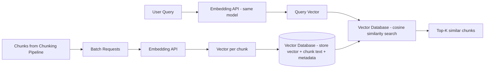

# Embedding APIs

## Why This Matters

Once you have chunks (see [Chunking Pipelines](chunking-pipelines.md)), you need a way to compare "how related is this chunk to this query" without a human reading every chunk for every query — that's a search problem, and traditional keyword search alone (matching exact words) fails badly when the query and the answer use different words for the same idea ("car" vs. "automobile", "cheap" vs. "affordable"). Embeddings solve this by converting text into a mathematical representation where *meaning* determines *position* — texts with similar meaning end up numerically close together, regardless of the exact words used. Understanding embeddings well enough to use them correctly — not just "text becomes vectors" but *why* that enables similarity search, and how to call an embedding API efficiently in production — is the layer that makes semantic retrieval possible at all.

## Core Concept

An **embedding** is a fixed-length list of floating-point numbers (a vector) that represents a piece of text such that texts with similar meaning produce vectors that are close together in that vector space, and texts with dissimilar meaning produce vectors that are far apart. A typical embedding model might output a vector of 1536 or 3072 numbers per input, regardless of whether the input was one word or a full paragraph.

"Close together" is measured mathematically, most commonly with **cosine similarity**: given two vectors, cosine similarity measures the cosine of the angle between them, ranging from -1 (opposite meaning) to 1 (identical meaning), largely ignoring vector *magnitude* and focusing on *direction*. Intuitively: imagine every possible meaning as a direction you could point in a very high-dimensional space (not 2D or 3D, but hundreds or thousands of dimensions) — the embedding model's job, learned from training on massive amounts of text, is to point semantically similar texts in nearly the same direction. Two vectors pointing almost the same way have a cosine similarity near 1; perpendicular (unrelated) vectors have similarity near 0. This is *why* similarity search works: "find chunks relevant to this query" becomes "find vectors whose direction is closest to the query vector's direction" — a well-defined, efficiently computable geometric problem instead of a fuzzy linguistic one.

## Mental Model

Think of an embedding as **GPS coordinates for meaning**. Just as two addresses with similar latitude/longitude are physically close regardless of what their street names are, two texts with similar embeddings are semantically close regardless of their exact wording. "The store closes at 9pm" and "business hours end at nine in the evening" use almost no overlapping words, but a good embedding model places them at nearly the same "coordinates" because they mean the same thing. Just as you wouldn't expect a street address in Tokyo and a street address in Toronto to be close on a map even if both contain the word "Main Street," you shouldn't expect embeddings to cluster by shared vocabulary — they cluster by shared meaning, which is precisely what makes them useful for retrieval that keyword matching cannot do alone.

## How It Works

1. **Send text to an embedding API** — a specialized model (distinct from a chat/completion model, though sometimes from the same provider) trained specifically to produce vectors optimized for similarity comparison, not for generating text.
2. **Receive a fixed-dimensionality vector** — the dimensionality (e.g., 1536) is a property of the *model*, not the input; a one-word input and a 500-word input from the same model both produce a vector of the same length.
3. **Store the vector alongside the chunk** in a [vector database](vector-database-apis.md), indexed for fast similarity search.
4. **At query time, embed the query using the same model** and compare it against stored chunk vectors using cosine similarity (or a related metric like dot product or Euclidean distance, depending on the vector database's index configuration).

Two operational details matter enormously in practice:

- **Batching**: embedding API calls have per-request overhead (network latency, fixed processing cost) independent of how much text is in the request, up to the model's input limits. Embedding 1,000 chunks with 1,000 separate API calls is dramatically slower and often more expensive than batching them into, say, 10 calls of 100 chunks each. Most embedding APIs accept an array of inputs per request specifically to enable this.
- **Model consistency**: the query and the documents *must* be embedded with the exact same model (and ideally the same model version). Vectors from different embedding models are not comparable — they don't share a coordinate system — so mixing them silently produces meaningless similarity scores rather than an obvious error.

## Architecture



## Request / Response Example

**Batch embedding request:**

```http
POST /v1/embeddings HTTP/1.1
Host: api.embeddingprovider.com
Authorization: Bearer sk_live_abc123
Content-Type: application/json

{
  "model": "text-embed-3-large",
  "input": [
    "Section 4.2 Refund Policy: Customers may request a refund within 30 days...",
    "Section 4.3 Exceptions: Digital goods are non-refundable once downloaded..."
  ]
}
```

```http
HTTP/1.1 200 OK
Content-Type: application/json

{
  "model": "text-embed-3-large",
  "data": [
    {"index": 0, "embedding": [0.0123, -0.0456, 0.0789, "...", 0.0021]},
    {"index": 1, "embedding": [-0.0034, 0.0567, -0.0198, "...", 0.0456]}
  ],
  "usage": {"prompt_tokens": 87, "total_tokens": 87},
  "dimensions": 3072
}
```

## Code Example

```python
import os
import asyncio
from typing import Iterable
import httpx

EMBEDDING_API_URL = "https://api.embeddingprovider.com/v1/embeddings"
EMBEDDING_MODEL = "text-embed-3-large"
API_KEY = os.environ["EMBEDDING_API_KEY"]  # never hardcode secrets

BATCH_SIZE = 100  # provider-specific limit; tune to the API's max batch size


def batched(items: list[str], size: int) -> Iterable[list[str]]:
    for i in range(0, len(items), size):
        yield items[i : i + size]


async def embed_batch(client: httpx.AsyncClient, texts: list[str]) -> list[list[float]]:
    """Embed one batch. Batching amortizes per-request network/latency
    overhead across many chunks instead of paying it once per chunk."""
    response = await client.post(
        EMBEDDING_API_URL,
        headers={"Authorization": f"Bearer {API_KEY}"},
        json={"model": EMBEDDING_MODEL, "input": texts},
        timeout=30.0,
    )
    response.raise_for_status()
    payload = response.json()
    # Provider guarantees response order matches input order via `index`
    ordered = sorted(payload["data"], key=lambda d: d["index"])
    return [item["embedding"] for item in ordered]


async def embed_chunks(chunk_texts: list[str]) -> list[list[float]]:
    """Embed a large list of chunks by splitting into provider-sized batches
    and issuing requests concurrently, then reassembling in original order."""
    async with httpx.AsyncClient() as client:
        batches = list(batched(chunk_texts, BATCH_SIZE))
        results = await asyncio.gather(*(embed_batch(client, batch) for batch in batches))
    # Flatten batch results back into one list matching chunk_texts order
    return [vec for batch_result in results for vec in batch_result]


async def embed_query(query: str) -> list[float]:
    """IMPORTANT: must use the exact same model as embed_chunks/embed_batch,
    or the resulting vector won't be comparable to stored document vectors."""
    async with httpx.AsyncClient() as client:
        vectors = await embed_batch(client, [query])
    return vectors[0]
```

## Production Considerations

- **Cost scales with tokens embedded, not documents**: a naive re-embed-everything-on-every-change pipeline gets expensive fast; only re-embed chunks that actually changed.
- **Rate limits**: embedding APIs enforce requests-per-minute and tokens-per-minute limits (see [AI Rate Limits](../15-production-ai-systems/README.md)); batching reduces request count and helps you stay under request-based limits, but you still need backoff/retry logic for token-based limits on large ingestion jobs.
- **Dimensionality affects storage and query cost**: higher-dimensional embeddings (e.g., 3072) are more expressive but cost more to store and search than lower-dimensional ones (e.g., 384–768); some models let you truncate dimensions for a speed/accuracy trade-off (Matryoshka-style embeddings).
- **Model versioning**: if a provider updates an embedding model, old and new vectors may not be compatible — track the model+version used per stored vector and plan a full re-embedding migration when you change models.
- **Asymmetric embedding models**: some embedding models are trained with separate "query" and "document" modes/prefixes (e.g., `"query: ..."` vs. `"passage: ..."`) — using the wrong mode for the wrong side silently degrades retrieval quality.

## Common Mistakes

- Embedding the query with a different model (or a different version of the same model) than the documents, producing vectors from incompatible coordinate systems that yield meaningless similarity scores without any obvious error.
- Sending one HTTP request per chunk instead of batching, multiplying latency and cost during ingestion of large document sets.
- Ignoring per-provider max input length per item — a chunk that's too large for the embedding model gets silently truncated, losing the tail of the text from the vector's representation.
- Not tracking which embedding model/version produced each stored vector, making future migrations error-prone.
- Treating embedding calls as free of failure — not handling rate limit errors (`429`) or transient network failures with retry/backoff during bulk ingestion.

## Best Practices

- Always batch embedding calls up to the provider's per-request limit; parallelize batches with bounded concurrency rather than serially.
- Pin and record the exact embedding model identifier (including version) as metadata on every stored vector.
- Use the provider's documented "query" vs. "document" mode/prefix if the model supports asymmetric embeddings.
- Build retry-with-backoff around embedding calls as a matter of course — bulk ingestion jobs will eventually hit rate limits.

## AI Engineering Perspective

Embedding quality is a silent multiplier on every downstream RAG component: a mediocre embedding model can be partially compensated for with [reranking](reranking.md), but no amount of clever retrieval logic fixes a fundamentally miscalibrated vector space. When designing an [AI agent](../17-ai-agents-and-mcp/README.md) that dynamically decides whether to retrieve, cache, or answer from memory, the agent's confidence in retrieved results is only as good as the embedding model's ability to actually separate relevant from irrelevant text — so embedding model choice is effectively an agent-reliability decision, not just a retrieval-quality one. It's also worth noting that embedding calls, unlike chat completions, are typically not subject to prompt caching in the way described in [Part 15](../15-production-ai-systems/README.md) — but the *vectors themselves* function as a cache: once a chunk is embedded, you never need to re-embed it unless its text or your model changes, which is exactly why tracking model version per vector matters.

## Exercises

**Beginner**: Given two short sentences, explain intuitively (without computing) which pair you'd expect to have higher cosine similarity: ("the cat sat on the mat", "a feline rested on the rug") or ("the cat sat on the mat", "stock prices rose sharply today").

**Intermediate**: Modify `embed_chunks` to add exponential backoff retry on `429` responses from the embedding API.

**Advanced**: Design a re-embedding migration process for switching from a 1536-dimension model to a 3072-dimension model in a live vector database with zero retrieval downtime.

## Key Takeaways

- Embeddings place text into a vector space where geometric closeness (commonly measured via cosine similarity) corresponds to semantic similarity — this is what makes similarity search possible.
- Queries and documents must be embedded with the exact same model; mixing models produces silently meaningless similarity scores.
- Batch embedding calls to amortize network overhead across many chunks; always plan for rate limits and retries.
- Track embedding model and version as metadata on every stored vector to support safe future migrations.

---
**Previous**: [Chunking Pipelines](chunking-pipelines.md) · **Next**: [Vector Database APIs](vector-database-apis.md)
