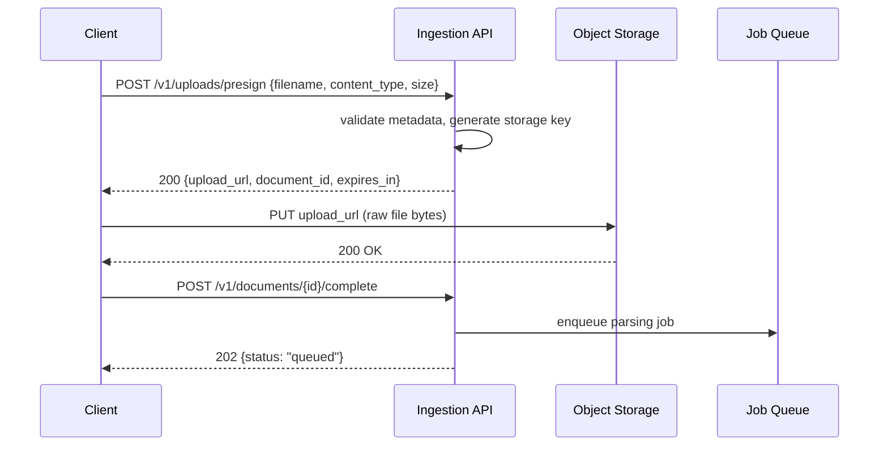

# File Upload Architecture

## Why This Matters

The naive way to build file upload — a client sends bytes to your API, your API writes them to disk or forwards them to storage — works fine for a demo and falls apart at production scale. Every byte a client uploads through your API server is a byte your API server has to receive, buffer, and forward, which means upload throughput is capped by your API's compute capacity, your API's memory becomes a target for exhaustion by large files, and every upload ties up a request-handling worker for as long as the transfer takes. For a RAG system that needs to ingest anything from a 2KB text snippet to a 500MB PDF corpus dump, getting the upload architecture right — deciding what goes through your API versus what goes directly to storage — is a foundational decision that affects cost, latency, and reliability for the life of the system.

## Core Concept

There are two fundamentally different upload architectures, and the choice between them is the single biggest lever you have:

1. **Proxied upload**: the client sends the file to your API, and your API forwards it to object storage (S3, GCS, Azure Blob). Simple to implement, but every byte transits your servers twice (client→API, API→storage), doubling bandwidth cost and making your API a bottleneck.
2. **Direct-to-storage upload via presigned URLs**: your API issues a short-lived, cryptographically signed URL that grants the client temporary permission to upload directly to object storage. Your API never sees the file bytes — it only orchestrates *permission* to upload, and is notified afterward (via a completion callback or the client calling back with the storage key).

Presigned URLs work because object storage services support **signed requests**: your API, holding storage credentials, computes a signature over a URL plus constraints (bucket, key, expiration, max size, content-type) using its secret key. The storage service can verify that signature without the client ever holding real credentials — the signature *is* the temporary, scoped permission. This is the same trust model as a wristband at a concert: the venue (your API) issues it, the gate (object storage) verifies it cryptographically without calling back to the venue for every person.

## Mental Model

Think of proxied upload as **you personally carrying every customer's package to the warehouse** — you're a single point of both cost and failure, and if ten customers show up with packages at once, nine of them wait in line behind you. Direct-to-storage upload is **you handing the customer a signed permission slip that lets the warehouse's own loading dock accept their package directly** — the warehouse (with far more capacity than your front desk) handles concurrent drop-offs natively, and you only get involved to hand out slips and to check the manifest afterward. For anything beyond small, occasional files, you want to be the front desk issuing permission slips, not the courier.

## How It Works

**Proxied upload flow:**
1. Client sends `multipart/form-data` to your API.
2. API buffers/streams the body, validates it, writes it to storage.
3. API responds once the write completes.

**Presigned URL flow:**
1. Client requests upload permission: `POST /v1/uploads/presign` with filename, content-type, and size.
2. API validates the *request metadata* (not the bytes — it hasn't seen them yet), generates a unique storage key, and asks the object storage SDK to produce a presigned PUT URL scoped to that exact key, content-type, and a short expiration (e.g., 5 minutes).
3. API returns the presigned URL and a `document_id` to the client, and records a `pending_upload` metadata row.
4. Client uploads the file bytes directly to object storage using that URL (a plain `PUT` or `POST` with no API-issued credentials involved).
5. Client (or a storage event notification) tells your API the upload is complete, triggering the ingestion pipeline from [Document Ingestion APIs](document-ingestion-apis.md).

The critical nuance: because your API never sees the bytes in the presigned flow, **you lose the ability to validate content synchronously** (e.g., "is this actually a valid PDF?"). That validation has to move to the async processing stage — the worker that picks up the file after upload must be prepared to reject corrupt or mismatched files and mark the document `failed` rather than assuming upload success means valid content.

## Architecture



## Request / Response Example

**Step 1 — request a presigned upload URL:**

```http
POST /v1/uploads/presign HTTP/1.1
Host: api.example.com
Authorization: Bearer sk_live_abc123
Content-Type: application/json

{
  "filename": "research-notes.pdf",
  "content_type": "application/pdf",
  "size_bytes": 8340213,
  "collection": "research"
}
```

```http
HTTP/1.1 200 OK
Content-Type: application/json

{
  "document_id": "doc_71ab90",
  "upload_url": "https://storage.example.com/rag-uploads/research/doc_71ab90?X-Amz-Signature=...&X-Amz-Expires=300",
  "upload_method": "PUT",
  "expires_in": 300,
  "max_size_bytes": 26214400
}
```

**Step 2 — client PUTs bytes directly to `upload_url`** (goes to object storage, not your API).

**Step 3 — client confirms completion:**

```http
POST /v1/documents/doc_71ab90/complete HTTP/1.1
Authorization: Bearer sk_live_abc123
```

```http
HTTP/1.1 202 Accepted
Content-Type: application/json

{
  "document_id": "doc_71ab90",
  "status": "queued",
  "status_url": "/v1/documents/doc_71ab90/status"
}
```

## Code Example

```python
import os
import uuid
import boto3
from fastapi import FastAPI, HTTPException
from pydantic import BaseModel

app = FastAPI()

s3 = boto3.client(
    "s3",
    # Never hardcode credentials — pull from environment / secrets manager
    aws_access_key_id=os.environ["S3_ACCESS_KEY_ID"],
    aws_secret_access_key=os.environ["S3_SECRET_ACCESS_KEY"],
    region_name=os.environ["S3_REGION"],
)

BUCKET = os.environ["RAG_UPLOADS_BUCKET"]
MAX_SIZE_BYTES = 25 * 1024 * 1024
ALLOWED_TYPES = {"application/pdf", "text/plain", "text/markdown"}


class PresignRequest(BaseModel):
    filename: str
    content_type: str
    size_bytes: int
    collection: str


@app.post("/v1/uploads/presign")
async def presign_upload(req: PresignRequest):
    # Validate metadata only — we never see the actual bytes in this flow
    if req.content_type not in ALLOWED_TYPES:
        raise HTTPException(415, f"Unsupported content type: {req.content_type}")
    if req.size_bytes > MAX_SIZE_BYTES:
        raise HTTPException(413, "Declared size exceeds maximum upload size")

    document_id = f"doc_{uuid.uuid4().hex[:8]}"
    storage_key = f"{req.collection}/{document_id}/{req.filename}"

    # generate_presigned_url signs the request with our credentials so the
    # client can upload without ever holding a real AWS key
    upload_url = s3.generate_presigned_url(
        ClientMethod="put_object",
        Params={
            "Bucket": BUCKET,
            "Key": storage_key,
            "ContentType": req.content_type,
        },
        ExpiresIn=300,  # 5 minutes — short-lived by design
    )

    await create_pending_upload_record(
        document_id=document_id,
        storage_key=storage_key,
        collection=req.collection,
        status="awaiting_upload",
    )

    return {
        "document_id": document_id,
        "upload_url": upload_url,
        "upload_method": "PUT",
        "expires_in": 300,
        "max_size_bytes": MAX_SIZE_BYTES,
    }
```

## Production Considerations

- **Verify after the fact, not just before**: since your API doesn't see bytes in the presigned flow, the async worker must re-validate (real file type via magic bytes, not just the client-declared `content_type`, actual size, malware scan) before parsing — never trust client-declared metadata as ground truth.
- **Virus/malware scanning**: for user-generated or externally sourced documents, route uploaded files through a scanning step (e.g., ClamAV or a managed scanning service) before they're parsed and indexed — an infected file sitting in object storage is relatively contained, but one that gets parsed, chunked, and served back through your RAG system's citations is a bigger exposure.
- **Short expirations**: presigned URLs should expire quickly (minutes) to limit the window an intercepted URL could be replayed.
- **Storage key collisions**: always generate the storage key server-side (never trust a client-supplied path) to prevent path traversal or overwrite attacks.
- **CORS on the storage bucket**: direct-to-storage uploads from a browser require CORS configuration on the bucket itself, which is often the most commonly missed setup step.

## Common Mistakes

- Proxying every upload through the API regardless of file size, turning the API into a bandwidth bottleneck.
- Trusting the client's declared `content_type` and `size_bytes` as fact instead of re-validating server-side after upload.
- Using long-lived or unscoped presigned URLs, turning a temporary permission into a de facto public write endpoint.
- Skipping malware/virus scanning because "it's just internal documents" — internal documents get shared, forwarded, and re-uploaded too.
- Forgetting to handle the "presigned but never uploaded" case — a `pending_upload` row that never transitions, silently leaking storage keys and metadata rows.

## Best Practices

- Default to presigned direct-to-storage uploads for anything beyond small, occasional files; reserve proxied uploads for cases needing synchronous inline validation of small payloads.
- Always re-validate file type by inspecting actual bytes (magic numbers), not filename extension or client-declared MIME type.
- Set a reaper job to clean up `pending_upload` records whose presigned URL expired without a completed upload.
- Log and monitor presigned URL issuance and usage separately — a spike in issued-but-unused URLs can indicate abuse or a broken client.

## AI Engineering Perspective

RAG systems frequently need to ingest documents at scales that make proxied upload untenable — a customer bulk-importing a knowledge base of thousands of PDFs, or an agent ([Part 17](../17-ai-agents-and-mcp/README.md)) autonomously fetching and uploading documents it discovers via tool calls. In agentic workflows specifically, an agent tool that "uploads a document" should itself use the presigned-URL pattern internally rather than streaming bytes through the agent's own context or compute — agents are compute environments you want to keep light, and shuttling multi-megabyte file bytes through a tool call response is both expensive in tokens and unnecessary when a storage reference will do.

## Exercises

**Beginner**: Write the request/response schema for a presign endpoint that supports multiple files in one request (batch upload).

**Intermediate**: Design the cleanup job that finds and removes `pending_upload` records whose presigned URL has expired without a completion callback. What query and what schedule?

**Advanced**: Design a system where the API is notified of upload completion via a storage service's native event notification (e.g., S3 event → SQS) instead of relying on the client calling a `/complete` endpoint. What are the trade-offs versus the client-driven approach?

## Key Takeaways

- Proxied uploads route every byte through your API; presigned direct-to-storage uploads let clients write to storage directly, using a signed URL as scoped, temporary permission.
- Presigned URLs mean you validate metadata before upload and must re-validate actual content after upload — you never get to inspect bytes synchronously.
- Malware scanning and true content-type verification belong in the async pipeline, not skipped because upload "succeeded."
- Short expirations and server-generated storage keys are essential to keeping presigned uploads safe.

---
**Previous**: [Document Ingestion APIs](document-ingestion-apis.md) · **Next**: [Chunking Pipelines](chunking-pipelines.md)
