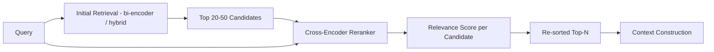

# Reranking

## Why This Matters

Vector similarity search (see [Retrieval](retrieval.md)) is fast because it's approximate and because it scores the query and each chunk *independently* — the embedding for a chunk is computed once at ingestion time, without any knowledge of what query it might eventually be compared against. That independence is exactly what makes the index fast to search, but it's also a structural limitation: the model never gets to look at the query and the chunk *together* and reason jointly about relevance. This means initial retrieval, however good, systematically leaves a gap between "vector-similar" and "actually the best answer to this specific question" — and reranking exists to close that gap by trading extra compute for extra precision, applied only to a small shortlist rather than the entire corpus.

## Core Concept

**Reranking** is a second-pass scoring step, applied to a small candidate set already returned by initial retrieval (typically the top 20-50 chunks), that re-scores and reorders those candidates using a model that jointly considers the query and each candidate chunk together, rather than comparing pre-computed independent embeddings.

The standard tool for this is a **cross-encoder**, in contrast to the **bi-encoder** architecture used for initial embedding-based retrieval. A bi-encoder (what you use for embeddings) encodes the query and each document *separately* into fixed vectors, then compares them with a cheap similarity function (cosine similarity) — fast because document vectors are precomputed once and reused for every query, but the model never actually "reads" the query and document side by side. A cross-encoder instead takes the query and a single candidate document *concatenated together* as one input, runs them jointly through a model, and outputs a single relevance score for that specific pairing — far more accurate because the model can directly attend to how query terms relate to document content, but far more expensive, since a fresh forward pass is required for every query-document pair and nothing can be precomputed or cached across queries.

This is why reranking is applied to a shortlist, never to the whole corpus: running a cross-encoder over a million documents per query would be computationally infeasible, but running it over the 20-50 candidates that initial retrieval already narrowed down is fast enough for real-time use and dramatically improves precision at the top of the list — which matters enormously because LLMs are known to be sensitive to the *order* and *relevance* of context they're given (irrelevant or poorly-ordered context measurably degrades answer quality even when the right information is present somewhere in the context).

## Mental Model

Think of initial retrieval as a **resume-screening algorithm that skims 10,000 resumes using keyword matching** to produce a shortlist of 30 plausible candidates quickly — fast, necessarily shallow, and good enough to narrow the field but not good enough to make a final hiring decision. Reranking is the **hiring manager who actually reads all 30 shortlisted resumes carefully**, comparing each one directly against the specific job requirements, and produces a much more accurate final ranking — but doing that careful reading for all 10,000 original resumes would take far too long. You use the cheap, fast method to narrow a huge pool down to a manageable shortlist, and the expensive, accurate method only on that shortlist.

## How It Works

1. **Initial retrieval returns a candidate set** — typically larger than what you'll ultimately use (e.g., retrieve top 30 to eventually keep top 5), specifically to give the reranker enough candidates to find genuinely better matches that ranked lower in the bi-encoder pass.
2. **Each (query, candidate) pair is sent to the cross-encoder** — either one at a time or batched, depending on the reranking API's interface.
3. **The cross-encoder returns a relevance score per pair** — not a similarity in the embedding-space sense, but a direct relevance judgment learned from training on query-document relevance labels.
4. **Candidates are re-sorted by this new score**, and the top-N (smaller than the original candidate set) are kept and passed to [context construction](context-construction.md).

**When reranking is worth the extra latency/cost**: reranking adds a network round-trip and nontrivial compute per candidate, typically tens to low-hundreds of milliseconds for a shortlist. It's most worth it when: initial retrieval quality is inconsistent (e.g., broad, heterogeneous document collections where bi-encoder similarity is a noisy signal), when the cost of a wrong top result is high (customer-facing answers, compliance-sensitive domains), or when you're retrieving from multiple sources (hybrid search, multiple collections) and need one unified, trustworthy ranking across them. It's often skippable for latency-critical, low-stakes use cases where initial retrieval is already reliably good, or where you're retrieving so few candidates that reordering them yields little practical difference.

## Architecture



## Request / Response Example

```http
POST /v1/rerank HTTP/1.1
Host: api.rerankprovider.com
Authorization: Bearer sk_live_abc123
Content-Type: application/json

{
  "model": "rerank-v2",
  "query": "how long do I have to return a digital purchase",
  "documents": [
    "Section 4.2 Refund Policy: Customers may request a refund within 30 days of purchase, provided the item is unused and in original packaging.",
    "Section 4.3 Exceptions: Digital goods are non-refundable once downloaded, except where required by local law.",
    "Section 1.1 Introduction: This handbook describes company policies effective as of Q1 2026."
  ],
  "top_n": 2
}
```

```http
HTTP/1.1 200 OK
Content-Type: application/json

{
  "model": "rerank-v2",
  "results": [
    {"index": 1, "relevance_score": 0.94, "document": "Section 4.3 Exceptions: Digital goods are non-refundable once downloaded..."},
    {"index": 0, "relevance_score": 0.61, "document": "Section 4.2 Refund Policy: Customers may request a refund within 30 days..."}
  ]
}
```

Note how the reranker correctly promotes the "digital goods" exception (index 1) above the general refund policy (index 0), even though the initial vector search may have scored them the other way — the cross-encoder directly reasons about "digital purchase" matching "digital goods" in a way the bi-encoder's precomputed similarity might have underweighted.

## Code Example

```python
import os
import httpx
from dataclasses import dataclass

RERANK_API_URL = "https://api.rerankprovider.com/v1/rerank"
RERANK_MODEL = "rerank-v2"
API_KEY = os.environ["RERANK_API_KEY"]  # never hardcode secrets


@dataclass
class RankedChunk:
    text: str
    relevance_score: float
    original_index: int


async def rerank(
    query: str, candidates: list[str], top_n: int = 5
) -> list[RankedChunk]:
    """Re-score a shortlist of already-retrieved candidates using a
    cross-encoder that jointly attends to the query and each document,
    unlike the bi-encoder used for the initial vector search."""
    if not candidates:
        return []

    async with httpx.AsyncClient() as client:
        response = await client.post(
            RERANK_API_URL,
            headers={"Authorization": f"Bearer {API_KEY}"},
            json={
                "model": RERANK_MODEL,
                "query": query,
                "documents": candidates,
                "top_n": min(top_n, len(candidates)),
            },
            timeout=10.0,  # rerankers are latency-sensitive; fail fast
        )
        response.raise_for_status()
        data = response.json()

    return [
        RankedChunk(
            text=r["document"],
            relevance_score=r["relevance_score"],
            original_index=r["index"],
        )
        for r in data["results"]
    ]


async def retrieve_and_rerank(
    query: str, retrieve_fn, retrieve_k: int = 30, final_k: int = 5
) -> list[RankedChunk]:
    """Full two-stage pattern: cast a wide net with cheap retrieval, then
    narrow precisely with an expensive reranker — never the reverse."""
    candidates = await retrieve_fn(query, top_k=retrieve_k)
    candidate_texts = [c.text for c in candidates]
    return await rerank(query, candidate_texts, top_n=final_k)
```

## Production Considerations

- **Latency budget**: reranking adds a synchronous call in the critical path before generation can begin — measure its P95/P99 contribution (see [Part 7](../07-caching-performance/README.md)) and decide whether it fits your latency SLA, especially for [streaming RAG](streaming-rag.md) where perceived time-to-first-token matters.
- **Cost**: rerank APIs typically bill per document scored, not per query — reranking 30 candidates per query at scale adds up; tune the candidate set size deliberately rather than defaulting to "retrieve as many as possible."
- **Diminishing returns past a point**: reranking meaningfully improves ordering among genuinely relevant-ish candidates, but cannot manufacture relevance that isn't present anywhere in the candidate set — if initial retrieval missed the right chunk entirely, no reranker recovers it.
- **A/B measurement**: reranking's value is easiest to justify with a measured before/after comparison on a real evaluation set (see [Retrieval](retrieval.md)), not assumed by default.

## Common Mistakes

- Running a cross-encoder reranker over the entire corpus instead of a pre-narrowed candidate shortlist, causing unacceptable latency and cost.
- Skipping reranking unconditionally "for speed" even in domains where retrieval precision materially affects answer correctness (e.g., compliance, medical, legal).
- Retrieving too few initial candidates (e.g., `top_k=5`) before reranking, leaving the reranker nothing better to promote than what vector search already found.
- Not handling reranker API failures gracefully — a reranking outage shouldn't take down the whole RAG pipeline; fall back to the unreranked order.
- Ignoring reranker latency in end-to-end SLA calculations, discovering the added round-trip only after it causes a production timeout.

## Best Practices

- Retrieve a meaningfully larger candidate set than your final target (e.g., 4-6x) specifically to give the reranker room to find better matches.
- Treat reranking as an optional, fail-open stage: if the reranker call fails or times out, fall back to the initial retrieval order rather than failing the whole request.
- Benchmark reranking's actual quality impact on your evaluation set before committing to the added latency and cost in production.
- Keep reranking as a distinct, swappable pipeline stage so you can experiment with different rerank models independently of retrieval or generation.

## AI Engineering Perspective

Reranking is one of the highest-leverage, lowest-risk additions you can make to a RAG-backed [AI agent](../17-ai-agents-and-mcp/README.md): agents make downstream decisions (which tool to call next, what to tell the user, whether to ask a clarifying question) based on the *order and apparent confidence* of retrieved context, so promoting the truly best-matching chunk to the top measurably improves not just answer quality but the agent's own reasoning about how confident to be. In multi-hop agent workflows — where an agent retrieves, reasons, and retrieves again — reranking each hop's results keeps context lean and relevant, which matters directly for cost and latency given that every hop's context typically gets re-sent to the LLM (interacting with [prompt caching](../15-production-ai-systems/README.md) strategies, since a stable, well-ordered context is more cache-friendly than a noisy one that changes ordering on every call).

## Exercises

**Beginner**: Explain in your own words why a cross-encoder is more accurate but slower than a bi-encoder, using the "resume screening vs. hiring manager" analogy or one of your own.

**Intermediate**: Modify `retrieve_and_rerank` to fail open — if the rerank API call raises an exception, return the top `final_k` candidates from the original retrieval order instead of propagating the error.

**Advanced**: Design an evaluation harness that measures reranking's improvement over unreranked retrieval using recall@K and MRR on a labeled query/chunk dataset, and use it to decide the optimal initial candidate set size (`retrieve_k`).

## Key Takeaways

- Reranking uses a cross-encoder to jointly score query and document together, more accurate but far more expensive than the bi-encoder used in initial retrieval.
- It's applied only to a small shortlist from initial retrieval, never the whole corpus, because cross-encoder scoring doesn't scale to millions of documents per query.
- Reranking is worth its added latency/cost when retrieval quality is inconsistent, stakes are high, or results come from multiple heterogeneous sources.
- Design reranking as a fail-open, swappable stage — never let a reranker outage take down the whole RAG pipeline.

---
**Previous**: [Retrieval](retrieval.md) · **Next**: [Context Construction](context-construction.md)
