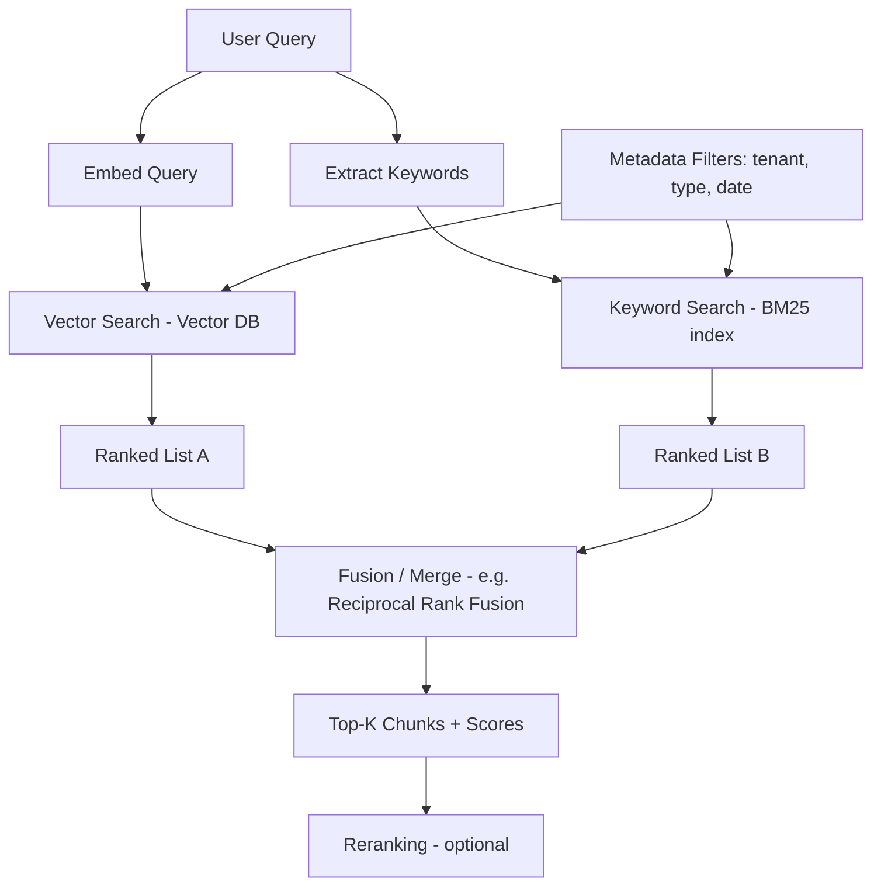

# Retrieval

## Why This Matters

Everything upstream — ingestion, chunking, embedding, indexing — exists to serve one moment: a user (or an agent) asks a question, and your system has to decide, in real time, *which* pieces of stored knowledge are worth handing to the LLM. Get this wrong and it doesn't matter how good your chunking or embedding model was — the LLM either answers from irrelevant context (producing a confidently wrong answer) or from too little context (producing an unhelpfully vague one). Retrieval is where all the earlier design decisions get tested against real queries, and it's rarely as simple as "run a vector search and take the top 5" — production retrieval systems combine multiple signals and make deliberate trade-offs between precision, recall, and latency.

## Core Concept

**Retrieval** is the process of taking a query, converting it into a form comparable against your indexed knowledge, and returning the most relevant chunks — typically the **top-K** most similar chunks by some scoring function, optionally narrowed by structured filters. There are two broad retrieval strategies, and production systems increasingly use both together:

- **Vector (semantic) search**: embed the query (see [Embedding APIs](embedding-apis.md)) and find the nearest chunk vectors by cosine similarity. Excellent at matching *meaning* even when wording differs, but can miss exact-match signals — a query for a specific product SKU or error code might not be the "semantically closest" match if the embedding model doesn't treat identifiers as meaningfully distinct.
- **Keyword (lexical) search**: classic full-text search (e.g., BM25 — a statistical scoring function that weights term frequency against how rare/common a term is across the whole corpus) that matches exact or near-exact terms. Excellent at precise matching of names, codes, and rare terms, but blind to synonyms and paraphrasing.

**Hybrid search** combines both: run vector search and keyword search in parallel, then merge/re-score the combined result set (commonly via a fusion algorithm like Reciprocal Rank Fusion, which combines ranked lists by rewarding items that rank highly across multiple lists). This captures the strengths of both — semantic understanding for paraphrased queries, exact-match precision for identifiers and rare terms — at the cost of running two retrieval paths and a fusion step.

**Metadata filtering** narrows the candidate pool *before or alongside* similarity scoring using structured fields attached at chunk creation time (tenant, document type, date range, section) — see [Chunking Pipelines](chunking-pipelines.md) for how that metadata gets attached. Filtering is not optional in multi-tenant systems: without a hard filter on tenant ID, similarity search alone provides no guarantee that one customer's query won't retrieve another customer's private documents.

## Mental Model

Think of retrieval like **asking two different experts the same question and then reconciling their answers**, rather than trusting a single opinion. The vector-search expert is great at understanding intent and paraphrase — ask them about "the return policy" and they'll surface content about "refund windows" even without the word "return" appearing. The keyword-search expert is literal and precise — ask them about "error code E4021" and they'll find the exact document containing that string, something the vector expert might rank lower because "E4021" doesn't carry much semantic meaning on its own. A hybrid system is the equivalent of consulting both experts and weighing their combined recommendations, rather than betting the whole answer on whichever expert you happened to ask first.

## How It Works

1. **Query arrives** — either typed by a user or generated by an upstream component (e.g., a query-rewriting step, or an agent formulating a search query as part of a tool call).
2. **Query embedding** — the query is embedded with the same model used for documents (critical, see [Embedding APIs](embedding-apis.md)).
3. **Parallel retrieval** — vector search against the [vector database](vector-database-apis.md) and, in a hybrid setup, keyword search against a full-text index run concurrently.
4. **Metadata filtering** — applied to constrain candidates to the correct tenant, document type, date range, etc., either as a pre-filter (narrowing the search space before scoring) or a post-filter (discarding out-of-scope results after scoring), depending on the vector database's capabilities and the filter's selectivity.
5. **Fusion/merge** — in hybrid setups, the two ranked result lists are merged into one ranked list.
6. **Top-K selection** — the final K chunks are returned, typically with their similarity/relevance scores and full metadata, ready either to be used directly or passed to a [reranker](reranking.md) for a final precision pass.

The **retrieval quality trade-off** at the heart of this stage is precision vs. recall vs. latency: a larger K increases the chance of including the truly relevant chunk (recall) but increases noise for the LLM and costs more context budget and latency (see [Context Construction](context-construction.md)); a smaller K is faster and cleaner but risks missing relevant content entirely. There is no fixed right answer — it's tuned per use case against real evaluation data.

## Architecture



## Request / Response Example

```http
POST /v1/retrieve HTTP/1.1
Host: api.example.com
Authorization: Bearer sk_live_abc123
Content-Type: application/json

{
  "query": "how long do I have to return a digital purchase",
  "collection": "employee-handbook",
  "top_k": 5,
  "search_type": "hybrid",
  "filters": {"tenant_id": "acme-corp", "document_type": "policy"}
}
```

```http
HTTP/1.1 200 OK
Content-Type: application/json

{
  "query": "how long do I have to return a digital purchase",
  "results": [
    {
      "chunk_id": "doc_71ab90_c1",
      "text": "Section 4.3 Exceptions: Digital goods are non-refundable once downloaded, except where required by local law.",
      "score": 0.89,
      "retrieval_source": "hybrid",
      "metadata": {"document_id": "doc_71ab90", "section": "4.3", "page": 12}
    },
    {
      "chunk_id": "doc_71ab90_c0",
      "text": "Section 4.2 Refund Policy: Customers may request a refund within 30 days of purchase...",
      "score": 0.81,
      "retrieval_source": "vector",
      "metadata": {"document_id": "doc_71ab90", "section": "4.2", "page": 12}
    }
  ],
  "latency_ms": 142
}
```

## Code Example

```python
from dataclasses import dataclass


@dataclass
class RetrievedChunk:
    chunk_id: str
    text: str
    score: float
    source: str
    metadata: dict


def reciprocal_rank_fusion(
    ranked_lists: list[list[str]], k: int = 60
) -> dict[str, float]:
    """Merge multiple ranked lists of chunk_ids into one fused score.
    Items ranking highly in MULTIPLE lists get boosted — this is what makes
    hybrid search better than either method alone. `k` dampens the impact
    of exact rank position (a standard RRF constant)."""
    fused_scores: dict[str, float] = {}
    for ranked_list in ranked_lists:
        for rank, chunk_id in enumerate(ranked_list):
            fused_scores[chunk_id] = fused_scores.get(chunk_id, 0.0) + 1.0 / (k + rank + 1)
    return fused_scores


async def hybrid_retrieve(
    query: str,
    vector_store,          # VectorStore from vector-database-apis.md
    keyword_index,         # a BM25-style full-text search client
    embed_query_fn,        # from embedding-apis.md
    collection: str,
    top_k: int = 5,
    filters: dict | None = None,
) -> list[RetrievedChunk]:
    query_vector = await embed_query_fn(query)

    # Run vector and keyword retrieval concurrently — they're independent
    vector_matches = await vector_store.query(
        collection=collection, vector=query_vector, top_k=top_k * 2, filter=filters
    )
    keyword_matches = await keyword_index.search(
        query=query, collection=collection, top_k=top_k * 2, filter=filters
    )

    vector_ids = [m.id for m in vector_matches]
    keyword_ids = [m["id"] for m in keyword_matches]

    fused = reciprocal_rank_fusion([vector_ids, keyword_ids])
    top_ids = sorted(fused, key=fused.get, reverse=True)[:top_k]

    # Build a lookup so we can attach text/metadata to the fused ranking
    lookup = {m.id: m for m in vector_matches}
    lookup.update({m["id"]: m for m in keyword_matches if m["id"] not in lookup})

    results = []
    for chunk_id in top_ids:
        m = lookup[chunk_id]
        text = m.metadata["text"] if hasattr(m, "metadata") else m["text"]
        metadata = m.metadata if hasattr(m, "metadata") else m["metadata"]
        results.append(
            RetrievedChunk(
                chunk_id=chunk_id,
                text=text,
                score=fused[chunk_id],
                source="hybrid",
                metadata=metadata,
            )
        )
    return results
```

## Production Considerations

- **Tenant filtering is a security boundary, not a convenience feature** — a retrieval query missing its tenant filter is a data leak, not a bug ticket.
- **Latency budget**: retrieval typically sits in the critical path before any LLM call can begin (see [Streaming RAG](streaming-rag.md)) — P95/P99 retrieval latency (see [Part 7 — Caching & Performance](../07-caching-performance/README.md)) directly adds to total response time.
- **Query rewriting**: raw user queries are often poor search queries (too short, ambiguous, conversational) — production systems frequently rewrite the query (e.g., using conversation history, or an LLM call to expand/clarify) before embedding and searching.
- **Evaluation**: retrieval quality should be measured against a labeled evaluation set (queries with known-relevant chunks) using metrics like recall@K and MRR (mean reciprocal rank), not eyeballed from a handful of manual tests.

## Common Mistakes

- Omitting tenant/access-control filters from retrieval queries, leaking cross-tenant or unauthorized content.
- Using vector search alone for queries that are fundamentally exact-match (product codes, error messages, names) where keyword search would perform far better.
- Fixing `top_k` at a single global value regardless of query type or downstream context budget.
- Not deduplicating near-identical chunks (e.g., overlapping chunks from the same document) in the returned result set — see [Context Construction](context-construction.md) for why this matters downstream.
- Never measuring retrieval quality quantitatively, relying solely on end-to-end "does the final answer look right" spot checks that don't isolate retrieval failures from generation failures.

## Best Practices

- Default to hybrid search for general-purpose RAG; pure vector search is often sufficient only when queries are always conversational/paraphrased and never contain identifiers or codes.
- Always scope retrieval to the correct tenant/collection as a hard filter, applied at the query layer, not just trusted from client input.
- Build a small, real evaluation set early and track recall@K over time as chunking, embedding, and retrieval logic evolve.
- Keep retrieval and reranking as separate, composable stages — retrieval optimizes for recall (don't miss the right chunk), reranking optimizes for precision (put the best chunk first).

## AI Engineering Perspective

Retrieval quality is the ceiling on agent reliability in any RAG-backed [AI agent](../17-ai-agents-and-mcp/README.md): an agent can reason perfectly and still produce a wrong answer if retrieval handed it the wrong chunks, and there's no amount of prompting that reliably compensates for consistently poor retrieval. In multi-turn agent conversations, retrieval also needs to account for conversational context, not just the literal last message — a follow-up question like "what about the exceptions?" is only answerable if the retrieval query incorporates the prior turn's topic, which is why production agent-RAG systems often rewrite queries using conversation history before embedding them, rather than embedding the raw user turn directly.

## Exercises

**Beginner**: Give an example query where vector search alone would likely fail but keyword search would succeed, and vice versa.

**Intermediate**: Implement recall@K evaluation: given a labeled set of (query, expected_chunk_id) pairs, compute the fraction where the expected chunk appears in the top-K retrieved results.

**Advanced**: Design a query-rewriting step that uses recent conversation history to expand an ambiguous follow-up query before it's embedded and searched. What happens when the rewrite is wrong?

## Key Takeaways

- Vector search captures semantic similarity; keyword search captures exact-match precision — hybrid search combines both via fusion.
- Metadata filtering (especially tenant scoping) is a correctness and security requirement, not an optional refinement.
- Retrieval trades precision, recall, and latency against each other through the choice of `top_k` and search strategy — tune with real evaluation data.
- Retrieval quality is the ceiling on everything downstream, including reranking, context construction, and agent reliability.

---
**Previous**: [Vector Database APIs](vector-database-apis.md) · **Next**: [Reranking](reranking.md)
