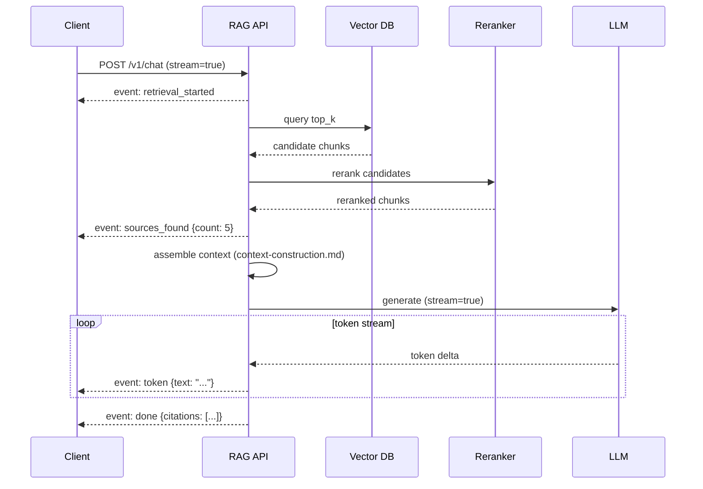

# Streaming RAG

## Why This Matters

RAG pipelines are inherently slow compared to a plain chat completion — before the LLM can generate a single token, you've already paid the latency cost of retrieval, possibly reranking, and context assembly (see [Retrieval](retrieval.md), [Reranking](reranking.md), and [Context Construction](context-construction.md)). If a user has to wait for retrieval *and* the full generation to complete before seeing anything, a RAG answer can feel dramatically slower than a plain chat response, even when the actual token generation speed is identical. Streaming — a technique already covered for plain LLM calls in [Streaming LLM Responses](../14-ai-api-engineering/streaming-llm-responses.md) — becomes even more important in RAG specifically because there's extra non-streamable latency stacked in front of generation, and the UX has to account for both stages, not just one.

## Core Concept

**Streaming RAG** means streaming the final LLM response token-by-token to the client as soon as generation begins, rather than waiting for the complete answer — but the RAG-specific nuance is that retrieval and reranking are **not themselves streamable** in the token sense; they're discrete operations that either complete or they don't. This creates a two-phase latency profile unique to RAG:

1. **Retrieval phase** (blocking, not streamable) — query embedding, vector search, optional reranking, context assembly. This is pure "dead air" from the user's perspective unless you deliberately surface it.
2. **Generation phase** (streamable) — once context is assembled and the LLM call begins, tokens can stream back exactly as in any other LLM call.

The core engineering decision in streaming RAG is what to do about phase 1's latency: hide it behind a loading state, surface it as visible progress ("Searching documents...", "Found 5 relevant sections..."), or in more advanced architectures, begin streaming *before* retrieval fully completes by overlapping stages where possible. All three are legitimate choices depending on your latency profile and UX goals — but a system that streams generation beautifully while leaving retrieval as an unexplained multi-second silence has only solved half the perceived-latency problem.

## Mental Model

Think of streaming RAG like **ordering food at a restaurant with an open kitchen versus a closed one**. A closed kitchen (no streaming, no retrieval visibility) makes you wait in silence until the entire meal arrives — you have no idea if anything is happening. A kitchen that streams only the final plating (generation streaming, but silent retrieval) shows you the food being assembled once cooking starts, but you still stood there wondering what was happening during the earlier prep work. An open kitchen with visible prep (streaming both retrieval progress and generation) lets you see the chef pull ingredients ("searching the pantry... found the right recipe cards") before you see the food being plated token by token — the total time to your first bite might be identical, but the *perceived* wait is dramatically shorter because you're never staring at an unexplained blank state.

## How It Works

1. **Client opens a streaming connection** — typically Server-Sent Events (SSE) or a chunked HTTP response, matching the pattern in [Streaming LLM Responses](../14-ai-api-engineering/streaming-llm-responses.md).
2. **Server performs retrieval** — during this phase, the server can optionally emit intermediate progress events (`retrieval_started`, `chunks_found`) over the same stream, giving the client something to render immediately instead of a blank wait.
3. **Server performs reranking (if used)** and **context construction** — again optionally emitting a progress event once complete.
4. **Server begins the LLM call with `stream=True`** and forwards each token/delta event to the client as it arrives from the model provider.
5. **Server emits a final event** containing structured metadata — which sources were used, citation mappings — once generation completes, since this metadata often isn't naturally embedded in the streamed text itself.
6. **Client renders progressively** — showing retrieval status first, then the answer appearing token-by-token, then finalizing citations once the stream closes.

The key architectural point: this is typically implemented as **one continuous SSE stream carrying multiple event types** (`retrieval`, `token`, `citation`, `done`), not separate requests for each phase — a single connection kept open across the whole pipeline avoids the overhead and complexity of the client managing multiple sequential requests.

## Architecture



## Request / Response Example

```http
POST /v1/chat/stream HTTP/1.1
Host: api.example.com
Authorization: Bearer sk_live_abc123
Content-Type: application/json
Accept: text/event-stream

{
  "query": "how long do I have to return a digital purchase",
  "collection": "employee-handbook",
  "stream": true
}
```

```http
HTTP/1.1 200 OK
Content-Type: text/event-stream
Cache-Control: no-cache
Connection: keep-alive

event: retrieval_started
data: {"query": "how long do I have to return a digital purchase"}

event: sources_found
data: {"count": 2, "top_score": 0.94}

event: token
data: {"text": "Digital"}

event: token
data: {"text": " purchases"}

event: token
data: {"text": " are"}

event: token
data: {"text": " non-refundable"}

event: done
data: {"citations": [{"document": "Employee Handbook", "section": "4.3", "page": 12}], "finish_reason": "stop"}
```

## Code Example

```python
import json
import os
from fastapi import FastAPI
from fastapi.responses import StreamingResponse
from pydantic import BaseModel

app = FastAPI()


class StreamChatRequest(BaseModel):
    query: str
    collection: str


def sse_event(event: str, data: dict) -> str:
    # SSE format: each event is "event: <name>\ndata: <json>\n\n"
    return f"event: {event}\ndata: {json.dumps(data)}\n\n"


async def rag_stream(request: StreamChatRequest):
    # Phase 1: retrieval — not token-streamable, but we emit progress events
    # so the client isn't staring at a blank screen during this latency.
    yield sse_event("retrieval_started", {"query": request.query})

    candidates = await hybrid_retrieve(  # from retrieval.md
        query=request.query, collection=request.collection, top_k=20
    )
    reranked = await rerank(request.query, [c.text for c in candidates], top_n=5)  # reranking.md

    yield sse_event("sources_found", {"count": len(reranked)})

    context_block, chunks_included, tokens_used = assemble_context(  # context-construction.md
        chunks=reranked, max_context_tokens=1500
    )

    # Phase 2: generation — this part streams natively from the LLM provider
    citations = []
    async for delta in call_llm_streaming(query=request.query, context=context_block):
        if delta.get("type") == "text":
            yield sse_event("token", {"text": delta["text"]})
        elif delta.get("type") == "citation":
            citations.append(delta["citation"])

    yield sse_event("done", {"citations": citations, "finish_reason": "stop"})


@app.post("/v1/chat/stream")
async def stream_chat(request: StreamChatRequest):
    return StreamingResponse(
        rag_stream(request),
        media_type="text/event-stream",
        headers={"Cache-Control": "no-cache", "X-Accel-Buffering": "no"},
    )
```

## Production Considerations

- **Time-to-first-token (TTFT) in RAG includes retrieval latency** — unlike plain chat, RAG's TTFT is retrieval time + reranking time + context assembly time + the LLM's own TTFT; measure and report this combined number, not just the LLM provider's TTFT in isolation.
- **Progress events reduce perceived latency even when they don't reduce actual latency** — emitting `retrieval_started`/`sources_found` costs almost nothing but meaningfully improves UX during the unavoidable retrieval delay.
- **Reverse proxies must not buffer SSE** — a proxy or load balancer configured to buffer responses will defeat streaming entirely, turning it back into a single delayed response; explicitly disable response buffering for streaming endpoints (e.g., `X-Accel-Buffering: no` for nginx).
- **Citations often arrive after the text they reference** — since final citation metadata is typically only fully known once generation completes (or via provider-specific inline citation events), design the client to render citations as a final annotation pass rather than assuming they're available token-by-token.
- **Client disconnects mid-stream**: cancel the underlying LLM call and release resources promptly when the client drops the connection, rather than continuing to generate (and pay for) a response nobody will see.

## Common Mistakes

- Streaming only the generation phase and leaving retrieval as an unexplained loading spinner, missing an easy UX win.
- Buffering the entire response at a reverse proxy or API gateway layer, silently defeating the streaming benefit end-to-end.
- Not handling client disconnects, continuing to consume LLM tokens (and cost) for a stream nobody is reading.
- Assuming citations are available before generation starts and trying to stream them inline as tokens, when they're often only fully resolved at the end.
- Treating retrieval latency as negligible during load testing with small local test collections, then discovering it dominates end-to-end latency at production data scale.

## Best Practices

- Use a single multi-event SSE stream carrying retrieval progress, generation tokens, and final metadata, rather than separate sequential requests.
- Explicitly disable buffering on every layer between your server and the client (reverse proxy, CDN, API gateway).
- Measure and alert on end-to-end TTFT (including retrieval), not just LLM-reported TTFT, since that's what the user actually experiences.
- Design the client to gracefully render partial state (streaming text with citations appended at the end) rather than waiting for a fully-formed response.

## AI Engineering Perspective

Streaming RAG interacts directly with agent design in [Part 17](../17-ai-agents-and-mcp/README.md): an agent that performs multiple retrieval hops within a single turn compounds the non-streamable retrieval latency across each hop, so agentic RAG systems benefit even more from surfaced progress events (e.g., "searching documents (step 2 of 3)...") than single-hop RAG does, precisely because the dead-air problem is multiplied. It also intersects with cost/latency tuning from [Part 15](../15-production-ai-systems/README.md): streaming doesn't reduce total tokens generated or total retrieval calls made, so it's purely a perceived-latency and UX optimization — teams sometimes mistakenly treat "we added streaming" as equivalent to "we made the pipeline faster," when the actual retrieval and reranking latency, and their associated cost, are unchanged and still need separate optimization.

## Exercises

**Beginner**: List the SSE event types you'd emit for a RAG chat endpoint and describe what UI state each one should trigger on the client.

**Intermediate**: Modify the `rag_stream` code example to handle a client disconnect by cancelling the in-flight LLM call rather than letting it run to completion.

**Advanced**: Design a streaming architecture for a multi-hop agentic RAG system where each hop's retrieval progress and any intermediate reasoning tokens are streamed to the client, while keeping the event schema stable enough for the client to render without knowing how many hops will occur in advance.

## Key Takeaways

- RAG has a non-streamable retrieval phase and a streamable generation phase; treat both explicitly in your UX rather than optimizing only the generation stream.
- A single multi-event SSE stream (progress events + token events + a final metadata event) is the standard pattern for streaming RAG.
- Streaming reduces perceived latency, not actual retrieval or token cost — don't conflate the two when reasoning about performance.
- Reverse proxy buffering is a common, easy-to-miss way streaming silently breaks in production.

---
**Previous**: [Context Construction](context-construction.md) · **Next**: [Async Document Processing](async-document-processing.md)
