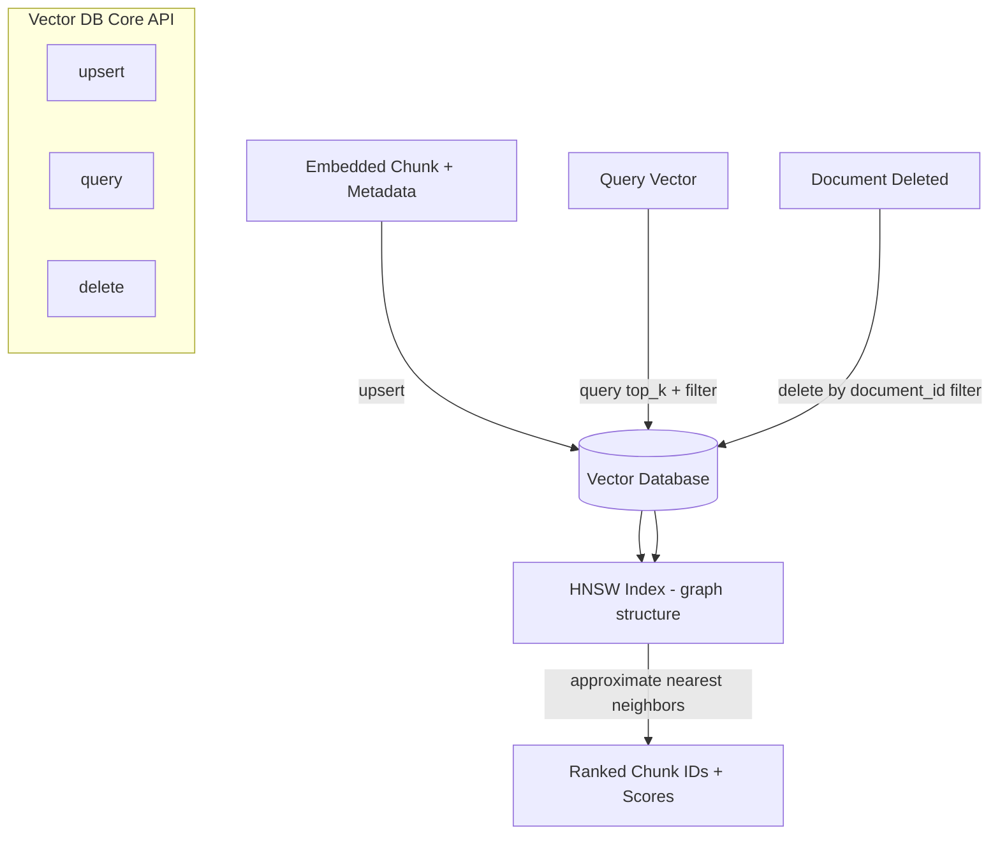

# Vector Database APIs

## Why This Matters

Once you have embeddings (see [Embedding APIs](embedding-apis.md)) for millions of chunks, you face a problem a regular relational database was never built to solve efficiently: "find the K vectors closest to this query vector" across millions of high-dimensional points, in milliseconds, repeatedly, under load. A naive approach — compute cosine similarity between the query and *every* stored vector, then sort — is `O(n)` per query and becomes untenable well before you reach a million vectors. Vector databases exist specifically to make this operation fast at scale using approximate nearest-neighbor indexing, and understanding what they provide beyond "a table with a vector column" is essential to designing a RAG system that stays fast as your document corpus grows from thousands to millions of chunks.

## Core Concept

A **vector database** is a data store purpose-built for storing high-dimensional vectors alongside metadata and performing fast **approximate nearest neighbor (ANN)** search — finding the vectors most similar to a query vector without exhaustively comparing against every stored vector. The "approximate" is deliberate and important: exact nearest-neighbor search at scale is too slow to be useful, so vector databases trade a small amount of recall (occasionally missing the true single-best match) for orders-of-magnitude speed improvements, using specialized index structures.

The most common index family used today is **HNSW (Hierarchical Navigable Small World)**. Conceptually, HNSW builds a multi-layered graph where each vector is a node, and nodes are connected to their approximate nearest neighbors. The top layer is sparse with long-range connections (like highways connecting distant cities), and each layer below is progressively denser with shorter-range connections (like local roads). A search starts at the top layer, greedily hops toward nodes closer to the query vector, then drops down a layer and repeats with finer granularity — narrowing in on the true nearest neighbors in roughly logarithmic time relative to the total number of vectors, rather than linear time. This is conceptually similar to how you'd navigate a city by first taking a highway toward the right neighborhood, then local streets to the right block, then walking to the right door — you don't check every building in the city.

A vector database's core API surface, regardless of vendor, converges on the same handful of operations: **upsert** (insert or update a vector + its metadata + an ID), **query** (find the top-K nearest vectors to a given query vector, optionally filtered by metadata), and **delete** (remove a vector by ID or by metadata filter). Everything else — namespaces/collections, hybrid search, filtering syntax — is built on top of that core.

## Mental Model

Think of a vector database like a **library that's organized by meaning instead of by title or author**. In a regular database, finding a book means knowing its exact title, ISBN, or author (an exact key lookup) — the equivalent of scanning a card catalog for an exact match. A vector database instead lets you walk in holding a book you liked and ask "give me the 5 books most similar in *content* to this one," and the librarian (the HNSW index) doesn't check every book on every shelf — they use a mental map of how books relate to each other, honed from experience, to walk directly toward the right section and pull out close matches quickly, occasionally missing the single most similar book somewhere obscure in exchange for not having to check the whole library every time.

## How It Works

1. **Upsert**: when a chunk is embedded (see [Embedding APIs](embedding-apis.md)), it's upserted into the vector database as a record containing an ID, the vector itself, the original chunk text (often stored alongside for convenience, since you need to return it), and metadata (document ID, section, tenant, tags).
2. **Indexing**: the database incrementally builds/updates its ANN index (e.g., HNSW graph) as vectors are upserted — this happens in the background and is why some vector databases have "eventual consistency" between an upsert and that vector becoming searchable.
3. **Query**: at retrieval time, the query vector is compared against the index (not the raw data) to find the top-K approximate nearest neighbors, optionally narrowed first or after by a metadata filter (e.g., `tenant_id = "acme-corp"`).
4. **Delete**: when a document is removed or re-processed, its associated chunk vectors must be deleted by ID or by a metadata filter (e.g., all chunks where `document_id = "doc_71ab90"`) so stale content doesn't keep surfacing in retrieval.

Most production vector databases also support **namespaces or collections** — logically separate indexes within the same database instance, commonly used to isolate tenants or environments (staging vs. production) without needing separate infrastructure.

## Architecture



## Request / Response Example

**Upsert vectors:**

```http
POST /v1/collections/employee-handbook/upsert HTTP/1.1
Host: vectordb.example.com
Authorization: Bearer sk_live_abc123
Content-Type: application/json

{
  "vectors": [
    {
      "id": "doc_71ab90_c0",
      "values": [0.0123, -0.0456, "...", 0.0021],
      "metadata": {
        "document_id": "doc_71ab90",
        "chunk_index": 0,
        "section": "4.2",
        "tenant_id": "acme-corp",
        "text": "Section 4.2 Refund Policy: Customers may request a refund within 30 days..."
      }
    }
  ]
}
```

```http
HTTP/1.1 200 OK
Content-Type: application/json

{"upserted_count": 1, "status": "ok"}
```

**Query for similar vectors:**

```http
POST /v1/collections/employee-handbook/query HTTP/1.1
Authorization: Bearer sk_live_abc123
Content-Type: application/json

{
  "vector": [0.0110, -0.0480, "...", 0.0019],
  "top_k": 3,
  "filter": {"tenant_id": "acme-corp"},
  "include_metadata": true
}
```

```http
HTTP/1.1 200 OK
Content-Type: application/json

{
  "matches": [
    {"id": "doc_71ab90_c0", "score": 0.912, "metadata": {"section": "4.2", "document_id": "doc_71ab90", "text": "Section 4.2 Refund Policy: ..."}},
    {"id": "doc_88cd41_c3", "score": 0.847, "metadata": {"section": "2.1", "document_id": "doc_88cd41", "text": "Section 2.1 Return Windows: ..."}},
    {"id": "doc_71ab90_c1", "score": 0.803, "metadata": {"section": "4.3", "document_id": "doc_71ab90", "text": "Section 4.3 Exceptions: ..."}}
  ]
}
```

## Code Example

```python
import os
from dataclasses import dataclass
from typing import Any, Protocol


@dataclass
class VectorRecord:
    id: str
    values: list[float]
    metadata: dict[str, Any]


@dataclass
class QueryMatch:
    id: str
    score: float
    metadata: dict[str, Any]


class VectorStore(Protocol):
    """Generic interface so the rest of the app doesn't depend on a specific
    vector DB vendor's SDK — swap implementations without touching callers."""

    async def upsert(self, collection: str, records: list[VectorRecord]) -> int: ...
    async def query(
        self, collection: str, vector: list[float], top_k: int, filter: dict | None = None
    ) -> list[QueryMatch]: ...
    async def delete(self, collection: str, filter: dict) -> int: ...


class PineconeStyleVectorStore:
    """Example adapter implementing VectorStore against an HTTP vector DB API.
    Swap this class for another provider's adapter without changing callers."""

    def __init__(self, base_url: str, api_key: str | None = None):
        self.base_url = base_url
        self.api_key = api_key or os.environ["VECTOR_DB_API_KEY"]  # never hardcode

    async def upsert(self, collection: str, records: list[VectorRecord]) -> int:
        import httpx

        payload = {
            "vectors": [
                {"id": r.id, "values": r.values, "metadata": r.metadata} for r in records
            ]
        }
        async with httpx.AsyncClient() as client:
            resp = await client.post(
                f"{self.base_url}/v1/collections/{collection}/upsert",
                headers={"Authorization": f"Bearer {self.api_key}"},
                json=payload,
                timeout=30.0,
            )
            resp.raise_for_status()
            return resp.json()["upserted_count"]

    async def query(
        self, collection: str, vector: list[float], top_k: int = 5, filter: dict | None = None
    ) -> list[QueryMatch]:
        import httpx

        payload = {"vector": vector, "top_k": top_k, "include_metadata": True}
        if filter:
            payload["filter"] = filter  # e.g. {"tenant_id": "acme-corp"}

        async with httpx.AsyncClient() as client:
            resp = await client.post(
                f"{self.base_url}/v1/collections/{collection}/query",
                headers={"Authorization": f"Bearer {self.api_key}"},
                json=payload,
                timeout=15.0,
            )
            resp.raise_for_status()
            data = resp.json()
            return [QueryMatch(**m) for m in data["matches"]]

    async def delete(self, collection: str, filter: dict) -> int:
        import httpx

        async with httpx.AsyncClient() as client:
            resp = await client.post(
                f"{self.base_url}/v1/collections/{collection}/delete",
                headers={"Authorization": f"Bearer {self.api_key}"},
                json={"filter": filter},  # e.g. {"document_id": "doc_71ab90"}
                timeout=15.0,
            )
            resp.raise_for_status()
            return resp.json().get("deleted_count", 0)
```

## Production Considerations

- **Index build lag**: many vector databases index asynchronously — a vector that was just upserted may not be immediately queryable. If your ingestion status reporting (see [Document Ingestion APIs](document-ingestion-apis.md)) marks a document "complete" before indexing catches up, you get a window where recently uploaded documents don't show up in search.
- **Filtering cost**: metadata filtering can be applied before or after the ANN search depending on the vector database's implementation — pre-filtering (narrow the candidate set first) is generally cheaper for highly selective filters (e.g., a specific tenant with few documents) than post-filtering a broad top-K result.
- **Recall vs. speed tuning**: HNSW and similar indexes expose tunable parameters (e.g., search breadth) that trade recall for latency — production systems typically benchmark this trade-off against real query/document sets rather than accepting defaults blindly.
- **Deletion hygiene**: always delete old chunk vectors when a document is deleted or reprocessed; orphaned vectors silently pollute retrieval results indefinitely.
- **Namespace/collection isolation**: use collections or namespaces to hard-isolate tenants at the storage layer, not just via a metadata filter that a bug could accidentally omit.

## Common Mistakes

- Relying solely on metadata filters for tenant isolation instead of using separate namespaces/collections as a stronger isolation boundary — one missing filter clause becomes a cross-tenant data leak.
- Not deleting stale vectors when documents are updated or removed, leaving outdated or duplicate content in retrieval results indefinitely.
- Treating upsert as synchronous-and-immediately-queryable when the underlying index build is asynchronous, causing "why isn't my just-uploaded document searchable yet" confusion.
- Storing the full chunk text only in the vector database with no separate source of truth, making it hard to re-index or audit without re-parsing original documents.
- Choosing `top_k` far larger than needed "just in case," increasing latency and context-window pressure downstream in [context construction](context-construction.md).

## Best Practices

- Treat the vector database as a derived index, not a system of record — keep chunk text and metadata recoverable from your primary metadata store so you can rebuild the vector index if needed.
- Always scope queries and deletes with tenant/collection identifiers, defense-in-depth alongside namespace isolation.
- Monitor index lag (time between upsert and queryability) as an operational metric, especially for latency-sensitive ingestion-to-search workflows.
- Abstract the vector database behind an interface (as shown in the code example) so you can benchmark or migrate providers without rewriting application logic.

## AI Engineering Perspective

The vector database's `top_k` and filter parameters are effectively parameters an [AI agent](../17-ai-agents-and-mcp/README.md) or your application logic tunes dynamically based on the task — a quick factual lookup might use `top_k=3` with tight filters, while a broad research query might use `top_k=20` and rely more heavily on [reranking](reranking.md) to sort signal from noise before it ever reaches the LLM's context window. It's also worth recognizing that vector database query latency is additive to your overall RAG response latency — in a [streaming RAG](streaming-rag.md) architecture, this query typically has to complete *before* the LLM call can begin, making it one of the few genuinely blocking, non-streamable stages in the entire pipeline, and therefore a prime target for latency optimization (index tuning, smaller `top_k`, caching frequent queries).

## Exercises

**Beginner**: Explain in your own words why exact nearest-neighbor search doesn't scale to millions of vectors, and why "approximate" is an acceptable trade-off for most RAG use cases.

**Intermediate**: Design the metadata schema for a multi-tenant vector database collection that needs to support filtering by tenant, document type, and date range.

**Advanced**: Design a zero-downtime re-indexing strategy for migrating from one HNSW parameter configuration to another (e.g., changing search-breadth settings) on a live collection serving production queries.

## Key Takeaways

- Vector databases provide fast approximate nearest-neighbor search over high-dimensional vectors, something exhaustive comparison cannot do efficiently at scale.
- HNSW-style indexes navigate a multi-layer graph to narrow toward nearest neighbors in roughly logarithmic time, trading a small amount of recall for large speed gains.
- The core API surface — upsert, query, delete — is consistent across vendors; abstract it behind an interface for portability.
- Index build lag, deletion hygiene, and tenant isolation are the operational details that separate a working demo from a safe production system.

---
**Previous**: [Embedding APIs](embedding-apis.md) · **Next**: [Retrieval](retrieval.md)
