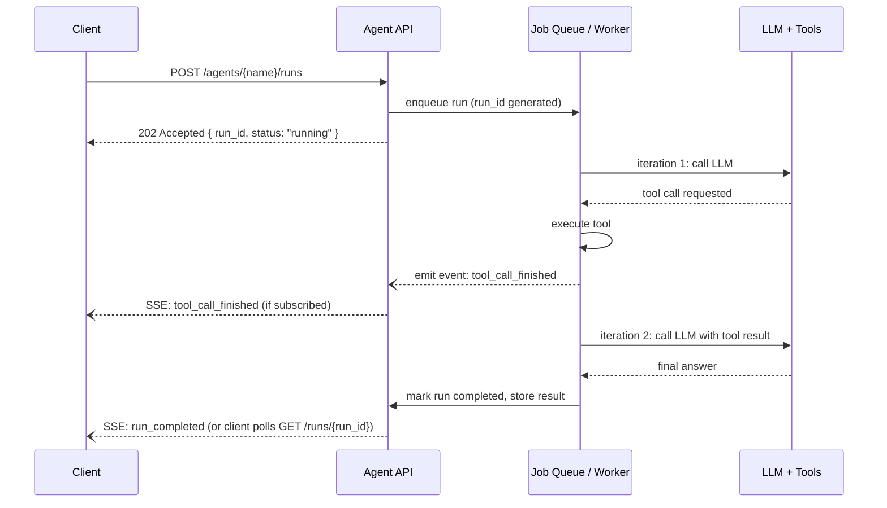

# Agent APIs

## Why This Matters

An agent loop (see [Agent Architecture](agent-architecture.md)) might take 5 iterations and 20 seconds to finish — or 15 iterations and two minutes if a tool is slow or the model needs to backtrack. A conventional REST endpoint that opens a connection, blocks until the work is done, and returns one JSON body was designed for handlers that finish in tens or hundreds of milliseconds. Exposing an agent this way works, but it strains every assumption your HTTP stack, load balancer, and client code make about "how long is a request allowed to take."

Designing an **agent API** means deciding, deliberately, how a client waits for a variable-length, multi-step process, and how much visibility it gets into the intermediate steps while waiting. This chapter covers the three shapes that show up in production: synchronous, asynchronous/job-based, and streaming.

## Core Concept

An agent API is the HTTP contract around an agent loop. It has to answer three questions that a normal CRUD endpoint doesn't:

1. **How long can/should the client wait on one connection?** (sync vs async)
2. **Does the client see intermediate steps, or only the final answer?** (streaming vs non-streaming)
3. **Can the client cancel, inspect, or resume a run that's in progress?** (run lifecycle management)

There is no single correct answer — the right shape depends on expected latency, client type (a chat UI vs. a backend-to-backend integration), and whether the agent might need human input mid-run (see [Agent Security and Guardrails](agent-security-and-guardrails.md)).

## Mental Model

Think of the three patterns as mirroring three familiar things you already know:

- **Sync request/response** is like calling a function and waiting for `return`. Simple, but the caller is blocked the whole time — fine for short agent runs (a few seconds), risky for long ones (timeouts, wasted connections).
- **Async job pattern** is like submitting a print job: you get a ticket (`job_id`) immediately, and you come back later to check if it's done or to collect the result. This is the standard pattern from [Part 8 — Async Systems](../08-async-systems/README.md) applied to agents.
- **Streaming intermediate steps** is like watching a build log scroll by instead of just waiting for "build succeeded." The client gets partial visibility into what the agent is doing (which tool it's calling, its intermediate reasoning) without needing to poll.

Most production agent products (support bots, coding assistants) actually combine two of these: a job is created (async), and the client subscribes to a stream of events on that job (streaming) rather than polling.

## How It Works

**Sync pattern**: the client sends `POST /agents/{name}/runs`, the server runs the full agent loop internally, and only returns the HTTP response once the loop terminates. Simple to implement and simple to consume, but every layer in between (browser, proxy, load balancer, framework) needs a timeout longer than your worst-case agent run, and the client can't see progress or cancel early.

**Async job pattern**: `POST /agents/{name}/runs` immediately returns `202 Accepted` with a `run_id` and a `status: "running"`. The agent loop executes in a background worker (see [Part 8](../08-async-systems/README.md) on background tasks and job queues). The client polls `GET /agents/{name}/runs/{run_id}` — or, better, subscribes to updates — until `status` becomes `completed`, `failed`, or `awaiting_input`.

**Streaming pattern**: instead of (or in addition to) polling, the server pushes events as they happen using Server-Sent Events or WebSocket (see [Part 9 — Real-Time APIs](../09-realtime-and-webhooks/README.md)). Each event corresponds to one step of the agent loop: `tool_call_started`, `tool_call_finished`, `reasoning_chunk`, `final_answer`. This is what powers the "the assistant is searching the web... now reading the results... now writing a response" experience in modern chat products.

A well-designed agent API often layers these: creating a run is always async (you get a `run_id` back immediately, even if the underlying loop happens to finish fast), and the client chooses to either poll the run's status endpoint or open a stream for live updates.

## Architecture



## Request / Response Example

**Creating a run (async pattern):**

```http
POST /agents/research-assistant/runs HTTP/1.1
Content-Type: application/json
Authorization: Bearer sk_live_...

{
  "input": "Summarize the top 3 competitors to our product and their pricing.",
  "stream": false
}
```

```http
HTTP/1.1 202 Accepted
Content-Type: application/json
Location: /agents/research-assistant/runs/run_7c31

{
  "run_id": "run_7c31",
  "status": "running",
  "created_at": "2026-08-18T14:02:01Z"
}
```

**Polling for the result:**

```http
GET /agents/research-assistant/runs/run_7c31 HTTP/1.1
Authorization: Bearer sk_live_...
```

```http
HTTP/1.1 200 OK
Content-Type: application/json

{
  "run_id": "run_7c31",
  "status": "completed",
  "steps": 4,
  "output": "Competitor A prices at $29/mo... Competitor B... Competitor C...",
  "tool_calls": ["web_search", "web_search", "fetch_page", "summarize"],
  "finished_at": "2026-08-18T14:02:19Z"
}
```

**Streaming variant** (`stream: true`) upgrades the initial response to `text/event-stream` and pushes one event per agent-loop step:

```
event: tool_call_started
data: {"tool": "web_search", "args": {"query": "competitor pricing"}}

event: tool_call_finished
data: {"tool": "web_search", "result_summary": "3 results found"}

event: final_answer
data: {"output": "Competitor A prices at $29/mo..."}
```

## Code Example

```python
from fastapi import FastAPI, BackgroundTasks, HTTPException
from pydantic import BaseModel
from uuid import uuid4
from enum import Enum

app = FastAPI()

# In production this is Redis / a database, not an in-memory dict —
# an in-memory store won't survive a restart or work across multiple workers.
RUNS: dict[str, dict] = {}


class RunStatus(str, Enum):
    RUNNING = "running"
    COMPLETED = "completed"
    FAILED = "failed"


class CreateRunRequest(BaseModel):
    input: str


@app.post("/agents/{agent_name}/runs", status_code=202)
def create_run(agent_name: str, body: CreateRunRequest, background_tasks: BackgroundTasks):
    run_id = f"run_{uuid4().hex[:8]}"
    RUNS[run_id] = {"status": RunStatus.RUNNING, "output": None, "steps": 0}

    # Hand the actual agent loop off to a background task so this HTTP
    # handler returns immediately instead of blocking for the full run.
    background_tasks.add_task(execute_agent_run, run_id, agent_name, body.input)

    return {"run_id": run_id, "status": RunStatus.RUNNING}


@app.get("/agents/{agent_name}/runs/{run_id}")
def get_run(agent_name: str, run_id: str):
    run = RUNS.get(run_id)
    if run is None:
        raise HTTPException(status_code=404, detail="run not found")
    return {"run_id": run_id, **run}


def execute_agent_run(run_id: str, agent_name: str, user_input: str):
    """Runs in the background. In production this should be a durable
    worker (Celery/RQ/arq job) rather than an in-process background task,
    so a crashed server doesn't silently lose in-flight runs."""
    try:
        # run_agent() is the loop from agent-architecture.md
        result = run_agent(user_input, tools=[], tool_impls={})
        RUNS[run_id].update(status=RunStatus.COMPLETED, output=result)
    except Exception as exc:
        RUNS[run_id].update(status=RunStatus.FAILED, output=str(exc))
```

## Production Considerations

- **`FastAPI.BackgroundTasks` is not durable** — it runs in the same process and is lost on crash/restart. For real workloads, use a proper job queue (Celery, RQ, arq — see [Part 8](../08-async-systems/README.md)) so a run can be retried or resumed after a deploy.
- **Idempotency matters at creation time**: if a client retries `POST /runs` after a timeout, you don't want to accidentally start the same expensive agent run twice. Support an idempotency key (see [Part 6 — Production API Reliability](../06-production-reliability/README.md)).
- **Long HTTP connections need infrastructure support**: SSE/WebSocket connections held open for minutes need load balancer and proxy timeouts configured accordingly, and need to survive worker restarts gracefully (reconnect + resume from last event).
- **Cancellation** is often overlooked: give clients a `POST /runs/{run_id}/cancel` endpoint, and make sure the background worker actually checks for cancellation between loop iterations rather than running to completion regardless.
- **Rate and cost limits per run and per user** should be enforced at the API layer, not just inside the loop — see [Agent Security and Guardrails](agent-security-and-guardrails.md).

## Common Mistakes

- Using a plain synchronous endpoint for an agent that can run 30+ seconds, and then fighting timeout errors at every layer of the stack instead of switching to the async pattern.
- Polling too aggressively (every 100ms) instead of using exponential backoff or, better, switching to a stream/webhook for the result.
- Losing run state on a server restart because it lived only in memory instead of a durable store.
- Not exposing `steps` or `tool_calls` in the response — this is often the first thing you need when debugging a bad answer in production.
- Forgetting cancellation entirely, so a user who closes the tab still burns tokens on a run nobody is waiting for.

## Best Practices

- Default to the **async job pattern** for anything that can take more than a couple of seconds — sync is only appropriate for latency-critical, short agent runs.
- Offer **streaming as an opt-in** (`stream: true`) on top of the async run so clients that want a live view can have one without forcing it on every caller.
- Always return a `run_id`, `status`, and step count/trace info — treat observability fields as part of the contract, not an afterthought.
- Provide cancellation and make workers cooperative (check a cancel flag between loop iterations).
- Version your agent API the same way you version any other API (see [Part 2 — REST API Design](../02-rest-api-design/README.md)) — agent behavior changes often as prompts and tools evolve, and callers need a stable contract.

## AI Engineering Perspective

Agent APIs are where "AI engineering" and "backend engineering" fully merge: the shape of the endpoint is a distributed-systems decision (sync vs async, at-least-once vs exactly-once run creation, streaming transport) applied to a non-deterministic, potentially slow, potentially expensive process. Teams that treat the agent as "just another endpoint" and reuse a synchronous request handler tend to hit the same wall: timeouts, no visibility, no way to cancel a runaway loop. Treating it like a background job with a durable status you can query — exactly the pattern used for video encoding or report generation — solves it with infrastructure you likely already understand.

## Exercises

**Beginner**: Sketch the request/response pair for a `POST /agents/{name}/runs/{run_id}/cancel` endpoint, including what `status` value the run should have afterward.

**Intermediate**: Extend the FastAPI code example to store runs in Redis instead of an in-memory dict, so state survives a server restart.

**Advanced**: Design an SSE event schema for an agent run that includes both tool-call events and a `awaiting_confirmation` event for a risky action (see [Agent Security and Guardrails](agent-security-and-guardrails.md)) that pauses the run until the client sends an approval back through a separate endpoint.

## Key Takeaways

- Sync request/response only works for short agent runs; anything longer needs the async job pattern (`run_id` + polling or streaming).
- Streaming intermediate steps (tool calls, partial reasoning) is what makes agent UIs feel responsive during a multi-second-to-multi-minute run.
- Run state must be durable (not just in-process memory) so runs survive restarts and can be queried, cancelled, or resumed.
- Treat step count, tool call list, and run status as first-class response fields — they're essential for debugging non-deterministic agent behavior.
