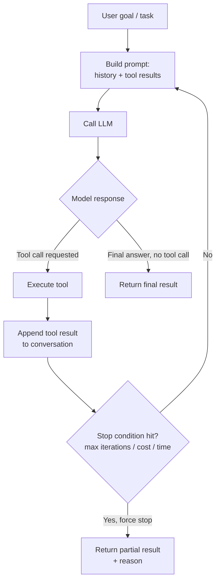

# Agent Architecture

## Why This Matters

Everything you learned in [Part 14](../14-ai-api-engineering/README.md) — chat completions, tool calling, structured outputs — gives you a model that can respond to a single prompt with a single answer, possibly requesting a tool call along the way. That's powerful, but it's still fundamentally a *one-shot* interaction: the caller sends a request, the model does one round of thinking, and control returns to the caller.

Many real problems don't fit in one shot. "Find the three cheapest flights to Tokyo next month, cross-reference them against my calendar, and draft an email to my manager requesting time off for the cheapest one that doesn't conflict" requires multiple tool calls, intermediate reasoning between them, and a decision about when the task is actually done. An **agent** is the architecture that makes that possible: a loop that lets a model use tools repeatedly, look at the results, and decide what to do next, until the task is finished.

Understanding this loop precisely — not as a buzzword, but as a concrete control-flow pattern — is the foundation for everything else in this part.

## Core Concept

An agent is a system that wraps an LLM in a **loop**: the model is repeatedly given the current state of the world (the conversation, tool results so far) and asked "given everything you know now, what's the next action?" The loop keeps running until the model decides the task is complete (or a limit is hit).

This is different from a single tool-calling completion in one crucial way: **the results of a tool call are fed back into another model call**, and the model gets to react to them. A single tool-calling request/response pair is not an agent — it's a function call. An agent is what you get when you keep doing that, in sequence, letting each result inform the next decision.

The classic formulation, borrowed from classical AI and robotics, is:

**Perceive → Plan → Act → Observe → Repeat**

- **Perceive**: gather the current state — the user's goal, conversation history, prior tool outputs.
- **Plan**: ask the model what to do next given that state (this is a single LLM call).
- **Act**: execute whatever the model decided — usually a tool call, sometimes a direct answer.
- **Observe**: capture the result of the action (tool output, error, external event).
- **Repeat**: feed the observation back into the next perceive step, until the model emits a final answer or a stop condition is reached.

## Mental Model

Think of the difference between a **calculator** and an **assistant with a calculator**.

A calculator (a single LLM call with tool calling) takes one expression and returns one result. If you need three calculations chained together where the second depends on the first, you — the caller — have to orchestrate that yourself, calling the model three separate times and stitching the logic together.

An assistant with a calculator (an agent) is handed the *goal* ("figure out how much I'll owe in taxes if I make X and deduct Y") and decides on its own how many calculations it needs, in what order, adjusting its plan based on intermediate results — without you re-prompting it at each step.

Another useful mental model: a single LLM call is a **function**. An agent is a **while loop around that function**, with the function's own output feeding back in as its next input.

## How It Works

Concretely, an agent loop does the following on every iteration:

1. Build a prompt (system instructions + conversation history + tool results so far).
2. Call the LLM with the list of available tools.
3. Inspect the response:
   - If the model returned a tool call (or several), execute the tool(s) (see [Tool Execution](tool-execution.md)) and append the results to the conversation as tool-role messages.
   - If the model returned a final text answer with no tool calls, the loop ends — that's the result.
4. Check stop conditions before looping again: has a maximum iteration count been reached? A cost or time budget? Did the model ask for confirmation on a risky action (see [Agent Security and Guardrails](agent-security-and-guardrails.md))?
5. If none of the stop conditions fire and the model requested tools, go back to step 1 with the updated conversation.

The key engineering insight is that **the entire conversation history (including every tool call and result) is replayed to the model on every iteration**. Nothing is implicitly remembered between calls — the LLM API is stateless per request. This has real cost and latency implications: a 10-step agent loop on a long conversation re-sends (and re-bills you for) the accumulated history on every single step. This is why [Memory Systems](memory-systems.md) and prompt caching (see [Part 15](../15-production-ai-systems/README.md)) matter so much for agents specifically.

## Architecture



The loop is simple to draw but the engineering complexity lives in the edges: what happens when a tool errors, what happens when the model calls a tool with bad arguments, what happens when the loop runs 40 iterations without converging. Those are covered in the next few chapters.

## Request / Response Example

Agents are usually exposed behind a single HTTP endpoint, even though internally they make several LLM calls. From the caller's perspective it can look as simple as this (see [Agent APIs](agent-apis.md) for streaming and async variants):

```http
POST /agents/travel-assistant/runs HTTP/1.1
Host: api.example.com
Content-Type: application/json
Authorization: Bearer sk_live_...

{
  "input": "Find the cheapest flight to Tokyo next month that doesn't conflict with my calendar, and draft an email to my manager requesting the time off.",
  "user_id": "usr_8213"
}
```

```http
HTTP/1.1 200 OK
Content-Type: application/json

{
  "run_id": "run_9f2a",
  "status": "completed",
  "output": "I found a flight on the 14th for $412 that's clear on your calendar, and drafted an email to your manager — see draft draft_774.",
  "steps": 5,
  "tool_calls": ["search_flights", "get_calendar_events", "search_flights", "check_conflict", "draft_email"]
}
```

Note the `steps` and `tool_calls` fields — a well-designed agent API surfaces how many loop iterations it took, which is essential for debugging and cost analysis.

## Code Example

```python
import json
from openai import OpenAI  # any tool-calling-capable client works similarly

client = OpenAI()

MAX_ITERATIONS = 8  # hard cap: never let the loop run forever

def run_agent(user_goal: str, tools: list[dict], tool_impls: dict) -> str:
    """
    A minimal agent loop.
    `tools` is the JSON-schema tool definitions passed to the model.
    `tool_impls` maps tool name -> a Python callable that executes it.
    """
    messages = [
        {"role": "system", "content": "You are a helpful assistant. Use tools when needed."},
        {"role": "user", "content": user_goal},
    ]

    for iteration in range(MAX_ITERATIONS):
        response = client.chat.completions.create(
            model="gpt-4.1",
            messages=messages,
            tools=tools,
        )
        message = response.choices[0].message
        messages.append(message.model_dump())

        # No tool calls means the model thinks it's done -> stop the loop.
        if not message.tool_calls:
            return message.content

        # Execute every tool call the model requested this turn.
        for call in message.tool_calls:
            fn_name = call.function.name
            fn_args = json.loads(call.function.arguments)

            try:
                result = tool_impls[fn_name](**fn_args)
                result_str = json.dumps(result)
            except Exception as exc:
                # Errors go BACK to the model as tool output, not raised —
                # the model needs a chance to recover (retry, ask user, etc.)
                result_str = json.dumps({"error": str(exc)})

            messages.append({
                "role": "tool",
                "tool_call_id": call.id,
                "content": result_str,
            })

    # Loop exhausted without a final answer -> fail loudly, don't guess.
    return "Agent stopped: exceeded maximum iterations without a final answer."
```

The load-bearing line is `for iteration in range(MAX_ITERATIONS)`. Without an explicit cap, a model that gets confused (bad tool result, ambiguous instructions) can loop indefinitely, burning tokens and money on every pass.

## Production Considerations

- **Cost is proportional to iterations × context size**, and context grows every iteration because tool results get appended. A 10-step agent on a 2,000-token conversation can easily send 20,000+ cumulative tokens by the last step. Budget for this explicitly (see [Part 15](../15-production-ai-systems/README.md) on cost tracking).
- **Latency compounds**: each iteration is a full LLM round-trip (hundreds of milliseconds to seconds) plus tool execution time. A 6-step agent can easily take 10-30 seconds — plan your API shape around that (see [Agent APIs](agent-apis.md)).
- **Determinism is low**: the same input can take a different number of steps, or a different path, on different runs. Don't design systems that assume a fixed step count.
- **Observability is not optional**: log every iteration (prompt, model output, tool calls, tool results) with a shared trace/run ID. When an agent misbehaves in production, this is the only way to diagnose why.

## Common Mistakes

- **No maximum iteration cap.** The single most common and most expensive agent bug. A model stuck retrying a failing tool call can loop until you hit a rate limit or a very large bill.
- **No cost or token budget ceiling**, separate from the iteration cap — a few iterations with huge tool outputs (e.g., dumping an entire file into context) can be as expensive as many small iterations.
- **Treating an agent like a deterministic function.** Callers sometimes assume the same input always takes the same path — it doesn't, and building brittle assertions around exact step counts or exact tool call order will break.
- **Reaching for an agent when a single tool call would do.** If the task is "look up the weather and tell me," that's one tool call, not a loop. Agents add latency, cost, and non-determinism — use them when the task genuinely requires multi-step, conditional reasoning.
- **Not distinguishing "stopped because done" from "stopped because it hit a limit."** Silently returning a truncated answer without signaling that the run was cut off misleads the caller.

## Best Practices

- Always set both a **max iteration count** and a **max token/cost budget**, and stop on whichever hits first.
- Return **why** the loop stopped (`completed`, `max_iterations`, `error`, `awaiting_confirmation`) as a structured field, not just prose.
- Log every step with a run ID so you can replay and debug a specific execution.
- Prefer the smallest number of well-designed tools over many overlapping ones — fewer choices per step means better model decisions (see [Tool Execution](tool-execution.md)).
- Ask "does this actually need to be an agent?" before building one. A fixed pipeline of 2-3 known steps is often more reliable, cheaper, and easier to debug than a fully autonomous loop.

## AI Engineering Perspective

The agent loop is the single most important mental model in this entire part — MCP, multi-agent systems, and memory systems are all refinements or extensions of this basic loop. When you evaluate any "agent framework" (LangChain, LlamaIndex agents, custom loops), ask exactly one question first: *what does their perceive-plan-act-observe loop actually look like, and where are the stop conditions?* Frameworks disagree wildly on abstractions but the underlying loop is always some variant of what's described here. If you can implement the loop by hand (as in the code example above), you can understand — and debug — any framework built on top of it.

## Exercises

**Beginner**: Trace through the code example by hand for a hypothetical `get_weather` tool call. Write out what `messages` looks like after each iteration for a 2-step run.

**Intermediate**: Modify the code example to also track and print cumulative token usage per iteration (`response.usage`), and stop the loop early if a token budget is exceeded — even if `MAX_ITERATIONS` hasn't been reached.

**Advanced**: Design (on paper) the stop-condition logic for an agent that books a restaurant reservation on the user's behalf. What conditions should force a stop and require human confirmation before the loop continues? Cross-reference [Agent Security and Guardrails](agent-security-and-guardrails.md).

## Key Takeaways

- An agent is a loop around an LLM call — perceive, plan, act, observe, repeat — not a single tool-calling request/response.
- The full conversation history, including every tool result, is replayed on every iteration, which drives up cost and latency as the loop grows.
- Always enforce a hard maximum iteration count and a cost/token budget — unbounded loops are the most common and most expensive agent bug.
- Not every task needs an agent; a single tool call or a fixed pipeline is often simpler, cheaper, and more reliable.
- See [Agent APIs](agent-apis.md) next for how to expose this loop as an HTTP endpoint, and [Tool Execution](tool-execution.md) for how the "Act" step is actually implemented safely.
