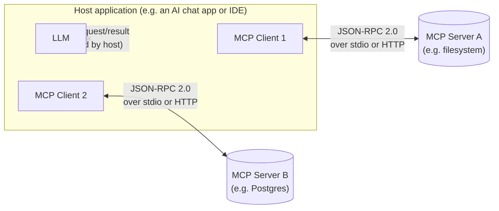
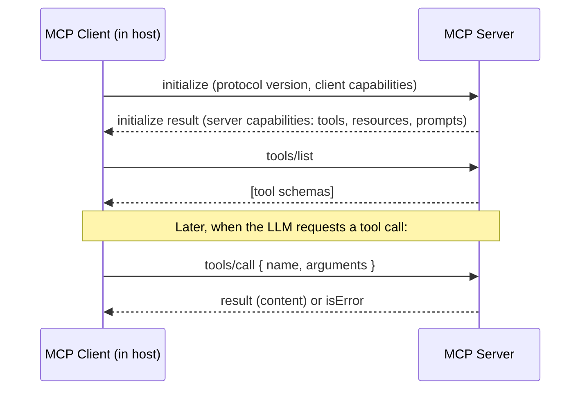

# MCP Architecture

## Why This Matters

By the time you've built two or three tool-using agents (see [Agent Architecture](agent-architecture.md) and [Tool Execution](tool-execution.md)), a pattern becomes obvious and annoying: every agent application re-implements the same glue code to connect an LLM to external systems — a Slack integration here, a database connector there, a filesystem tool somewhere else — and none of it is reusable across applications. If you build a "search our internal docs" tool for one agent, and someone else wants the same capability in a different agent (a different codebase, maybe a different company entirely), they have to write it again from scratch, hand-rolling the schema, the execution, the error handling.

The **Model Context Protocol (MCP)** exists to fix exactly this: it's an open, standardized protocol so that tool/data-source integrations can be built **once**, as an independent server, and used by **any** MCP-compatible AI application, the same way a REST API can be built once and consumed by any HTTP client. Anthropic introduced MCP in late 2024 specifically to solve this fragmentation problem for AI applications.

## Core Concept

MCP is a client-server protocol, transmitted over JSON-RPC 2.0, that standardizes how an AI application connects to external tools, data sources, and prompt templates. It defines three roles:

- **Host**: the AI application the user actually interacts with (a chat app, an IDE, an agent framework). The host embeds the LLM and decides, at the application level, which MCP servers to connect to.
- **Client**: a component *inside* the host that maintains a 1:1 connection to a single MCP server, speaking the MCP protocol on the host's behalf. A host with three MCP server connections runs three clients internally.
- **Server**: an independent process (local or remote) that exposes capabilities — tools, resources, and prompts (see [Tools, Resources, Prompts](tools-resources-prompts.md)) — over the MCP protocol, without knowing or caring which host is connecting to it.

This is deliberately analogous to how a browser (host) uses HTTP clients to talk to independent web servers, each of which has no idea what browser or client is calling it. MCP does for AI-tool integrations what HTTP + REST conventions did for web services: it lets the server side and the client side be built independently, by different people, as long as both sides speak the same protocol.

## Mental Model

The cleanest mental model is: **MCP is to AI tool integrations what a USB-C port is to peripherals.** Before a standard, every device needed its own bespoke cable and driver. USB-C means any compliant device can plug into any compliant port. MCP means any compliant AI application (host) can connect to any compliant tool/data server, and any tool/data server, once built, works with every compliant AI application — you don't rebuild the "Postgres connector" or the "GitHub connector" separately for every agent product that wants to use it.

A second useful comparison, since you already know REST deeply: **MCP is like a REST API, but purpose-built for LLM consumption and using a different wire protocol.** A REST endpoint exposes resources over HTTP verbs, documented (ideally) with OpenAPI, and any HTTP client can consume it, but the client has to already know the shape of each endpoint. MCP exposes tools, resources, and prompts over JSON-RPC, and — critically — the server tells the client what it offers at connection time (capability negotiation), so a generic MCP client can discover and use *any* MCP server's capabilities without being coded against that specific server in advance. This dynamic discovery is the main structural difference from a typical REST integration, where you hardcode which endpoints you call.

## How It Works

1. **Transport establishment**: the host's MCP client opens a connection to a server, either over `stdio` (the server is a local subprocess, communicating via stdin/stdout — common for local tools like filesystem or git access) or over HTTP (the server is a remote process, typically using HTTP POST with Server-Sent Events for streaming responses — common for hosted/shared servers). See [MCP Servers](mcp-servers.md) for transport specifics.
2. **Initialization handshake**: the client sends an `initialize` request declaring its protocol version and capabilities; the server responds with its own protocol version and the capabilities it supports (which primitives it offers: tools, resources, prompts, and any optional features). This is **capability negotiation** — neither side assumes what the other supports; they establish it explicitly at connection time.
3. **Discovery**: the client asks the server what's actually available — `tools/list`, `resources/list`, `prompts/list` — and gets back structured descriptions (names, JSON schemas for tool arguments, resource URIs). See [MCP Clients](mcp-clients.md) for the discovery flow in detail.
4. **Invocation**: when the host's LLM decides to use a capability (e.g., it wants to call a tool), the client sends a request like `tools/call` with the tool name and arguments, and the server executes it and returns a result — structurally the same request/response cycle as [Tool Execution](tool-execution.md) describes, just standardized over the wire instead of being an in-process function call.
5. **The host mediates everything**: the LLM itself never talks to the MCP server directly. The host's application code is what decides, based on the LLM's tool-call request, to route that call through the appropriate MCP client to the appropriate server, then feeds the result back into the LLM's context — exactly the same "Act" step from the [Agent Architecture](agent-architecture.md) loop, just backed by MCP servers instead of hand-written tool implementations.

## Architecture





## Request / Response Example

MCP messages are JSON-RPC 2.0. Here's the initialization handshake, framed exactly as it appears on the wire:

```json
// Client -> Server
{
  "jsonrpc": "2.0",
  "id": 1,
  "method": "initialize",
  "params": {
    "protocolVersion": "2025-06-18",
    "capabilities": {},
    "clientInfo": { "name": "example-host", "version": "1.0.0" }
  }
}
```

```json
// Server -> Client
{
  "jsonrpc": "2.0",
  "id": 1,
  "result": {
    "protocolVersion": "2025-06-18",
    "capabilities": {
      "tools": { "listChanged": true },
      "resources": {},
      "prompts": {}
    },
    "serverInfo": { "name": "postgres-mcp-server", "version": "0.4.0" }
  }
}
```

Note the shape: a `jsonrpc` version, a correlating `id`, and a `method`/`params` on the request matched by a `result` (or `error`) on the response — the same envelope every MCP message uses, whether it's initialization, discovery, or invocation.

## Code Example

MCP servers are normally built with an official SDK (Python, TypeScript, and others) rather than hand-rolled JSON-RPC — always check the official MCP SDK documentation for the exact, current API. This is illustrative pseudo-SDK code showing the *shape* of what a server declares, not a literal API surface:

```python
# Conceptual / pseudo-SDK — follow the official MCP SDK docs for exact syntax.
from mcp_sdk import Server, Tool  # hypothetical import; use the real SDK in practice

server = Server(name="postgres-mcp-server", version="0.4.0")

@server.tool(
    name="run_readonly_query",
    description="Execute a read-only SQL query against the reporting database.",
    input_schema={
        "type": "object",
        "properties": {"query": {"type": "string"}},
        "required": ["query"],
    },
)
async def run_readonly_query(query: str) -> dict:
    # The server owns execution, sandboxing, and credentials — the host/client
    # never sees the database connection string, only the tool's declared interface.
    if not query.strip().upper().startswith("SELECT"):
        return {"isError": True, "content": [{"type": "text", "text": "Only SELECT statements are permitted."}]}

    rows = await execute_readonly(query)  # your own bounded, read-only execution path
    return {"content": [{"type": "text", "text": str(rows)}]}

if __name__ == "__main__":
    server.run(transport="stdio")  # or transport="http" for a remote server
```

The important architectural point this code illustrates: the server, not the host application, owns the credentials and the execution logic. The host only ever sees the declared tool schema and the result — this is what makes the server independently reusable across any number of different host applications.

## Production Considerations

- **MCP does not remove the need for the safeguards in [Tool Execution](tool-execution.md)** — schema validation, timeouts, sandboxing, and least-privilege credentials still belong inside the server implementation. MCP standardizes the *interface*, not the safety of what's behind it.
- **Trust boundary**: connecting to a third-party MCP server means trusting that server's implementation with whatever the host lets it see. Treat adding an MCP server the same way you'd treat adding a new third-party dependency or API integration — review what it can do before connecting.
- **Versioning**: MCP has an explicit `protocolVersion` negotiated at `initialize` time specifically so hosts and servers can evolve independently without breaking each other, the same motivation behind [API versioning](../02-rest-api-design/README.md) in ordinary REST APIs.
- **Remote MCP servers over HTTP need the same production concerns as any API**: auth, rate limiting, and TLS (see [Part 10 — API Security](../10-api-security/README.md)) — MCP doesn't magically exempt them from standard API hardening.

## Common Mistakes

- Assuming MCP is "just function calling with extra steps" — it's specifically the *standardization and discoverability* layer on top of tool calling that makes servers reusable across hosts, which plain function/tool calling (Part 14) does not provide by itself.
- Treating an MCP server as automatically safe because it's "official protocol" — the protocol standardizes the interface, not the trustworthiness of a given server's implementation.
- Skipping capability negotiation assumptions — building a client that assumes every server supports resources and prompts, when a given server might only implement tools.
- Confusing the **host** and the **client** — the client is the protocol-speaking component inside the host, not the end-user-facing application itself.

## Best Practices

- Review any third-party MCP server's exposed tools and their credential scope before connecting a host to it — connecting to a server is functionally equivalent to adding a new dependency with runtime capabilities.
- Design servers to declare only the capabilities they actually implement, so clients doing capability negotiation get an accurate picture rather than empty/unsupported endpoints.
- Version your server's protocol and tool schemas deliberately, the same discipline you'd apply to a public REST API (see [Part 2](../02-rest-api-design/README.md)).
- Prefer building or adopting an MCP server for capabilities you expect multiple applications or teams to reuse; keep single-purpose, one-off integrations as plain in-process tools.
- Apply standard API hardening (auth, TLS, rate limiting) to any remote HTTP MCP server exactly as you would to any other production API.

## AI Engineering Perspective

Compare MCP explicitly to the "custom tool integration" approach from [Part 14](../14-ai-api-engineering/README.md) and [Tool Execution](tool-execution.md): a hand-written tool is fast to build for one specific agent but is not reusable — the schema, the execution code, and the wiring all live inside that one application. An MCP server is more upfront investment (you build to a real protocol, with a real SDK) but pays off the moment more than one AI application wants the same capability — you write the Postgres connector, the GitHub connector, the internal-docs connector *once*, and every MCP-compatible host (Claude, an IDE, a custom internal agent) can use it without modification. The practical rule of thumb: build a plain in-process tool for something specific to one agent; build (or adopt) an MCP server for a capability you expect to be reused across agents or shared across a team/organization.

## Exercises

**Beginner**: In your own words, explain the difference between the host, the client, and the server in MCP, using a concrete example application (pick a chat app you use).

**Intermediate**: Sketch the JSON-RPC `initialize` request/response pair for a hypothetical MCP server that only supports tools (not resources or prompts) — what would its `capabilities` object look like in the response?

**Advanced**: You maintain three internal AI applications, each currently with its own hand-written "search internal wiki" tool. Write a short design note (a few paragraphs) on whether and how you'd migrate this into a shared MCP server, including what trust/access-control questions you'd need to resolve first.

## Key Takeaways

- MCP is a client-server protocol over JSON-RPC 2.0 that standardizes how AI applications (hosts) connect to external tools, data, and prompts (servers), so integrations can be built once and reused across any compliant host.
- The host embeds the LLM and owns the decision of what to connect to; the client is the in-host component speaking MCP to one specific server; the server independently exposes capabilities without knowing which host is calling it.
- Capability negotiation at `initialize` time lets clients and servers evolve independently, similar in spirit to API versioning.
- MCP standardizes the interface, not the safety of what's behind it — the tool-execution safeguards from [Tool Execution](tool-execution.md) still apply inside every server.
- Reach for MCP when a tool/data capability needs to be reused across multiple AI applications; a simple in-process tool is still the right choice for something specific to a single agent.
