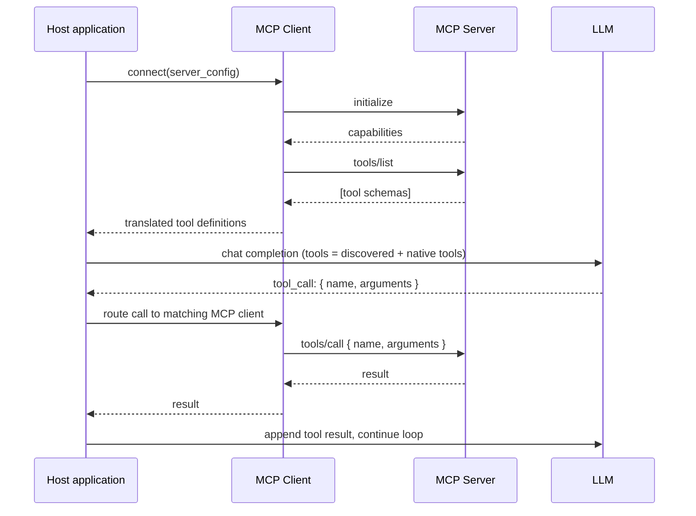

# MCP Clients

## Why This Matters

An MCP server ([MCP Servers](mcp-servers.md)) is useless on its own — something has to connect to it, discover what it offers, and translate the model's intentions into protocol calls. That's the client's job. Understanding the client side matters even if you never build one yourself (most engineers will consume MCP servers through an existing host application rather than writing a client from scratch), because it clarifies exactly how a model "decides" to use a tool it has never seen before, at runtime, without anyone hardcoding that tool into the application.

This is the mechanism that makes MCP's core promise — "build a server once, use it from any compatible host" — actually work: the client doesn't need to know anything about a server in advance. It discovers everything at connection time.

## Core Concept

An MCP client is the component, living inside a host application (see [MCP Architecture](mcp-architecture.md)), responsible for exactly one server connection. Its job:

1. Perform the `initialize` handshake and capability negotiation with that server.
2. Discover what the server offers (`tools/list`, `resources/list`, `prompts/list`).
3. Translate discovered tools into whatever format the host's LLM API expects for tool-calling (e.g., the JSON-schema tool definitions from [Part 14](../14-ai-api-engineering/README.md)).
4. Route the model's tool-call requests to the right server call (`tools/call`) and return results back to the host's agent loop.
5. Handle the connection's lifecycle: reconnects, server-initiated notifications (e.g., "the tool list changed, re-fetch it"), and shutdown.

A host typically runs **one client per connected server**. If a chat application connects to a filesystem server, a Postgres server, and a Slack server, it's running three MCP clients internally, each maintaining its own session.

## Mental Model

Think of an MCP client like a **typed SDK client that generates itself at runtime**. Normally, to call a REST API from code, you either hand-write the request logic or use a generated client from its OpenAPI spec, and either way that code is written *before* you know what's available — someone read the docs and wrote it. An MCP client instead asks the server, live, "what do you offer?" and builds the equivalent of that client code on the fly, translating whatever it discovers into a form the LLM can choose from. This is exactly why a single generic client implementation can work with *any* MCP server without server-specific code — the discovery step does what a human reading API docs and writing bindings would otherwise have to do.

## How It Works

1. **Connect**: the client opens the configured transport (spawn a subprocess for stdio, or open an HTTP connection for a remote server).
2. **Initialize**: send the `initialize` request with the client's own protocol version and capabilities; receive the server's capabilities in response. If the versions are incompatible, negotiation fails cleanly rather than proceeding with undefined behavior.
3. **Discover**: call `tools/list` (and `resources/list`, `prompts/list` if the server declared support for them). Cache the results — the client doesn't need to re-discover on every single model call, only when the server signals a change (via a `listChanged` notification) or on reconnect.
4. **Translate**: convert each discovered tool's name/description/`inputSchema` into the tool-definition format the host's LLM API expects. This is largely mechanical since both MCP's `inputSchema` and typical LLM tool-calling formats are JSON Schema-based.
5. **Expose to the agent loop**: the host's agent loop (see [Agent Architecture](agent-architecture.md)) now sees these as just more tools alongside any natively-implemented ones. When the model requests one, the host's dispatcher routes the call through the corresponding MCP client instead of a local function.
6. **Invoke**: the client sends `tools/call` with the arguments the model produced, waits for the server's response, and returns the result to the agent loop to append as a tool-role message — the exact hand-off point described in [Tool Execution](tool-execution.md), just crossing a process/network boundary via MCP instead of calling a local function directly.

## Architecture



## Request / Response Example

The client-side discovery-to-invocation flow, shown as the two JSON-RPC exchanges the client performs on the model's behalf. First, discovery at connection time (cached, not repeated per model call):

```json
// Client -> Server
{ "jsonrpc": "2.0", "id": 1, "method": "resources/list" }
```

```json
// Server -> Client
{
  "jsonrpc": "2.0",
  "id": 1,
  "result": {
    "resources": [
      { "uri": "wiki://pages/onboarding", "name": "Onboarding Guide", "mimeType": "text/markdown" }
    ]
  }
}
```

Then, when the model — having seen this resource surfaced by the host — requests it be read, the client issues:

```json
// Client -> Server
{
  "jsonrpc": "2.0",
  "id": 4,
  "method": "resources/read",
  "params": { "uri": "wiki://pages/onboarding" }
}
```

```json
// Server -> Client
{
  "jsonrpc": "2.0",
  "id": 4,
  "result": {
    "contents": [
      { "uri": "wiki://pages/onboarding", "mimeType": "text/markdown", "text": "# Onboarding Guide\n..." }
    ]
  }
}
```

## Code Example

```python
# Conceptual / pseudo-SDK code — follow the official MCP SDK docs for the
# real client API. This illustrates the translation logic a host performs.
from mcp_sdk import ClientSession, StdioServerParameters

async def connect_and_discover(command: str, args: list[str]) -> list[dict]:
    """Connects to one MCP server over stdio and returns tool definitions
    in the shape a typical LLM tool-calling API expects."""

    server_params = StdioServerParameters(command=command, args=args)

    async with ClientSession(server_params) as session:
        await session.initialize()  # handshake + capability negotiation

        discovered = await session.list_tools()

        # Translate MCP's tool schema into the LLM API's tool format —
        # both are JSON Schema-based, so this is largely a reshaping step.
        llm_tools = [
            {
                "type": "function",
                "function": {
                    "name": tool.name,
                    "description": tool.description,
                    "parameters": tool.inputSchema,
                },
            }
            for tool in discovered.tools
        ]
        return llm_tools


async def call_mcp_tool(session: "ClientSession", name: str, arguments: dict) -> str:
    """Routes a model-requested tool call through the MCP client to the
    server, and returns a string result ready to append as a tool message."""
    result = await session.call_tool(name, arguments)

    if result.isError:
        # Same principle as tool-execution.md: errors go back to the model
        # as structured content, they don't raise and kill the agent loop.
        return f"Error: {result.content[0].text}"

    return result.content[0].text


# In the host's agent loop, an MCP-backed tool call is dispatched exactly
# like any other tool call in agent-architecture.md's run_agent() — the
# dispatcher just routes by name to either a local function or an MCP session.
```

## Production Considerations

- **Cache discovery results**, but respect `listChanged` notifications from the server — re-running full discovery on every single agent-loop iteration adds unnecessary latency.
- **One client per server, isolated failure**: if one MCP server connection drops or errors, it shouldn't take down the host's other server connections or the agent loop entirely — handle reconnection and partial availability gracefully.
- **Tool name collisions across servers**: if two connected servers both expose a tool named `search`, the host needs a disambiguation strategy (namespacing by server, e.g. `wiki.search` vs `github.search`) before presenting them to the model.
- **Security posture per server**: a host connecting to multiple MCP servers should track which server each tool call is routed through, since different servers may warrant different trust levels (see [Agent Security and Guardrails](agent-security-and-guardrails.md)) — a tool from an unverified third-party server deserves more scrutiny than one from your own internal server.
- **Timeouts at the client level**, in addition to whatever the server enforces internally — a client blocked forever on a hung server call stalls the whole agent loop exactly as an unbounded local tool call would (see [Tool Execution](tool-execution.md)).

## Common Mistakes

- Re-running full discovery (`tools/list`, `resources/list`, `prompts/list`) on every single LLM call instead of caching it and only refreshing on explicit change notifications.
- Not namespacing or disambiguating tools when connected to multiple servers, leading to name collisions or the model calling the wrong server's version of a similarly-named tool.
- Treating every connected MCP server as equally trustworthy, regardless of whether it's an internal server you built or a third-party server you added without review.
- Letting a single slow or unresponsive server connection block the entire host application instead of isolating and timing out that connection specifically.

## Best Practices

- Cache discovered capabilities and invalidate only on explicit `listChanged` notifications or reconnect.
- Namespace tools by server when presenting them to the model, to avoid collisions and make it clear (for logging/security purposes) which server handled which call.
- Apply per-connection timeouts and isolate failures so one bad server connection doesn't degrade the whole host.
- Track and enforce different trust/permission levels per connected server, especially when mixing internal and third-party servers.

## AI Engineering Perspective (MCP in the broader ecosystem)

The client is what turns "a server exists" into "the model can actually use it," and it's also where a host's product decisions live: which servers to connect to, how to present discovered tools to the model, and what trust boundary to enforce per server. Compare this to the "custom integration" approach from [Part 14](../14-ai-api-engineering/README.md): in a hand-built system, the engineer decides ahead of time exactly which tools exist and writes them directly into the codebase. An MCP client instead makes that decision *configurable* — connect to a different set of servers, and the same host application gains entirely new capabilities with zero code changes to the agent loop itself. That flexibility is the main practical win worth remembering: MCP moves "what tools does this agent have" from a code-time decision to a connection-time/configuration decision.

## Exercises

**Beginner**: Explain, in your own words, why a client caching `tools/list` results is safe most of the time but still needs to handle a `listChanged` notification.

**Intermediate**: Extend `connect_and_discover` to prefix every tool name with the server's name (e.g., `wiki__search_wiki`) to avoid collisions when the host connects to multiple servers simultaneously.

**Advanced**: Design a trust-tiering scheme for a host that connects to both an internal, company-built MCP server and a third-party MCP server discovered from a public registry. What differs in how each server's tool results are treated once they re-enter the model's context (see [Agent Security and Guardrails](agent-security-and-guardrails.md))?

## Key Takeaways

- An MCP client lives inside the host, owns exactly one server connection, and turns that server's discovered capabilities into tools the LLM can choose to call.
- Discovery happens at connection time (not hardcoded in advance), which is what lets a generic client work with any compliant server.
- The host's agent loop treats MCP-backed tools identically to natively-implemented ones — the dispatch just routes through a client/session instead of a local function.
- Cache discovery, isolate per-server failures, namespace tool names across multiple servers, and apply client-side timeouts.
- MCP shifts "what tools does this agent have" from a code-time decision to a connection-time, configurable one.
