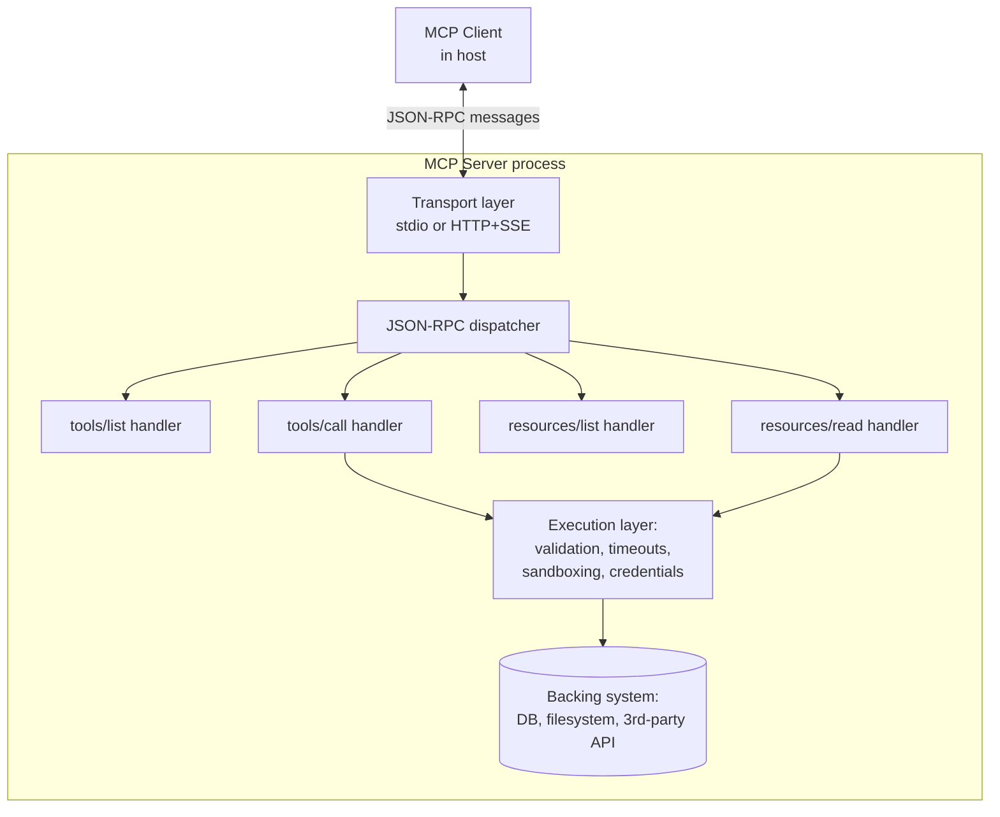

# MCP Servers

## Why This Matters

An MCP server is the half of the protocol that does actual work: it's the process that owns a database connection, a filesystem, an API key for a third-party service, or any other capability worth exposing to an AI application (see [MCP Architecture](mcp-architecture.md) for the client-host-server model this fits into). If you want your internal systems — a ticketing system, an internal search index, a deployment pipeline — usable by an AI agent in a standardized, reusable way, you build an MCP server for it once, and any MCP-compatible host can connect.

Understanding what a server actually exposes, and the two transports it can run over, is the practical, buildable core of MCP — the part you'll actually write code for.

## Core Concept

An MCP server is a process that:

1. Declares its capabilities during the `initialize` handshake (which of tools, resources, and prompts it supports — see [Tools, Resources, Prompts](tools-resources-prompts.md)).
2. Responds to discovery requests (`tools/list`, `resources/list`, `prompts/list`) with structured descriptions of what it offers.
3. Executes invocations (`tools/call`, `resources/read`, `prompts/get`) when the client requests them, and returns results.
4. Owns all the credentials, sandboxing, and execution logic needed to actually perform the work — none of that is visible to, or the responsibility of, the client.

Crucially, an MCP server has **no idea what LLM, if any, is ultimately consuming its output** — it just implements the protocol correctly and lets the host/client worry about the AI application layer. This is the same separation of concerns a well-designed REST API has from its callers: the server doesn't know or care if it's called from a browser, a script, or another service.

## Mental Model

Think of an MCP server the way you'd think about a **well-designed internal microservice** (see [Part 11 — Microservices & Distributed Systems](../11-microservices-distributed-systems/README.md)): it exposes a defined interface, owns its own data/credentials, and is consumed by callers it doesn't need to know about individually. The difference from a typical microservice is the wire format (JSON-RPC over stdio or HTTP, instead of typically REST/gRPC) and the fact that the "interface" is specifically shaped for consumption by an LLM-driven client — tool schemas describe arguments the *way a function signature would*, because the whole point is that a model will read that schema and decide how to call it.

## How It Works

Building a minimal MCP server, conceptually, means:

1. **Choose a transport.** `stdio` for a server that runs as a local subprocess of the host (the host spawns the server process and talks to it over stdin/stdout — this is the default for local tools like filesystem or git access, and requires no networking at all). HTTP (with SSE for streaming server-to-client messages) for a server that runs remotely and is shared across multiple hosts/users — this needs the same production hardening as any other HTTP API (see [Part 10](../10-api-security/README.md) and [Part 6](../06-production-reliability/README.md)).
2. **Declare tools/resources/prompts** with the SDK's decorators or registration calls, each with a name, description, and (for tools) a JSON schema for its arguments — the model relies entirely on these descriptions to decide when and how to use each one, so precise, unambiguous descriptions matter as much as correct code.
3. **Implement execution logic** for each capability, applying the exact same discipline covered in [Tool Execution](tool-execution.md): validate arguments, bound execution time, sandbox anything risky, and normalize results/errors into the protocol's expected response shape.
4. **Run the server**, which starts a loop reading JSON-RPC requests from the transport, dispatching them to the right handler, and writing JSON-RPC responses back.

Real implementations should use the official MCP SDK (Python, TypeScript, and others are officially maintained) rather than hand-implementing JSON-RPC framing — the SDK handles handshake, message framing, and error formatting correctly so you only write the capability logic.

## Architecture



## Request / Response Example

A `tools/list` request/response pair — this is how a client discovers what a server offers, before ever invoking anything:

```json
// Client -> Server
{
  "jsonrpc": "2.0",
  "id": 2,
  "method": "tools/list"
}
```

```json
// Server -> Client
{
  "jsonrpc": "2.0",
  "id": 2,
  "result": {
    "tools": [
      {
        "name": "run_readonly_query",
        "description": "Execute a read-only SQL query against the reporting database.",
        "inputSchema": {
          "type": "object",
          "properties": { "query": { "type": "string" } },
          "required": ["query"]
        }
      }
    ]
  }
}
```

And a `tools/call` invocation using that discovered tool:

```json
// Client -> Server
{
  "jsonrpc": "2.0",
  "id": 3,
  "method": "tools/call",
  "params": {
    "name": "run_readonly_query",
    "arguments": { "query": "SELECT count(*) FROM signups WHERE plan = 'pro'" }
  }
}
```

```json
// Server -> Client
{
  "jsonrpc": "2.0",
  "id": 3,
  "result": {
    "content": [{ "type": "text", "text": "{\"count\": 318}" }],
    "isError": false
  }
}
```

## Code Example

```python
# Conceptual / pseudo-SDK code — for exact, current syntax always follow the
# official MCP SDK documentation for your language.
from mcp_sdk import Server
import asyncio

server = Server(name="internal-wiki-mcp-server", version="1.0.0")

@server.tool(
    name="search_wiki",
    description="Search the internal engineering wiki by keyword and return matching page titles and snippets.",
    input_schema={
        "type": "object",
        "properties": {
            "query": {"type": "string"},
            "max_results": {"type": "integer", "minimum": 1, "maximum": 10, "default": 5},
        },
        "required": ["query"],
    },
)
async def search_wiki(query: str, max_results: int = 5) -> dict:
    # Same discipline as any tool executor: bound execution time, never let
    # a slow backend search hang the whole MCP request indefinitely.
    try:
        results = await asyncio.wait_for(wiki_search_backend(query, max_results), timeout=5.0)
    except asyncio.TimeoutError:
        return {"isError": True, "content": [{"type": "text", "text": "Search timed out."}]}

    formatted = "\n".join(f"- {r.title}: {r.snippet}" for r in results)
    return {"content": [{"type": "text", "text": formatted or "No results found."}]}


@server.resource(uri_template="wiki://pages/{page_id}")
async def read_wiki_page(page_id: str) -> dict:
    # Resources are read, not "called" — no side effects, just data retrieval.
    page = await get_wiki_page(page_id)
    if page is None:
        return {"isError": True, "content": [{"type": "text", "text": "Page not found."}]}
    return {"contents": [{"uri": f"wiki://pages/{page_id}", "mimeType": "text/markdown", "text": page.body}]}


if __name__ == "__main__":
    # stdio: server runs as a local subprocess of the host, no network exposure.
    # Swap to transport="http" (with proper auth) for a remote, shared server.
    server.run(transport="stdio")
```

## Production Considerations

- **stdio servers inherit the host's trust boundary** — the host process spawns them directly, so a locally-run MCP server has whatever filesystem/network access the host process grants it. Don't run a stdio server with broader permissions than the specific capability needs.
- **HTTP servers need standard API hardening**: authentication for who's allowed to connect, TLS in transit, and rate limiting, exactly as with any other production API (see [Part 10 — API Security](../10-api-security/README.md) and [Part 6 — Production API Reliability](../06-production-reliability/README.md)). MCP's protocol doesn't provide these for you.
- **Tool/resource descriptions are load-bearing.** The model decides whether and how to use a capability based entirely on its declared name, description, and schema — vague or ambiguous descriptions lead directly to the model calling the wrong tool or passing malformed arguments, the same failure mode covered in [Tool Execution](tool-execution.md).
- **Backward compatibility**: once other teams' hosts depend on your server, changing a tool's argument schema is a breaking change exactly like changing a public REST endpoint's contract — version it deliberately.
- **Observability**: log every `tools/call` (and its arguments and result status) server-side, independent of whatever the host logs — you often don't control or see the host's own logging.

## Common Mistakes

- Writing vague tool descriptions ("does stuff with the database") that give the model no real signal about when to use the tool or what arguments it expects.
- Running a stdio server with far more filesystem or network access than the specific tools it exposes actually need.
- Standing up an HTTP MCP server with no authentication because "it's just for internal use," and then having it reachable from an unintended network.
- Skipping input validation inside the server because "the client already validated it" — never trust that the caller validated correctly; the server is the actual security boundary.
- Hand-rolling JSON-RPC framing instead of using the official SDK, and getting subtle protocol details (error shapes, notification handling) wrong.

## Best Practices

- Use the official MCP SDK for your language rather than hand-implementing the protocol.
- Write tool and resource descriptions as carefully as you'd write public API documentation — the model is your primary "reader."
- Apply the full [Tool Execution](tool-execution.md) discipline inside every tool handler: schema validation, timeouts, sandboxing, least-privilege credentials, and normalized errors.
- Choose stdio for local, host-spawned tools and HTTP for shared/remote servers — don't force a remote-only capability into stdio or vice versa.
- Treat a shared HTTP MCP server as a production service: auth, rate limits, monitoring, versioning.

## AI Engineering Perspective (MCP in the broader ecosystem)

An MCP server is the reusable unit of AI tooling: build one well, and it becomes usable across your organization's chat assistants, IDE integrations, and custom agents without re-implementation — the payoff described in [MCP Architecture](mcp-architecture.md). The build effort is comparable to standing up a small internal microservice (define the interface, own execution and credentials, harden the transport), which is exactly the right mental model to bring to it: an MCP server is not a special AI artifact, it's an ordinary well-scoped service that happens to speak JSON-RPC and describe itself to a model instead of a human developer reading OpenAPI docs.

## Exercises

**Beginner**: Using the `search_wiki` example, write the `tools/list` response you'd expect this server to return, in the same JSON-RPC shape shown earlier.

**Intermediate**: Add a second tool, `create_wiki_page`, to the code example, that requires human approval before executing (mirroring the `requires_approval` pattern from [Tool Execution](tool-execution.md)) since it mutates data rather than just reading it.

**Advanced**: Design the authentication and rate-limiting strategy for turning the `internal-wiki-mcp-server` example from a local stdio server into a shared HTTP server usable by multiple teams' AI hosts. What credential does each host present, and how do you scope what each host's queries can access?

## Key Takeaways

- An MCP server owns execution, credentials, and sandboxing for a capability, and exposes it through the protocol without knowing which host or LLM is calling it.
- Choose stdio for local, host-spawned tools with no network exposure, and HTTP (with standard API hardening) for shared, remote servers.
- Tool and resource descriptions are read and acted on by the model — write them with the same care as public API documentation.
- Every tool handler still needs the full tool-execution discipline (validation, timeouts, sandboxing, least privilege) — MCP standardizes the interface, not the safety of the implementation behind it.
- Use the official MCP SDK rather than hand-rolling JSON-RPC framing.
