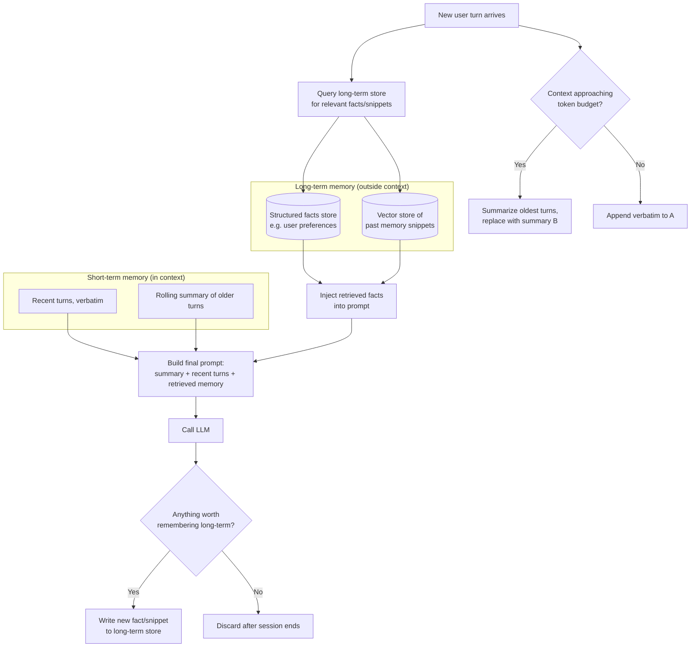

# Memory Systems

## Why This Matters

LLM APIs are stateless. Every call to a chat completion endpoint receives exactly what you send it — nothing more. If you want an agent to "remember" that a user mentioned their name three turns ago, or that a task it started yesterday is still in progress, that memory has to live somewhere in *your* system, not the model's. The model has no persistence of its own between API calls.

As an agent loop grows longer (more tool calls, more turns), or as a conversation spans multiple sessions over days or weeks, naively appending everything to the prompt breaks down: you hit the context window limit (see [Part 14](../14-ai-api-engineering/README.md)), costs grow with every token you resend, and irrelevant history dilutes the model's attention on what actually matters right now. Memory systems are the engineering discipline of deciding what to keep, what to compress, and what to fetch on demand.

## Core Concept

"Memory" in an agent system is not one thing — it's at least three different problems with different solutions:

- **Short-term / working memory**: the current conversation or agent run's message history. This is just the list of messages you're sending to the LLM API on each call — it lives entirely within the current context window.
- **Long-term memory**: facts, preferences, or past interactions that should persist *across* sessions — "the user prefers metric units," "this customer's account was flagged last month." This has to be stored outside the context window and selectively retrieved.
- **Episodic/task memory**: state specific to a long-running task ("step 3 of the deployment is done, waiting on step 4") — closer to a workflow/job state store than to "memory" in the human sense.

The engineering problem in all three cases is the same: context windows are finite and expensive, so you cannot just keep appending forever. You need strategies to compress, prioritize, and selectively retrieve.

## Mental Model

Think of an agent's memory the way you'd think about a computer's memory hierarchy: **registers/L1 cache** (the last few messages, always in context, cheap to access), **RAM** (the full current conversation, still in context but getting expensive), and **disk** (long-term storage — a database or vector store — that isn't in context by default and has to be explicitly paged in via retrieval).

Short-term memory is "what's currently loaded." Long-term memory is "what's on disk, fetched only when relevant." The retrieval step that pages long-term memory into context is, mechanically, the exact same operation as retrieval in a RAG pipeline (see [Part 16 — RAG APIs](../16-rag-apis/README.md)) — which is why the line between "agent memory" and "RAG" is blurrier than marketing material suggests.

## How It Works

**Short-term memory** is simply the message list you pass to each LLM call. The main engineering task is *pruning* it as it grows: dropping the oldest turns, or replacing them with a summary, once you approach a token budget.

**Summarization** is the most common technique for keeping short-term memory bounded: periodically (e.g., every N turns, or when approaching X% of the context window), ask the LLM itself to compress the older portion of the conversation into a dense summary, replace those messages with the summary, and keep the recent turns verbatim. This trades some fidelity (details in the summary are lossy) for a bounded, controllable context size.

**Long-term memory** requires an explicit store outside the LLM call: a database of structured facts ("user_id -> preferred_language: fr"), or a vector store of embedded memory snippets that can be retrieved by semantic similarity to the current query. At the start of (or during) an agent run, you query this store for anything relevant to the current turn and inject the results into the prompt — functionally identical to a RAG retrieval step, just retrieving "memories" instead of "documents."

**When memory becomes a RAG problem**: the moment you store more than a handful of long-term facts and need to *search* them for relevance rather than just dumping them all into every prompt, you are doing retrieval-augmented generation. The chunking, embedding, retrieval, and reranking techniques in [Part 16](../16-rag-apis/README.md) apply directly — "long-term agent memory" and "a RAG system over a memory store" are the same architecture with different framing.

## Architecture



## Request / Response Example

A memory-augmented agent call typically involves an internal retrieval step before the LLM call. Here's what the retrieved memory injection can look like as it's assembled into the prompt sent to the model:

```json
{
  "model": "gpt-4.1",
  "messages": [
    {
      "role": "system",
      "content": "You are a support assistant.\n\nKnown facts about this user (retrieved from long-term memory):\n- Prefers email contact over phone\n- Has an active subscription on the Pro plan\n- Reported a billing issue on 2026-07-02 (resolved)\n\nSummary of earlier conversation: The user previously asked about upgrading their plan and was told the Pro plan includes API access."
    },
    { "role": "user", "content": "Actually, can you remind me what my plan includes again?" }
  ]
}
```

Note that none of the earlier raw conversation turns are present — they've been compressed into the system message's summary and the retrieved facts, keeping the prompt bounded regardless of how long the relationship with this user has been.

## Code Example

```python
from dataclasses import dataclass, field

@dataclass
class ConversationMemory:
    """Short-term memory: bounded message history with automatic summarization."""
    messages: list[dict] = field(default_factory=list)
    summary: str = ""
    max_turns_before_summarize: int = 12

    def add(self, role: str, content: str):
        self.messages.append({"role": role, "content": content})

    def build_prompt(self, system_prompt: str) -> list[dict]:
        # The summary (if any) and recent turns are what actually go to the model —
        # everything older than max_turns_before_summarize was already compressed.
        system = system_prompt
        if self.summary:
            system += f"\n\nSummary of earlier conversation:\n{self.summary}"
        return [{"role": "system", "content": system}, *self.messages]

    def maybe_summarize(self, llm_client):
        if len(self.messages) <= self.max_turns_before_summarize:
            return

        # Compress everything except the last 4 turns into an updated summary.
        to_compress = self.messages[:-4]
        recent = self.messages[-4:]

        summary_prompt = (
            f"Existing summary:\n{self.summary}\n\n"
            f"New messages to fold in:\n{to_compress}\n\n"
            "Produce an updated, concise summary capturing key facts and decisions."
        )
        response = llm_client.chat.completions.create(
            model="gpt-4.1-mini",  # a cheaper model is fine for summarization
            messages=[{"role": "user", "content": summary_prompt}],
        )
        self.summary = response.choices[0].message.content
        self.messages = recent  # drop the compressed turns, keep only the tail


class LongTermMemoryStore:
    """Minimal long-term memory backed by a vector store (conceptual —
    swap in a real vector DB client per Part 16)."""

    def __init__(self, vector_client, embed_fn):
        self.vector_client = vector_client
        self.embed_fn = embed_fn

    def remember(self, user_id: str, fact: str):
        # Persist a fact tied to this user, embedded for later semantic retrieval.
        embedding = self.embed_fn(fact)
        self.vector_client.upsert(namespace=user_id, vector=embedding, metadata={"text": fact})

    def recall(self, user_id: str, query: str, top_k: int = 3) -> list[str]:
        # Retrieval-augmented recall — same mechanics as RAG document retrieval,
        # just scoped to one user's memory namespace.
        query_embedding = self.embed_fn(query)
        results = self.vector_client.query(namespace=user_id, vector=query_embedding, top_k=top_k)
        return [r.metadata["text"] for r in results]
```

## Production Considerations

- **Summarization is lossy and can silently drop important details** — a compressed summary of a 40-turn negotiation might lose a specific number the user stated. Consider preserving verbatim any turns flagged as containing hard facts (amounts, dates, IDs) rather than summarizing everything uniformly.
- **Long-term memory needs a write policy, not just a read policy.** Deciding *when* to persist something as a long-term memory (every message? Only explicit "remember this"? An LLM judgment call at the end of a session?) is a real design decision with cost and privacy implications.
- **Memory storage is a data-retention and privacy surface.** If you're persisting facts about users across sessions, that's personal data subject to the same deletion/export requirements as any other stored user data (see [Part 10 — API Security](../10-api-security/README.md)).
- **Staleness**: a "fact" cached in long-term memory can go out of date (a user's plan changes). Either set a TTL on facts, invalidate them explicitly on the relevant event, or bias retrieval toward recency.
- **Latency and cost of retrieval**: every long-term memory lookup is an extra round trip (embedding + vector search) before the main LLM call — budget for it the same way you'd budget for a RAG retrieval step.

## Common Mistakes

- **Never pruning short-term memory**, letting the message list grow until it silently gets truncated by the API or blows the cost budget.
- **Summarizing so aggressively that critical details are lost** — treating summarization as a free win with no trade-off.
- **Storing everything in long-term memory indiscriminately**, turning retrieval into noisy, low-precision search instead of a small set of genuinely useful facts.
- **Conflating "long-term memory" with "just make the context window bigger."** A bigger context window delays the problem, it doesn't solve the retrieval/relevance problem, and it costs more per call regardless.
- **No user-facing way to view, correct, or delete stored long-term memories** — a privacy and trust problem once memory persists real facts about people.

## Best Practices

- Bound short-term memory explicitly (a turn count or token threshold) and summarize proactively before you hit the model's context limit, not after.
- Preserve verbatim any turn containing hard facts (numbers, IDs, dates, commitments) rather than letting a general-purpose summarizer compress them lossily.
- Scope long-term memory per user/tenant, and treat it as retrieval — rank and filter for relevance rather than injecting everything you've ever stored.
- Set a write policy: decide explicitly what's worth persisting long-term (not every message) and revisit it as your product evolves.
- Give stored long-term memory a staleness strategy (TTL, invalidation on relevant events, or recency bias in retrieval) so outdated facts don't silently mislead the model.
- Provide a way for users to view and delete what's stored about them — treat long-term memory as regulated personal data (see [Part 10](../10-api-security/README.md)).

## AI Engineering Perspective

The most useful reframe in this chapter: **long-term agent memory is a RAG system with a narrower, more personal corpus.** Once you accept that, the entire toolkit from [Part 16 — RAG APIs](../16-rag-apis/README.md) — chunking, embeddings, retrieval, reranking — becomes directly applicable to "what does this agent remember about this user." The interesting design decisions in memory systems aren't really about the retrieval mechanics (that part is solved); they're about *write* policy (what's worth remembering, when), staleness, and privacy — problems that don't have an off-the-shelf answer and require product judgment specific to your application.

## Exercises

**Beginner**: Given a 20-turn conversation transcript, manually write a 3-sentence summary that would preserve the key facts if the earlier turns were dropped from context. Note what you had to leave out.

**Intermediate**: Extend `ConversationMemory.maybe_summarize` to preserve verbatim any message that contains a number or a proper noun (a crude heuristic for "hard facts"), rather than folding it into the lossy summary.

**Advanced**: Design a write policy for `LongTermMemoryStore.remember` — decide, and justify, when a fact should be persisted (every user statement? only ones the model flags as "durable preference"? an end-of-session LLM pass?) and how you'd let a user view and delete what's stored about them.

## Key Takeaways

- LLM APIs are stateless — all memory (short-term or long-term) has to be managed explicitly by your application, not the model.
- Short-term memory is the in-context message list; keep it bounded with pruning or summarization as it grows.
- Long-term memory requires external storage and selective retrieval — and once you're searching a memory store for relevance, you're building a RAG system (see [Part 16](../16-rag-apis/README.md)).
- Summarization trades fidelity for boundedness — decide deliberately what's safe to compress and what must be preserved verbatim.
- Persisted memory about users is a real privacy surface with retention, correction, and deletion obligations (see [Part 10](../10-api-security/README.md)).
