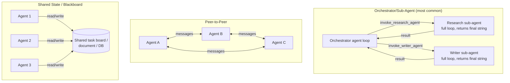

# Multi-Agent Communication

## Why This Matters

A single agent loop (see [Agent Architecture](agent-architecture.md)) with a well-chosen set of tools handles a surprising amount of complexity. But some problems genuinely benefit from splitting work across multiple agents with different roles: a "researcher" agent that gathers information and a "writer" agent that turns it into a polished document, or a "planner" that breaks a task into subtasks handed to specialized "worker" agents. Multi-agent systems are the architecture for coordinating several LLM-driven loops toward one overall goal.

This chapter is as much about *when not to* use multiple agents as it is about how to. Multi-agent systems introduce real complexity — coordination overhead, more places for failures to hide, higher cost — and a lot of production "multi-agent" systems are, on inspection, a single well-tooled agent with unnecessary ceremony wrapped around it.

## Core Concept

A multi-agent system is a set of independently-looping agents (each following its own perceive-plan-act-observe cycle) that communicate to accomplish a shared or related set of goals. The core design question is always: **how do agents pass information to each other**, and **who decides what happens next**?

There are two axes worth separating:

- **Topology**: who talks to whom — a central coordinator directing subordinates (orchestrator/sub-agent), or agents talking directly to each other as equals (peer-to-peer).
- **Communication mechanism**: how information moves between them — passing explicit messages (message passing, like function calls between agents) versus reading and writing a common state (shared state/blackboard, like a shared database or document).

Most production systems use **orchestrator/sub-agent with message passing**, because it's the easiest to reason about, debug, and put limits on — it maps directly onto the "call a function, get a return value" model you already understand from regular software.

## Mental Model

Think of the orchestrator/sub-agent pattern like a **engineering manager delegating to specialists**: the manager (orchestrator) doesn't do the deep research or write the code themselves — they break the goal into sub-tasks, hand each to the right specialist (sub-agent), and integrate the results. The manager is still, itself, running its own perceive-plan-act-observe loop — except its "tools" are other agents, not raw functions.

Peer-to-peer multi-agent systems are more like a **group chat between coworkers with no manager** — each agent can message any other, propose ideas, and react. This is more flexible but much harder to bound: nothing forces the "conversation" between agents to converge, and debugging a multi-way exchange is significantly harder than debugging a single call chain.

Shared-state coordination is like a **shared whiteboard**: agents don't message each other directly, they read and write to common state (a document, a task board, a database), and each agent's next action depends on what's currently on the board. This decouples agents from knowing about each other directly, at the cost of making the causal chain of "who changed what and why" harder to trace after the fact.

## How It Works

**Orchestrator/sub-agent**: the orchestrator is itself an agent loop. Instead of calling a `search_web` tool, one of its "tools" is literally `invoke_research_agent(task: str) -> str` — calling it runs an entire nested agent loop and returns a final string result, exactly like any other tool call from the orchestrator's point of view. The orchestrator sees sub-agents as black boxes; it doesn't see their internal steps unless you explicitly surface them.

**Peer-to-peer**: agents exchange messages directly, often through a shared message bus or by being given each other as callable tools symmetrically ("agent A can call agent B, and agent B can call agent A back"). This requires explicit protocol design to prevent infinite back-and-forth (A asks B, B asks A a clarifying question, A asks B again...) — you need the same kind of loop-termination discipline as a single agent, but now distributed across multiple decision-makers.

**Shared state / blackboard**: agents don't call each other at all. They read from and write to a common store — a task list, a shared document, a set of "claims" in a database — and each agent decides its next action by inspecting the current state. A scheduler (which can be as simple as a loop, or as complex as a job queue) decides which agent runs next based on what's pending in the shared state.

## Architecture



## Request / Response Example

From the outside, an orchestrator-based multi-agent system is exposed through the same agent API shape as a single agent (see [Agent APIs](agent-apis.md)) — the multi-agent structure is an internal implementation detail:

```http
POST /agents/report-builder/runs HTTP/1.1
Content-Type: application/json

{
  "input": "Research our top 3 competitors and write a 1-page briefing for the exec team."
}
```

```http
HTTP/1.1 202 Accepted

{
  "run_id": "run_4b21",
  "status": "running"
}
```

If you expose sub-agent visibility (useful for debugging and trust), the run's detail endpoint can show the delegation structure explicitly:

```json
{
  "run_id": "run_4b21",
  "status": "completed",
  "output": "Briefing: ...",
  "sub_runs": [
    { "agent": "research-agent", "run_id": "run_4b21_a", "steps": 6, "status": "completed" },
    { "agent": "writer-agent", "run_id": "run_4b21_b", "steps": 3, "status": "completed" }
  ]
}
```

## Code Example

```python
def invoke_research_agent(task: str) -> str:
    """Runs an entire nested agent loop and returns only the final answer —
    from the orchestrator's perspective this is indistinguishable from a
    regular tool call. Internal steps are hidden unless explicitly logged."""
    research_tools = [web_search_tool, fetch_page_tool]
    return run_agent(user_goal=task, tools=research_tools, tool_impls=RESEARCH_TOOL_IMPLS)


def invoke_writer_agent(task: str) -> str:
    writer_tools = [outline_tool, cite_source_tool]
    return run_agent(user_goal=task, tools=writer_tools, tool_impls=WRITER_TOOL_IMPLS)


# The orchestrator is a normal agent (same run_agent loop from
# agent-architecture.md) whose "tools" happen to be other agents.
ORCHESTRATOR_TOOLS = [
    {
        "type": "function",
        "function": {
            "name": "invoke_research_agent",
            "description": "Delegate a research task to a specialized research agent. Returns a summary of findings.",
            "parameters": {
                "type": "object",
                "properties": {"task": {"type": "string"}},
                "required": ["task"],
            },
        },
    },
    {
        "type": "function",
        "function": {
            "name": "invoke_writer_agent",
            "description": "Delegate a writing task to a specialized writer agent. Returns the drafted text.",
            "parameters": {
                "type": "object",
                "properties": {"task": {"type": "string"}},
                "required": ["task"],
            },
        },
    },
]

ORCHESTRATOR_TOOL_IMPLS = {
    "invoke_research_agent": invoke_research_agent,
    "invoke_writer_agent": invoke_writer_agent,
}

# Running this: the orchestrator loop decides when to call research vs. writer,
# and each of those calls runs its own bounded sub-loop with its own
# MAX_ITERATIONS cap — a runaway sub-agent still can't loop forever.
final_report = run_agent(
    user_goal="Research our top 3 competitors and write a 1-page briefing.",
    tools=ORCHESTRATOR_TOOLS,
    tool_impls=ORCHESTRATOR_TOOL_IMPLS,
)
```

Note that every sub-agent call still goes through the exact same guardrails as any tool call (see [Tool Execution](tool-execution.md)): a timeout, a max iteration cap inside its own loop, and normalized error handling if the sub-agent fails.

## Production Considerations

- **Cost multiplies fast**: each sub-agent invocation is itself a full agent loop with its own multiple LLM calls. A 3-step orchestrator that calls 2 sub-agents, each running 5 steps, is roughly 10+ LLM calls for one user request — budget and cap accordingly at every level (see [Agent Architecture](agent-architecture.md) on iteration and cost limits).
- **Bound sub-agent loops independently.** A misbehaving sub-agent shouldn't be able to consume the orchestrator's entire budget; give each sub-agent its own max-iteration and cost ceiling.
- **Observability needs to span the whole tree.** Use a single top-level run/trace ID propagated into every sub-agent invocation so you can reconstruct the full call graph when debugging (see [Part 12 — Observability](../12-observability/README.md)).
- **Peer-to-peer and shared-state patterns need explicit convergence guarantees** — without them, two agents can loop on each other indefinitely, or repeatedly overwrite each other's changes to shared state (a distributed race condition, conceptually identical to a database consistency problem).
- **Failure isolation**: decide what happens to the orchestrator if a sub-agent errors out entirely — does the orchestrator retry it, substitute a fallback, or surface the failure to the user? Don't let a single sub-agent's crash silently corrupt the whole run.

## Common Mistakes

- **Reaching for multi-agent architecture as a default**, when a single agent with more/better tools would solve the same problem more cheaply and more reliably. Splitting a task into "agents" doesn't add capability by itself — it adds coordination overhead.
- **No independent iteration/cost caps per sub-agent**, so a stuck sub-agent silently consumes the entire budget meant for the whole multi-agent run.
- **Peer-to-peer designs with no termination guarantee**, leading to two agents endlessly "negotiating" or asking each other clarifying questions.
- **Losing traceability** across the agent tree — when something goes wrong, not being able to tell which sub-agent, on which step, produced the bad output.
- **Treating agent-to-agent messages as trusted**, the same mistake as trusting raw tool output (see [Agent Security and Guardrails](agent-security-and-guardrails.md)) — a compromised or misled sub-agent can pass misleading content upward.

## Best Practices

- Default to **orchestrator/sub-agent with message passing** unless you have a specific reason to need peer-to-peer or shared state — it's the easiest topology to bound, debug, and reason about.
- Give every sub-agent its own independent iteration cap and cost budget, on top of the orchestrator's overall budget.
- Propagate a single trace/run ID through the entire call tree for observability.
- Keep the number of distinct agent roles small — two or three well-scoped agents (e.g., researcher + writer) is usually enough; large "agent societies" are hard to debug and rarely outperform a smaller, well-designed system in practice.
- Before building multi-agent, prototype with a single agent and a richer toolset first — only split into multiple agents if you hit a concrete limitation (context isolation needs, distinctly different tool sets, or a genuine need for parallel work).

## AI Engineering Perspective

The honest framing: most of what's marketed as "multi-agent systems" is orchestrator/sub-agent — which is structurally just **nested function calls where the functions happen to be other agent loops**. That's a useful pattern (it isolates context — a research sub-agent doesn't need the writer's conversation history cluttering its context, and vice versa), but it is not fundamentally different from good old function decomposition applied to LLM calls. Reach for it when you have a genuine reason to isolate context or parallelize independent sub-tasks, not because "multi-agent" sounds more sophisticated than "one agent with well-designed tools." The complexity cost is real and compounds with every additional agent in the system.

## Exercises

**Beginner**: Draw the call tree (as text or a diagram) for a 2-level orchestrator system handling "research this topic and write a summary," showing which LLM calls happen at each level.

**Intermediate**: Modify the code example so `invoke_research_agent` and `invoke_writer_agent` each enforce their own `MAX_ITERATIONS` independently from the orchestrator's, and propagate a shared `trace_id` into both sub-agent calls for logging.

**Advanced**: Design a shared-state (blackboard) coordination scheme for 3 agents jointly filling out a structured report (one gathers data, one drafts sections, one reviews for consistency) without any agent calling another directly. Specify what's in the shared state, how an agent decides it's its turn to act, and how you'd prevent two agents from writing conflicting updates simultaneously.

## Key Takeaways

- Multi-agent systems coordinate several independent agent loops; the dominant, easiest-to-reason-about pattern is orchestrator/sub-agent with message passing.
- From the orchestrator's perspective, a sub-agent is just another tool call that happens to run an entire nested loop and return a final result.
- Cost and iteration limits must be enforced independently at every level of the agent tree, not just at the top.
- Peer-to-peer and shared-state topologies are more flexible but much harder to bound and debug — use them only when orchestrator/sub-agent genuinely doesn't fit.
- Prefer a single well-tooled agent unless you have a concrete reason (context isolation, distinct tool sets, parallelizable sub-tasks) to split into multiple agents.
