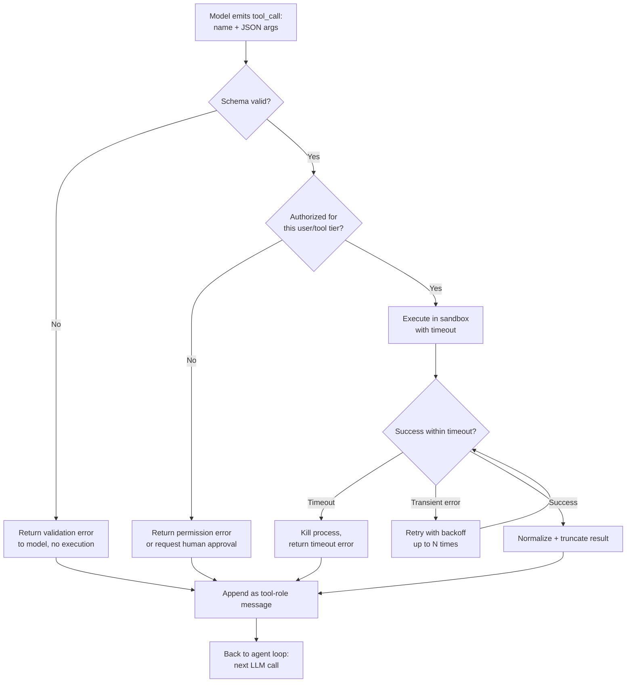

# Tool Execution

## Why This Matters

The model's job in an agent loop is to *decide* what to do next — it emits a tool name and a JSON blob of arguments. It never actually runs code. Something else has to take that request, execute it safely, and hand the result back. That "something else" is your code, running with your permissions, in your infrastructure, often on arguments the model invented from untrusted or partially-untrusted input.

This is the part of an agent system where ordinary backend engineering discipline — timeouts, sandboxing, input validation, retries — matters more than prompt engineering. A model that "wants" to run `rm -rf /tmp/*` because a tool result told it to is not a hypothetical; it's the default behavior of a system that blindly executes whatever the model asks for. Tool execution is where you draw the line between what the model can *request* and what your system will actually *do*.

## Core Concept

Tool execution is the "Act" step of the agent loop (see [Agent Architecture](agent-architecture.md)): given a tool name and arguments from the model, your code must:

1. **Validate** the arguments against the tool's schema before touching anything.
2. **Authorize** the call — is this tool allowed at all, for this user, in this context?
3. **Execute** it with a bounded timeout and, where the tool can affect the outside world, inside a sandbox.
4. **Capture** the result (or error) in a form the model can consume.
5. **Return** that result back into the conversation as a tool-role message — never let a raw exception propagate up and kill the agent loop.

The model treats the tool as a black box; your execution layer is what makes that black box safe to open.

## Mental Model

Think of tool execution like a **Unix syscall boundary**. User-space code (the LLM's "intentions") can request operations, but the kernel (your execution layer) decides what's actually permitted, enforces limits (max execution time, memory, file access), and translates raw failures into well-defined error codes rather than crashing the whole machine. The model never gets raw, unmediated access to your systems — it always goes through this checked boundary.

Another useful frame: the tool executor is a **reverse API gateway**. A normal API gateway sits between an untrusted external caller and your internal services, enforcing auth, rate limits, and validation (see [Part 11 — Microservices & Distributed Systems](../11-microservices-distributed-systems/README.md)). Here, the "untrusted caller" is the LLM itself — it's trying to call your internal functions based on probabilistic text generation, so the same gatekeeping instincts apply.

## How It Works

For each tool call the model requests, the executor typically does:

1. **Schema validation** — parse the JSON arguments and validate them against the tool's declared schema (types, required fields, enums). Reject before execution if invalid, and feed a clear error back to the model so it can retry with corrected arguments.
2. **Permission check** — verify this specific user/session is allowed to invoke this tool, and that the tool's risk tier doesn't require human approval first (see [Agent Security and Guardrails](agent-security-and-guardrails.md)).
3. **Timeout enforcement** — wrap execution in a hard time limit. A hanging tool (a slow API, a stuck subprocess) should never be allowed to stall the entire agent loop indefinitely.
4. **Sandboxing** — for tools that execute code or shell commands, run them in an isolated environment (container, restricted subprocess, WASM sandbox) with no more access to the filesystem, network, or credentials than the specific task requires.
5. **Result normalization** — convert whatever the tool returns (a DataFrame, an HTTP response, a stack trace) into a compact, model-readable string, usually JSON. Truncate large outputs; dumping a 50,000-token file into the next LLM call defeats context management.
6. **Retry semantics** — transient failures (network blip, rate limit from an upstream API) can be retried automatically with backoff (see [Part 6](../06-production-reliability/README.md)); *logical* failures (invalid arguments, "resource not found") should not be retried blindly — they should go back to the model as an error so it can change its approach.

## Architecture



## Request / Response Example

Internally, a tool executor is usually invoked with the raw tool call the model produced, and returns a normalized envelope. This example shows a typical internal contract (not a public HTTP API — it's the boundary between your agent loop and your tool layer):

```json
// Input: the model's tool call
{
  "tool_call_id": "call_a91f",
  "name": "run_sql_query",
  "arguments": {
    "query": "SELECT count(*) FROM orders WHERE status = 'refunded'"
  }
}
```

```json
// Output: what gets appended back to the conversation as a tool-role message
{
  "tool_call_id": "call_a91f",
  "status": "success",
  "duration_ms": 184,
  "result": { "count": 42 }
}
```

```json
// Failure case — this still goes back to the model, not raised as an exception
{
  "tool_call_id": "call_a91f",
  "status": "error",
  "error_type": "permission_denied",
  "message": "This tool only permits SELECT statements."
}
```

## Code Example

```python
import asyncio
import json
from dataclasses import dataclass
from jsonschema import validate, ValidationError

@dataclass
class ToolSpec:
    name: str
    schema: dict          # JSON schema for arguments
    handler: callable      # the actual function that performs the work
    timeout_seconds: float = 10.0
    requires_approval: bool = False   # risky tools pause for human confirmation


ALLOWED_TOOLS: dict[str, ToolSpec] = {
    "run_sql_query": ToolSpec(
        name="run_sql_query",
        schema={
            "type": "object",
            "properties": {"query": {"type": "string"}},
            "required": ["query"],
        },
        handler=lambda query: execute_readonly_sql(query),
        timeout_seconds=5.0,
        requires_approval=False,
    ),
    "send_refund": ToolSpec(
        name="send_refund",
        schema={
            "type": "object",
            "properties": {
                "order_id": {"type": "string"},
                "amount_cents": {"type": "integer", "minimum": 1},
            },
            "required": ["order_id", "amount_cents"],
        },
        handler=lambda order_id, amount_cents: issue_refund(order_id, amount_cents),
        timeout_seconds=8.0,
        requires_approval=True,   # money movement always needs a human OK
    ),
}


async def execute_tool_call(name: str, raw_arguments: str, user) -> dict:
    """Executes one tool call safely and returns a normalized envelope
    that is always safe to feed back into the conversation."""

    spec = ALLOWED_TOOLS.get(name)
    if spec is None:
        # The model hallucinated a tool name that doesn't exist — never
        # attempt to execute something we didn't explicitly register.
        return {"status": "error", "error_type": "unknown_tool", "message": f"No such tool: {name}"}

    # 1. Validate arguments before touching anything real.
    try:
        arguments = json.loads(raw_arguments)
        validate(instance=arguments, schema=spec.schema)
    except (json.JSONDecodeError, ValidationError) as exc:
        return {"status": "error", "error_type": "invalid_arguments", "message": str(exc)}

    # 2. Enforce least-privilege / human-in-the-loop for risky tools.
    if spec.requires_approval and not user.has_pending_approval(name, arguments):
        return {
            "status": "pending_approval",
            "message": f"Tool '{name}' requires human confirmation before it can run.",
        }

    # 3. Execute with a hard timeout so a stuck tool can't stall the whole loop.
    try:
        result = await asyncio.wait_for(
            asyncio.to_thread(spec.handler, **arguments),
            timeout=spec.timeout_seconds,
        )
    except asyncio.TimeoutError:
        return {"status": "error", "error_type": "timeout", "message": f"{name} timed out after {spec.timeout_seconds}s"}
    except Exception as exc:
        # Never let a raw stack trace leak back into the model context —
        # normalize it to a short, safe message instead.
        return {"status": "error", "error_type": "execution_failed", "message": str(exc)[:300]}

    # 4. Truncate large results — dumping megabytes into context is a cost bug.
    result_json = json.dumps(result)
    if len(result_json) > 4000:
        result_json = result_json[:4000] + "...(truncated)"

    return {"status": "success", "result": json.loads(result_json) if result_json.strip().startswith(("{", "[")) else result_json}
```

## Production Considerations

- **Sandboxing for code-execution tools** (Python interpreters, shell access) should use a real isolation boundary — a container with no network access and a read-only filesystem, or a WASM runtime — never `exec()`/`subprocess` directly against the host with the application's own credentials.
- **Timeouts must be enforced at the execution layer, not hoped for from the tool itself.** An upstream API without its own timeout can hang your entire agent loop; always wrap calls in your own bound (`asyncio.wait_for`, thread with a deadline, etc.).
- **Least privilege**: give each tool implementation only the credentials and scope it needs. A "read customer record" tool should use a read-only, row-scoped database credential — not the same service account used by a "delete customer record" tool.
- **Idempotency for side-effecting tools**: if a tool call times out on your side but actually succeeded upstream, a naive retry can double-charge a customer or send a duplicate email. Use idempotency keys for anything that mutates state (see [Part 6](../06-production-reliability/README.md)).
- **Structured error taxonomy**: distinguish `invalid_arguments` (the model should retry with different input), `permission_denied` (the model should stop trying), and `timeout`/`transient` (safe to retry) — this shapes how the model behaves on the next loop iteration.

## Common Mistakes

- **Executing tool arguments without schema validation**, trusting that the model always produces well-formed JSON matching the tool's contract — it doesn't always, especially with smaller or fine-tuned models.
- **Treating tool output as trusted input.** If a tool fetches a webpage or reads a file, its content is untrusted, potentially attacker-controlled text that gets fed straight back to the model — this is the core prompt-injection surface (see [Agent Security and Guardrails](agent-security-and-guardrails.md)).
- **No timeout**, letting one slow external call stall the entire agent run.
- **Letting exceptions propagate and crash the loop** instead of catching them and returning a structured error the model can react to.
- **Granting a tool broader permissions than the task needs** ("just use the admin API key for everything") because it's easier than scoping credentials per tool.
- **Blind retries on every failure**, including ones that will never succeed (bad arguments), wasting time and money.

## Best Practices

- Validate every tool call against a strict JSON schema before execution.
- Wrap every tool execution in an explicit timeout.
- Sandbox anything that runs code or touches the filesystem/network on the model's behalf.
- Normalize both success and failure into a consistent, bounded-size envelope that always goes back to the model as a tool-role message — never as an unhandled exception.
- Scope credentials per tool, following least privilege, and require explicit human approval for high-risk tools (payments, deletions, external communication).
- Log every tool call — name, arguments, duration, result status — with the run ID for traceability.

## AI Engineering Perspective

Tool execution is where "the model is smart" stops being a relevant fact. No matter how capable the model is, it cannot make an unsafe execution layer safe — it can only ask for things. The engineering discipline here is identical to designing any internal API surface for an untrusted caller: validate, authorize, bound, sandbox, and normalize errors. The only genuinely new wrinkle compared to a normal internal API is that the "caller" occasionally does something no human caller would — pass malformed arguments, request a tool that doesn't exist, or (if it has ingested attacker-controlled content) try to exfiltrate data or take a destructive action it was manipulated into requesting. Build the executor assuming that will happen, not as an edge case.

## Exercises

**Beginner**: Add a new read-only tool (e.g., `get_order_status`) to the `ALLOWED_TOOLS` registry in the code example, including its JSON schema.

**Intermediate**: Extend `execute_tool_call` to implement retry-with-backoff for `timeout` and `execution_failed` errors, but only up to 2 retries, and never retry `invalid_arguments` or `permission_denied`.

**Advanced**: Design (in prose or pseudocode) a sandboxing strategy for a `run_python_code` tool that lets the agent execute arbitrary Python snippets for data analysis, without giving that code network access or access to the host filesystem outside a scratch directory.

## Key Takeaways

- Tool execution is the checked boundary between what the model *requests* and what your system actually *does* — validate, authorize, bound, and sandbox every call.
- Always enforce a hard timeout per tool call; never trust an upstream dependency to time out on its own.
- Errors should be caught and returned to the model as structured tool results, not raised as exceptions that crash the loop.
- Tool output is untrusted content once it re-enters the model's context — treat it as a potential prompt-injection vector, not as safe system data.
- Scope credentials per tool (least privilege) and require human approval for high-risk actions like payments or deletions.
