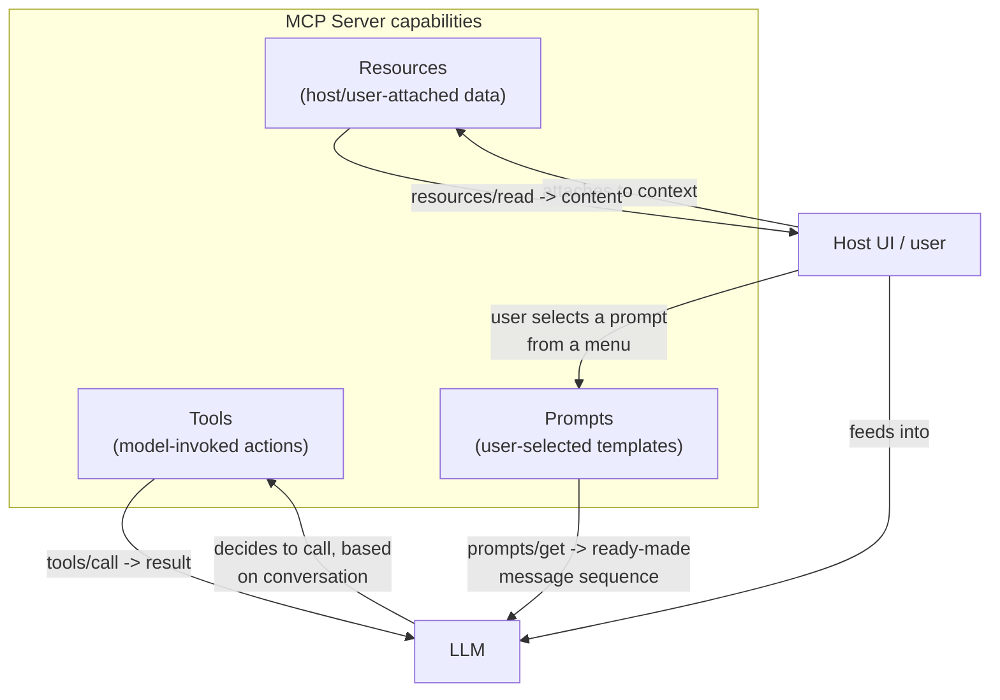

# Tools, Resources, Prompts

## Why This Matters

MCP servers expose exactly three kinds of capability: **tools**, **resources**, and **prompts** (see [MCP Architecture](mcp-architecture.md) for where these fit in the protocol, and [MCP Servers](mcp-servers.md) for how a server declares them). It's tempting to treat all three as roughly interchangeable "stuff the model can access," but they have distinct semantics, and using the wrong primitive for a job leads to real design mistakes — e.g., exposing a search operation as a resource when it should be a tool, or forcing a static reference document through a tool call when it should be a resource. Understanding the actual difference is what lets you design MCP servers well instead of by guesswork.

## Core Concept

The three primitives, precisely:

- **Tools**: model-invoked actions. A tool has a name, a description, and a JSON schema for its arguments; calling it can have side effects and returns a result. The LLM decides, based on the conversation, when to call a tool — exactly like the function/tool calling you already know from [Part 14](../14-ai-api-engineering/README.md). Tools are for *doing something* — running a query, sending a message, executing code.
- **Resources**: application-controlled (or user-controlled) data the host can read and feed into context. A resource has a URI (e.g., `file:///path/to/doc.md`, `postgres://schema/table`), a MIME type, and content. Unlike tools, the model doesn't necessarily "call" a resource on its own initiative — the *host application* typically decides which resources to attach to context (often via a user picking a file, or the host automatically attaching something relevant), though a host may also let the model request a resource read explicitly. Resources are for *referencing something* — a document, a database row, a log file.
- **Prompts**: reusable, server-defined prompt templates, typically invoked by the *user*, not the model. A server can expose a prompt like "summarize-pr-for-review" that takes a PR number as an argument and returns a fully-formed prompt (possibly with embedded resources) ready to send to the LLM. Prompts are for *packaging a known-good interaction pattern* that the server's author has already figured out — the user (or host UI) selects it explicitly, the way you'd pick a slash-command or a saved template.

The distinguishing question for each is **"who decides to use this, and what happens when they do?"** — the model decides for tools (side effects), the host/user decides for resources (data), and the user decides for prompts (interaction templates).

## Mental Model

Map these onto a familiar analogy: a **tool** is like a **function call** — something with a defined interface that does work and returns a value, invoked programmatically by whoever (here, the model) decides it's needed. A **resource** is like a **file or a REST `GET` endpoint** — static or semi-static data, addressed by a URI, that you fetch and read, not something you "execute." A **prompt** is like a **saved query or a slash-command in a chat app** — a pre-written, parameterized template that a human explicitly picks to kick off a known kind of interaction, rather than data the model autonomously decides to fetch.

If you've used a code editor with AI features, you've likely seen all three without naming them: the AI running a "find references" action is a **tool**; you attaching a specific file to the chat context is a **resource**; you invoking a saved "/explain-this-function" command is a **prompt**.

## How It Works

**Tools** are declared with `name`, `description`, and `inputSchema` (JSON Schema); invoked via `tools/call` with arguments; return `content` (text, images, or embedded resources) and an `isError` flag. This is the primitive covered in depth in [MCP Servers](mcp-servers.md) and [Tool Execution](tool-execution.md) — nothing about its mechanics changes here, this chapter just places it alongside the other two.

**Resources** are declared with a `uri`, `name`, and `mimeType`, discoverable via `resources/list` and fetched via `resources/read`. A server can also expose **resource templates** — parameterized URI patterns like `wiki://pages/{page_id}` — so a client can construct valid URIs for a whole class of resources without the server having to enumerate every single one upfront. Servers can also notify clients when a resource's content changes (`notifications/resources/updated`), which matters for resources backed by live data.

**Prompts** are declared with a `name`, `description`, and a list of expected arguments, discoverable via `prompts/list` and materialized via `prompts/get`, which returns a fully-formed sequence of messages (potentially including embedded resource content) ready to be sent as-is to the LLM. This is the primitive most directly aimed at humans: host applications typically surface available prompts as a picker UI (a menu, a slash-command list) rather than leaving discovery to the model.

## Architecture



## Request / Response Example

A `prompts/get` call — the user has picked a server-defined prompt template from a menu, and the client materializes it into an actual message sequence:

```json
// Client -> Server
{
  "jsonrpc": "2.0",
  "id": 5,
  "method": "prompts/get",
  "params": {
    "name": "summarize-pr-for-review",
    "arguments": { "pr_number": "482" }
  }
}
```

```json
// Server -> Client
{
  "jsonrpc": "2.0",
  "id": 5,
  "result": {
    "description": "Summarize a pull request for code review",
    "messages": [
      {
        "role": "user",
        "content": {
          "type": "text",
          "text": "Summarize the following pull request for a reviewer, calling out any risky changes:"
        }
      },
      {
        "role": "user",
        "content": {
          "type": "resource",
          "resource": {
            "uri": "github://repo/pulls/482/diff",
            "mimeType": "text/x-diff",
            "text": "diff --git a/app.py b/app.py\n..."
          }
        }
      }
    ]
  }
}
```

Notice how the prompt embeds a **resource** directly inside the returned messages — prompts and resources compose naturally, while tools remain a separate, model-triggered mechanism entirely.

## Code Example

```python
# Conceptual / pseudo-SDK code — follow the official MCP SDK docs for exact syntax.
from mcp_sdk import Server

server = Server(name="github-mcp-server", version="1.0.0")

# TOOL — the model decides, mid-conversation, whether to call this.
@server.tool(
    name="create_pr_comment",
    description="Post a comment on a specific pull request.",
    input_schema={
        "type": "object",
        "properties": {
            "pr_number": {"type": "integer"},
            "body": {"type": "string"},
        },
        "required": ["pr_number", "body"],
    },
)
async def create_pr_comment(pr_number: int, body: str) -> dict:
    await github_api.post_comment(pr_number, body)
    return {"content": [{"type": "text", "text": f"Comment posted on PR #{pr_number}."}]}


# RESOURCE — the host/user attaches this; the model doesn't autonomously fetch it.
@server.resource(uri_template="github://repo/pulls/{pr_number}/diff")
async def get_pr_diff(pr_number: str) -> dict:
    diff = await github_api.get_diff(pr_number)
    return {"contents": [{"uri": f"github://repo/pulls/{pr_number}/diff", "mimeType": "text/x-diff", "text": diff}]}


# PROMPT — the user picks this from a menu; the server returns ready-to-send messages.
@server.prompt(
    name="summarize-pr-for-review",
    description="Summarize a pull request for code review",
    arguments=[{"name": "pr_number", "required": True}],
)
async def summarize_pr_for_review(pr_number: str) -> dict:
    diff_resource = await get_pr_diff(pr_number)
    return {
        "description": "Summarize a pull request for code review",
        "messages": [
            {"role": "user", "content": {"type": "text", "text": "Summarize this PR, calling out risky changes:"}},
            {"role": "user", "content": {"type": "resource", "resource": diff_resource["contents"][0]}},
        ],
    }
```

This one server exposes all three primitives for the same underlying domain (GitHub PRs): a tool that *acts* (posts a comment), a resource that *provides data* (the diff), and a prompt that *packages a known-good interaction* (summarize-for-review, which itself embeds the resource).

## Production Considerations

- **Don't force an action into a resource, or a data fetch into a tool** — a resource should have no meaningful side effects when read (idempotent, safe), while a tool is expected to potentially mutate state. Mixing these up confuses both the model's expectations and any caching you might do on resource reads.
- **Prompts are a good place to bake in your organization's best practices** for a recurring interaction (e.g., "always include the diff and the linked ticket when summarizing a PR") — treat them as versioned, reviewed artifacts, not throwaway strings.
- **Resource templates** (`wiki://pages/{page_id}`) scale much better than enumerating every resource upfront — use them whenever the resource space is large or dynamic (e.g., every row in a table, every page in a wiki).
- **Notify on change**: if a resource's content can change while a session is open (a live log file, a frequently-updated document), use the update notification rather than expecting the client to poll.

## Common Mistakes

- Implementing a data-fetching operation as a tool when it has no side effects and would be better modeled (and cached) as a resource.
- Implementing an action with side effects as a resource "because it seemed like data," which breaks the assumption that reading a resource is safe and repeatable.
- Never using prompts at all, and instead relying entirely on the host application's own system prompt for every interaction pattern — missing the chance to ship well-tested, reusable prompt templates alongside the server that knows the domain best.
- Enumerating thousands of individual resources instead of using a resource template, bloating `resources/list` responses.

## Best Practices

- Ask "does this have side effects?" before deciding whether something is a tool or a resource — safe-to-repeat reads belong as resources, anything that changes state belongs as a tool.
- Use resource templates for large or dynamic resource spaces instead of enumerating every individual resource.
- Write tool and prompt descriptions with the same care as public documentation — both are read and acted on by the model or surfaced directly to users.
- Version prompts deliberately once other people depend on them, and treat them as reviewed artifacts rather than throwaway strings.
- Notify clients on resource content changes instead of expecting them to poll.

## AI Engineering Perspective (MCP in the broader ecosystem)

The three-primitive split is MCP's answer to a design question every custom tool-calling integration eventually runs into but rarely names explicitly: not everything an AI application needs from an external system is an "action the model decides to take." Some of it is data a human or the host attaches deliberately (resources), and some of it is a known-good interaction pattern a human wants to trigger on demand (prompts). Custom, ad hoc tool-calling setups (as in [Part 14](../14-ai-api-engineering/README.md)) tend to flatten all of this into "tools," because tool calling is the only primitive a raw LLM API gives you. MCP's contribution here is making the other two first-class, standardized concepts — which, once you've seen the distinction, is a useful design lens even outside MCP: when you build any tool-calling system, ask whether a given capability is really an action the model should decide to invoke, or data/a template a human should be attaching or selecting instead.

## Exercises

**Beginner**: For each of the following, classify it as a tool, a resource, or a prompt, and justify why: (a) "fetch today's server error log," (b) "restart the payment service," (c) "generate a standard incident postmortem template."

**Intermediate**: Add a resource template to the code example for listing all open PRs (`github://repo/pulls`) rather than a single PR's diff, and describe what its discovery entry in `resources/list` would look like.

**Advanced**: Design a prompt (`name`, `description`, `arguments`, and the returned `messages` structure) for an internal MCP server that helps engineers draft incident postmortems, including at least one embedded resource (e.g., the incident timeline) inside the returned messages.

## Key Takeaways

- Tools are model-invoked actions with side effects; resources are host/user-attached data meant to be read safely; prompts are user-selected, server-defined interaction templates.
- The distinguishing question is "who decides to use this, and does it have side effects" — the model for tools, the host/user for resources, the user for prompts.
- Resources should be safe to read repeatedly (idempotent); actions with side effects belong in tools, not resources.
- Prompts can embed resources directly, giving servers a way to ship known-good, reviewed interaction patterns alongside their data and actions.
- This three-way split is one of the clearest conceptual contributions MCP makes beyond plain tool calling — it's a useful design lens even when you're not using MCP directly.
