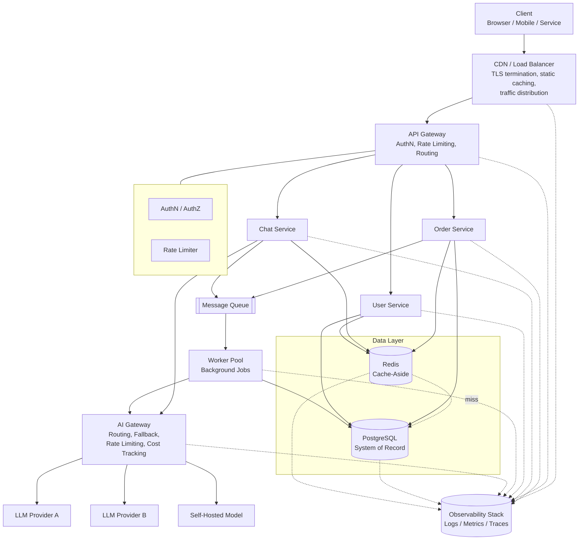

# Complete Architecture Walkthrough

## Why This Matters

Every chapter before this one taught you one piece of a production system in isolation: how a load balancer distributes traffic, how a circuit breaker stops cascading failure, how Redis serves a cached value in under a millisecond, how an LLM gateway routes a completion request to a fallback provider. Each of those is easy to understand on its own page. What's hard — and what actually matters when you're the engineer on call — is holding the *whole system* in your head at once: knowing which of the twelve moving parts a request touches, why each one exists, and what breaks if you removed it.

This chapter is that whole system. It is one architecture, assembled from every part of this handbook, described component by component in the order a request actually flows through it. If you've read Parts 1–17, nothing here will be a new *concept* — but seeing it all wired together, with each piece's job stated plainly next to its neighbors, is what turns "I understand rate limiting" into "I can design a production API platform." That's the payoff of this part of the handbook.

## Core Concept

A production API platform — especially one that also serves AI features — is not one service. It is a **pipeline of specialized layers**, each solving exactly one class of problem, composed so that a request passes through only the layers it needs and each layer can fail, scale, and be operated independently of the others.

The layers, in the order a request encounters them:

1. **Client** — browser, mobile app, or another service.
2. **CDN / Load Balancer** — the network edge: TLS termination, static asset caching, and traffic distribution.
3. **API Gateway** — the single front door for all API traffic: authentication, rate limiting, routing.
4. **Application Services** — the stateless business-logic layer (FastAPI services, per Part 3).
5. **Data layer** — PostgreSQL (source of truth), Redis (cache), and a message queue (async work).
6. **Workers** — processes that consume the queue for background and long-running work.
7. **AI Gateway** — the specialized internal gateway for every LLM call in the system.
8. **LLM Providers** — external (or self-hosted) model APIs the AI Gateway calls.
9. **Observability stack** — logs, metrics, and traces collected from every layer above.

No single team, and often no single engineer, owns the whole diagram — but every engineer working on this system needs to know what each box does and why it's there, which is exactly what the rest of this chapter walks through.

## Mental Model

Think of this architecture as an **airport**, not a single building. A passenger (request) doesn't walk directly onto the tarmac (the database). They pass through curb-side drop-off (CDN/load balancer), security screening (API gateway — identity check and a limit on how many people can pass per minute), then into the terminal where different counters handle different needs (application services). Checked baggage disappears into a separate handling system that runs on its own schedule (queue and workers) and reunites with the passenger later rather than making them wait at the counter. A connecting international flight (an AI-backed request) goes through an additional customs layer (the AI Gateway) that talks to other countries' authorities (LLM providers) with their own rules and occasional closures. And cameras and sensors (observability) watch every one of those areas simultaneously, not just the front door — because when something goes wrong, you need to know *where*, not just *that*.

The point of the airport analogy: every layer exists because putting that responsibility anywhere else either overloads a shared resource or removes the possibility of scaling and failing independently. That is the design principle behind the whole architecture, and it's worth keeping in mind as you read each layer's description below.

## How It Works

**1. Client.** A browser, mobile app, or upstream service issues an HTTPS request. It doesn't know or care how many services exist behind the URL it's calling — it only knows a hostname, a JSON contract (Part 2 — [REST API Design](../02-rest-api-design/README.md)), and how to hold a bearer token (Part 5 — [Authentication & Authorization](../05-authentication-authorization/README.md)).

**2. CDN / Load Balancer.** The request first lands at the network edge. A CDN serves static assets and cacheable GET responses from a point of presence near the client, so most traffic never reaches your origin at all. Anything that must reach the origin hits a load balancer, which terminates TLS and distributes connections across many API Gateway instances using a strategy like round robin or least-connections. This layer is deliberately dumb — it does not know about users, tokens, or business logic. It exists purely to survive traffic spikes and instance failures before a request reaches anything stateful.

**3. API Gateway.** This is the single front door for API traffic, covered in depth in [API Gateway](../11-microservices-distributed-systems/api-gateway.md). It does three jobs before a request is allowed anywhere near business logic:
   - **Authentication** — validates the bearer token or API key (see [Bearer Tokens](../05-authentication-authorization/README.md) and [JWT Deeply Explained](../05-authentication-authorization/README.md) in Part 5), rejecting unauthenticated requests immediately, cheaply, at the edge of the system.
   - **Rate limiting** — enforces per-user and per-tenant limits (see [Rate Limiting](../06-production-reliability/rate-limiting.md)) so a single abusive or buggy client cannot starve everyone else.
   - **Routing** — maps the request path to the correct downstream service in a microservices topology, and can also handle request/response transformation and API versioning.

   Putting auth and rate limiting *here* instead of in every application service means every downstream service can assume the request in front of it is already authenticated and within quota — a huge simplification repeated across dozens of services.

**4. Application Services.** These are the stateless FastAPI services that implement actual business logic — orders, users, chat sessions, whatever the product does (Part 3 — [Building APIs](../03-building-apis/README.md)). "Stateless" is load-bearing: an application service instance keeps no session data in memory, so any instance can handle any request, instances can be added or removed freely, and a crashed instance loses nothing but the one in-flight request. All durable state lives one layer down.

**5. Database.** PostgreSQL is the system of record (Part 4 — [Databases & APIs](../04-databases-and-apis/README.md)). Application services talk to it through connection pools, wrapped in transactions where multiple writes must be atomic. It is the slowest, most stateful, and most operationally sensitive component in the synchronous path — which is exactly why the next two components exist: to keep as much load off it as possible.

**6. Cache.** Redis sits between application services and the database, serving the cache-aside pattern (see [Cache-Aside](../07-caching-performance/cache-aside.md) and [Redis](../07-caching-performance/redis.md)): read the cache first, fall back to the database on a miss, populate the cache, return. A well-designed cache absorbs the majority of read traffic, which is what lets the database layer scale far less aggressively than the application layer in front of it.

**7. Message Queue.** Anything that doesn't need to finish before the response is sent — sending an email, generating a report, processing an uploaded file — is pushed onto a queue instead of executed inline (see [Message Queues](../08-async-systems/message-queues.md)). This is what lets `POST /orders` return in 80ms even though "send confirmation email" and "update analytics" might take seconds.

**8. Workers.** A pool of worker processes consumes queued jobs independently of the request/response cycle. Workers scale on queue depth rather than HTTP traffic, and a slow or failing job never blocks a user waiting on an API response, per Part 8 — [Async Systems](../08-async-systems/README.md).

**9. AI Gateway.** Any request that needs an LLM completion — whether triggered synchronously from an application service or asynchronously from a worker — goes through the AI Gateway, never directly to a model provider. Covered fully in [LLM Gateways](../15-production-ai-systems/llm-gateways.md), this internal service owns provider credentials, request/response normalization, [model routing](../15-production-ai-systems/model-routing.md), and [fallback](../15-production-ai-systems/fallback-systems.md) behavior. Treating AI calls as a *gateway-fronted external dependency*, structurally identical to how the API Gateway fronts your own services, is the single most important architectural decision in an AI-backed system — it's what keeps a provider outage from becoming an application-wide outage.

**10. LLM Providers.** OpenAI-style, Anthropic-style, or self-hosted model servers. From the rest of the system's point of view, these are just another flaky, rate-limited, latency-variable upstream dependency — the same category of problem as any third-party API, solved with the same tools: [timeouts](../06-production-reliability/README.md), [retries](../06-production-reliability/retries.md), and [circuit breakers](../06-production-reliability/circuit-breakers.md).

**11. Observability stack.** Every layer above emits logs, metrics, and traces into a shared observability stack (Part 12 — [Observability](../12-observability/README.md)). A single request carries one trace ID from the API Gateway all the way through to the LLM provider call and back (see [Distributed Tracing](../12-observability/distributed-tracing.md)), which is the only reason a production incident spanning six services is debuggable in minutes instead of hours.

## Architecture



The solid arrows are the synchronous and asynchronous data path; the dashed arrows into the Observability Stack represent every layer continuously reporting telemetry, independent of any single request's success or failure.

## Request / Response Example

A single `GET /orders/42` illustrates how many layers a "simple" read touches even before it reaches business logic:

```http
GET /orders/42 HTTP/1.1
Host: api.example.com
Authorization: Bearer eyJhbGciOi...
X-Request-Id: 6f1e2b3a-...
```

The load balancer forwards it to a healthy API Gateway instance. The gateway validates the bearer token, checks the caller's rate-limit bucket, attaches (or generates) `X-Request-Id` for tracing, and routes to an Order Service instance. That service checks Redis for `order:42`; on a hit, it returns immediately without touching PostgreSQL:

```http
HTTP/1.1 200 OK
Content-Type: application/json
X-Cache: HIT
X-Request-Id: 6f1e2b3a-...

{
  "id": 42,
  "status": "shipped",
  "total_cents": 4599
}
```

Every one of those layers — gateway, cache, service — recorded a log line and a trace span tagged with the same `X-Request-Id`, which is what lets you reconstruct this exact path later in the observability stack.

## Code Example

A simplified representation of how an application service is configured to know about its neighbors — the cache, the database, the queue, and the AI Gateway — as explicit, independently-failing dependencies rather than assumptions baked into business logic:

```python
from dataclasses import dataclass
from redis.asyncio import Redis
from sqlalchemy.ext.asyncio import AsyncEngine
import httpx


@dataclass
class ServiceDependencies:
    """Every external dependency this service touches, made explicit.

    This is the architecture diagram, expressed as code: if it's not
    listed here, this service doesn't talk to it, and if it is listed
    here, it can fail independently and needs its own timeout/retry
    policy (see Part 6 — Production Reliability).
    """
    db: AsyncEngine
    cache: Redis
    queue_publish: callable          # publishes to the message queue
    ai_gateway: httpx.AsyncClient    # never a direct LLM provider client


async def get_order(order_id: int, deps: ServiceDependencies) -> dict:
    cache_key = f"order:{order_id}"

    if cached := await deps.cache.get(cache_key):
        return {"source": "cache", "data": cached}

    async with deps.db.connect() as conn:
        row = await conn.execute(
            "SELECT id, status, total_cents FROM orders WHERE id = :id",
            {"id": order_id},
        )
        order = row.mappings().first()

    if order:
        await deps.cache.set(cache_key, dict(order), ex=300)  # TTL, see cache-aside.md

    return {"source": "db", "data": dict(order) if order else None}
```

Notice what this function does *not* do: it doesn't call an LLM provider's SDK directly, it doesn't open a raw socket to Postgres without a pool, and it doesn't publish to the queue without going through a documented interface. Every dependency crosses an explicit boundary — the same boundaries drawn in the architecture diagram above.

## Production Considerations

- **No layer should be a single point of failure.** Every box in the diagram above runs as multiple instances except, arguably, the primary database — and even that has replicas (see [Scaling Strategy](scaling-strategy.md)).
- **Each layer scales on its own signal**, not on a shared one: application services scale on CPU/request rate, workers scale on queue depth, the database scales via read replicas and connection pooling. Conflating these signals is one of the most common scaling mistakes (see [Common Mistakes](#common-mistakes) below).
- **The AI Gateway is architecturally identical in *role* to the API Gateway** — both are chokepoints that centralize cross-cutting concerns (auth vs. provider credentials, rate limiting vs. token limiting) — but they are *separate services* precisely so that AI provider incidents can't take down non-AI traffic, and vice versa.
- **Every hop between layers needs its own timeout budget.** A request touching six services each with a 30-second timeout can hang for minutes; timeouts must be set per-hop and should sum to a sane end-to-end budget (see [Timeouts](../06-production-reliability/README.md)).
- **This diagram is a starting topology, not a fixed law.** A small system might collapse "application services" into one deployable unit and skip a dedicated AI Gateway process until AI traffic justifies it. The *responsibilities* described here still apply even when they're temporarily co-located.

## Common Mistakes

- **Putting business logic in the API Gateway.** The gateway should only do cross-cutting concerns — auth, rate limiting, routing. Gateways that grow custom logic per-route become an unversioned, hard-to-test monolith that every team is afraid to touch.
- **Calling LLM providers directly from application services**, bypassing the AI Gateway "just this once" for a new feature. This is how you end up with provider API keys scattered across five services, no unified cost tracking, and a provider outage that takes down features nobody realized depended on it.
- **Treating the cache as a second source of truth.** Redis in this architecture is disposable — if it's flushed, the system must still be correct (just slower), because every value is reconstructible from PostgreSQL. Storing data in Redis that doesn't also exist durably elsewhere is a data-loss incident waiting to happen.
- **Synchronous chains across too many services.** If `POST /orders` synchronously calls the Order Service, which synchronously calls the Inventory Service, which synchronously calls the Payment Service, you've built a distributed monolith with the latency and failure modes of the slowest link, multiplied. Anything that doesn't need an immediate answer belongs on the queue.
- **No shared request ID.** Without a trace ID generated at the edge and propagated through every hop, debugging a production issue across this many services is nearly impossible — see [Distributed Tracing](../12-observability/distributed-tracing.md).

## Best Practices

- Draw this diagram (or your system's version of it) somewhere every engineer can see it, and keep it accurate as the system evolves — architecture diagrams that lie are worse than none.
- Give every layer an independent health check and readiness probe so orchestration systems can make correct decisions about routing traffic to it.
- Default new cross-service calls to asynchronous (queue-based) unless there's a specific reason the caller needs to block for the answer.
- Route 100% of LLM traffic through the AI Gateway from day one, even in a small system — retrofitting this later means finding and migrating every direct provider call.
- Instrument first, optimize second: you cannot correctly identify which layer needs to scale or harden without the observability stack already in place.

## AI Engineering Perspective

The single biggest architectural difference an AI-backed system introduces, compared to a traditional CRUD API, is that one of your "downstream dependencies" (the LLM provider) is dramatically slower, more expensive, and less predictable than a database query — often by two to three orders of magnitude in latency and with real per-call dollar cost. Every pattern that traditional backend engineering treats as optional hardening — circuit breakers, fallbacks, aggressive caching — becomes load-bearing infrastructure for AI features, not a nice-to-have. That's why this architecture gives AI traffic its own gateway layer rather than folding it into the general API Gateway: the failure modes, rate limits, and cost-tracking needs of "call GPT-4" are different in kind from "call our own Order Service," and mixing them makes both harder to reason about. See [Multi-Provider Architecture](../15-production-ai-systems/multi-provider-architecture.md) for how this plays out when you have more than one provider.

## Exercises

**Beginner**
1. Redraw the architecture diagram from memory, labeling each box with the one-sentence job it does. Compare against this chapter and note anything you missed.
2. For each layer in the diagram, name one earlier chapter in this handbook that explains it in depth, and one thing that layer is explicitly *not* responsible for.

**Intermediate**
3. A new "image generation" feature is being added that calls an external image-generation API. Where does it fit in this architecture — does it go through the AI Gateway, get its own gateway, or something else? Justify your answer.

**Advanced**
4. Sketch what changes in this architecture if traffic grows 100x overnight. Which layers need architectural changes (not just "add more instances") and which can absorb the growth by scaling horizontally as-is? Cross-reference [Scaling Strategy](scaling-strategy.md) after you've made your own attempt.

## Key Takeaways

- A production system is a pipeline of specialized layers — client, edge, gateway, services, data, workers, AI gateway, providers, observability — each solving one class of problem so it can scale and fail independently of the others.
- The API Gateway and AI Gateway play structurally identical roles (a centralizing chokepoint for cross-cutting concerns) for two very different kinds of traffic, and keeping them separate is what isolates AI provider incidents from the rest of the system.
- Application services stay stateless; all durable state lives in the data layer, which is why instances can be added, removed, or crashed freely.
- Anything that doesn't need to block the response belongs on a queue, consumed by an independently-scaling worker pool.
- Observability isn't a bolt-on layer — every other layer continuously feeds it, and it's what makes a six-service request debuggable at all.
