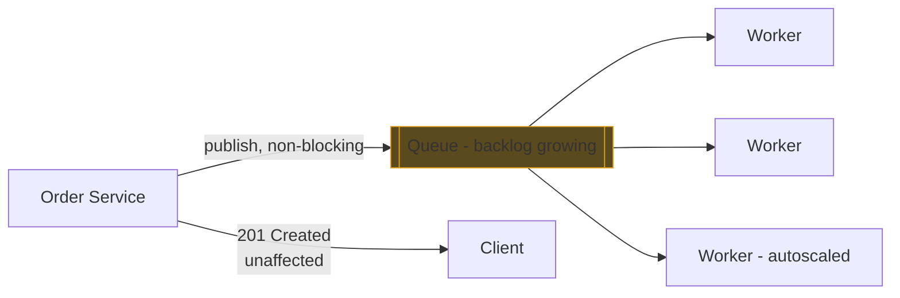
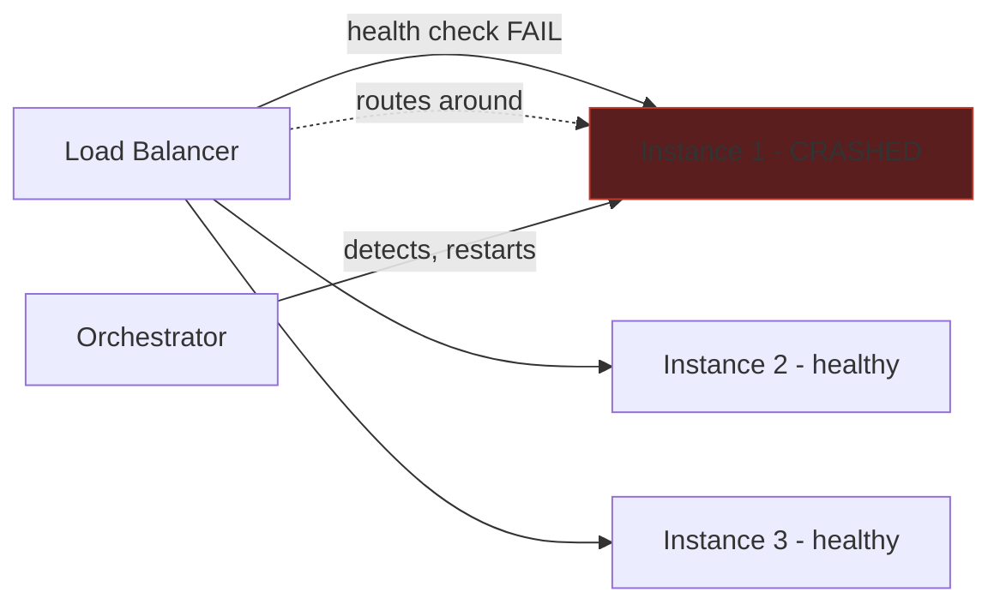

# Failure Scenarios

## Why This Matters

A system diagram describes the happy path. Production is the study of everything that isn't the happy path. Every component in the [Complete Architecture Walkthrough](complete-architecture-walkthrough.md) will, eventually, fail — the database will become unreachable, Redis will restart, a cloud region will have a bad afternoon, an LLM provider will return 503s for twenty minutes, a queue will back up faster than workers can drain it, an application instance will be OOM-killed mid-request. None of this is exotic; it is the normal operating condition of any system that runs long enough. What separates a resilient architecture from a fragile one is not the absence of these failures but whether the architecture *contains* each one to the smallest possible blast radius, using exactly the patterns covered in [Part 6 — Production Reliability](../06-production-reliability/README.md) and [Part 15 — Production AI Systems](../15-production-ai-systems/README.md). This chapter walks through five representative failures and traces how the architecture is supposed to respond to each.

## Core Concept

Every failure scenario below follows the same analytical shape, worth internalizing as a general skill:

1. **What breaks** — the specific component and how it breaks (unreachable, slow, returning errors, at capacity).
2. **Who notices first** — which layer's health checks, timeouts, or error rates detect it.
3. **What the architecture does automatically** — the pattern (circuit breaker, retry, fallback, degraded mode) that contains the failure without a human intervening.
4. **What the user experiences** — the honest answer, which is sometimes "a slightly slower response" and sometimes "a clear error," but should almost never be "the whole platform is down."

Good architecture doesn't prevent failures. It makes sure a failure in one box never becomes a failure of every box.

## Mental Model

Think of this architecture as a building with **fire doors** between sections. A fire in the kitchen (the database) should not require evacuating the entire building — it should trigger the fire doors around that section (circuit breakers, timeouts, fallback to cache) so the rest of the building keeps operating while the kitchen is dealt with. A building with no fire doors — where every room is one continuous open space — turns every small fire into a total evacuation. The patterns in this chapter are the fire doors; the rest of this chapter shows where each one is installed and why.

## How It Works

### Scenario 1 — Database goes down

**What breaks:** PostgreSQL becomes unreachable — a failover event, a crashed primary, a network partition to the data layer.

**Who notices first:** Application service connection pools start timing out on queries; health checks that include a DB ping start failing.

**What the architecture does:** Reads for data already in Redis continue to succeed, because the cache-aside pattern (see [Cache-Aside](../07-caching-performance/cache-aside.md)) means cached values don't require a live database round-trip. Writes, and reads that miss the cache, fail fast behind a [circuit breaker](../06-production-reliability/circuit-breakers.md) instead of piling up as hung connections — once the breaker trips, the service returns a fast, clear `503` instead of a slow timeout for every request. If the database has read replicas, read traffic can be redirected to a replica while the primary recovers (see [Scaling Strategy](scaling-strategy.md)).

**What the user experiences:** Reads of recently-accessed data (product listings, a user's own profile) keep working from cache. Writes and cache-miss reads return a clear, immediate error rather than hanging — degraded, but honest and fast to fail.

```mermaid
flowchart LR
    SVC[Application Service] -->|read| CACHE[(Redis)]
    CACHE -->|HIT: served| SVC
    CACHE -.->|MISS| DB[(PostgreSQL - DOWN)]
    SVC -->|write| CB{Circuit Breaker}
    CB -->|OPEN: fail fast| SVC
    DB -.x CB
    style DB fill:#5a1e1e,stroke:#c0392b
    style CB fill:#5a4a1e,stroke:#e0a020
```

### Scenario 2 — Cache goes down

**What breaks:** Redis becomes unreachable or is flushed.

**Who notices first:** Cache client calls start erroring or timing out; cache hit rate metrics drop to zero.

**What the architecture does:** Because Redis in this architecture is deliberately treated as disposable (every cached value is reconstructible from PostgreSQL — see the [Complete Architecture Walkthrough](complete-architecture-walkthrough.md)), application services fall back to reading directly from the database on cache errors. This is the correct behavior, but it is also dangerous: if the cache is down long enough and traffic is high enough, the database can be hit with load it was never sized for — a **cache stampede**. This is why cache-down handling should include request coalescing or a short-lived local fallback, not just an unconditional pass-through.

**What the user experiences:** Requests get noticeably slower (every read now costs a database round-trip instead of a cache hit) but continue to succeed — until and unless the database itself becomes overloaded by the sudden traffic, which is why this failure needs active load-shedding, not just a silent fallback.

```mermaid
flowchart LR
    SVC[Application Service] -->|read| CACHE[(Redis - DOWN)]
    CACHE -.x SVC
    SVC -->|fallback| DB[(PostgreSQL)]
    DB -->|now absorbing\nfull read load| SVC
    style CACHE fill:#5a1e1e,stroke:#c0392b
    style DB fill:#5a4a1e,stroke:#e0a020
```

### Scenario 3 — One LLM provider goes down

**What breaks:** The primary LLM provider starts returning `5xx` errors or timing out.

**Who notices first:** The AI Gateway's own health checks and per-provider error-rate tracking, well before it becomes a user-visible incident.

**What the architecture does:** This is the scenario the AI Gateway exists to contain. Its circuit breaker for that provider trips after a threshold of failures, and its router (see [Model Routing](../15-production-ai-systems/model-routing.md)) redirects new requests to a secondary provider per the configured [fallback](../15-production-ai-systems/fallback-systems.md) policy — automatically, without a human intervening, typically within seconds of the provider's error rate spiking. Because every AI call in the system goes through this one gateway rather than being called directly from a dozen services, this fix applies everywhere at once.

**What the user experiences:** Little to nothing, if the fallback provider is well-matched in capability — perhaps marginally different response style, and slightly higher latency for the requests that were mid-flight when the failover happened. This is the best-contained failure in the whole system precisely because Part 15's patterns were designed for exactly this case.

```mermaid
flowchart LR
    CHAT[Chat Service] --> AIGW[AI Gateway]
    AIGW --> CB{Circuit Breaker\nProvider A}
    CB -->|OPEN| ROUTE[Router: switch to Provider B]
    ROUTE --> LLMB[LLM Provider B - healthy]
    CB -.x LLMA[LLM Provider A - DOWN]
    style LLMA fill:#5a1e1e,stroke:#c0392b
    style CB fill:#5a4a1e,stroke:#e0a020
    style LLMB fill:#1e5a2e,stroke:#27ae60
```

### Scenario 4 — Queue backs up

**What breaks:** Message volume outpaces worker throughput — a traffic spike, a slow downstream dependency the workers call, or a worker deployment that temporarily reduces capacity.

**Who notices first:** Queue depth / consumer lag metrics climb; this is a leading indicator that should alert well before anything else is user-visible.

**What the architecture does:** Because publishing to the queue from `POST /orders` (see [Request Flow](request-flow.md)) is fire-and-forget from the caller's perspective, a backed-up queue does *not* slow down the synchronous request path — it only delays the async side effects (confirmation emails, analytics updates). Worker pools should autoscale on queue depth (see [Scaling Strategy](scaling-strategy.md)) to drain the backlog. If a specific message type is poison (repeatedly failing and blocking the queue), a dead-letter queue isolates it so it doesn't stall processing of everything behind it.

**What the user experiences:** The API stays fast. Side effects — a confirmation email, a webhook notification — arrive later than usual. This is the textbook case for why [Message Queues](../08-async-systems/message-queues.md) exist: to convert a throughput problem into a latency problem for the *non-critical* part of the request only.



### Scenario 5 — A service instance crashes

**What breaks:** A single Application Service (or AI Gateway, or Worker) process crashes — OOM, an unhandled exception, a bad deploy, the underlying VM being reclaimed.

**Who notices first:** The load balancer's health check for that instance starts failing within one or two check intervals.

**What the architecture does:** Because application services are stateless (see [Complete Architecture Walkthrough](complete-architecture-walkthrough.md)), the load balancer simply stops routing new requests to the dead instance and sends them to the remaining healthy ones — this is the entire reason readiness and liveness probes exist (Part 6 — [Production Reliability](../06-production-reliability/README.md)). The only requests lost are the ones that were in-flight on that exact instance at the moment it died, and orchestration (Kubernetes, ECS, etc.) restarts a replacement instance automatically.

**What the user experiences:** At most, a handful of clients see one failed request, which a well-behaved client retries (see [Retries](../06-production-reliability/retries.md) and [Exponential Backoff](../06-production-reliability/README.md)). No visible outage, provided there was enough spare capacity in the remaining instances to absorb the load — which is why running at exactly N instances for exactly N instances' worth of traffic, with no headroom, turns this routine event into a capacity incident.



## Architecture

Each scenario above includes its own diagram; together they form a checklist. The general shape that recurs across all five: a **detector** (health check, circuit breaker, queue-depth metric) notices the failure faster than a human could, and a **pre-built response** (fallback path, fail-fast, reroute, autoscale) contains it, so the failure stays local to the one component instead of propagating through every layer that depends on it.

## Request / Response Example

What a client sees during Scenario 3 (LLM provider down, fallback engaged) versus an *unhandled* version of the same failure, side by side:

With fallback (this architecture):
```http
HTTP/1.1 200 OK
X-AI-Provider: provider-b-fallback
X-Request-Id: 6f1e2b3a-...

data: {"delta": "Your order..."}
```

Without fallback (naive direct-call architecture):
```http
HTTP/1.1 502 Bad Gateway
X-Request-Id: 6f1e2b3a-...

{"error": "upstream_provider_unavailable"}
```

The difference between these two responses — a slightly different but working answer versus a hard failure — is entirely the AI Gateway doing its job.

## Code Example

A minimal aggregated health check that reflects the "fire door" philosophy: it reports each dependency's status independently rather than collapsing the whole service to a single up/down bit, so operators (and load balancers) can see exactly which failure scenario is in play.

```python
from enum import Enum
from dataclasses import dataclass
import asyncio


class Status(str, Enum):
    HEALTHY = "healthy"
    DEGRADED = "degraded"
    DOWN = "down"


@dataclass
class DependencyHealth:
    name: str
    status: Status
    detail: str = ""


async def check_database(deps) -> DependencyHealth:
    try:
        async with asyncio.timeout(0.5):
            await deps.db.execute("SELECT 1")
        return DependencyHealth("database", Status.HEALTHY)
    except Exception as exc:
        return DependencyHealth("database", Status.DOWN, str(exc))


async def check_cache(deps) -> DependencyHealth:
    try:
        async with asyncio.timeout(0.2):
            await deps.cache.ping()
        return DependencyHealth("cache", Status.HEALTHY)
    except Exception as exc:
        # cache failure is degraded, not fatal — see cache-down scenario above
        return DependencyHealth("cache", Status.DEGRADED, str(exc))


async def check_ai_gateway(deps) -> DependencyHealth:
    try:
        async with asyncio.timeout(0.5):
            resp = await deps.ai_gateway.get("/health")
        if resp.json().get("active_provider_count", 0) == 0:
            return DependencyHealth("ai_gateway", Status.DOWN, "no healthy providers")
        return DependencyHealth("ai_gateway", Status.HEALTHY)
    except Exception as exc:
        return DependencyHealth("ai_gateway", Status.DOWN, str(exc))


async def aggregate_health(deps) -> dict:
    results = await asyncio.gather(
        check_database(deps), check_cache(deps), check_ai_gateway(deps)
    )
    # readiness = "can this instance safely serve traffic", not "is everything perfect"
    overall = Status.DOWN if any(r.status == Status.DOWN for r in results if r.name == "database") else Status.HEALTHY
    return {"overall": overall, "dependencies": [r.__dict__ for r in results]}
```

## Production Considerations

- **Design for graceful degradation explicitly**, not as an afterthought: decide, per dependency, whether its failure should be fatal (database, for writes) or tolerable (cache, for reads; a single LLM provider, given fallback).
- **Alert on leading indicators, not just outages** — queue depth, circuit breaker trip counts, and per-provider error rates should page someone before the failure becomes user-visible, per [SLI, SLO, SLA](../12-observability/sli-slo-sla.md).
- **Test these scenarios deliberately**, not just theoretically — chaos-testing a provider outage or killing a service instance in staging is the only reliable way to confirm the fallback path actually works and isn't just aspirational configuration.
- **Capacity headroom is part of failure handling.** A crashed instance is only "no big deal" if the remaining instances have spare capacity to absorb its share of traffic.

## Common Mistakes

- **No circuit breaker on the database path**, so a struggling primary gets hammered with retries from every service instance simultaneously, turning a slow database into a fully dead one — the exact opposite of containment.
- **Treating every LLM provider failure as an application-wide outage** because AI calls were made directly from services instead of through a gateway with fallback — see [Common Mistakes](complete-architecture-walkthrough.md#common-mistakes) in the walkthrough chapter.
- **A cache-down fallback with no protection against a stampede**, letting every request pile onto the database at once instead of coalescing duplicate reads or applying a brief local rate limit.
- **Health checks that only test "is the process running"** rather than "can this instance actually serve a request" — a process can be alive and completely unable to reach its database.
- **No dead-letter queue**, so one malformed message blocks an entire queue's processing indefinitely.

## Best Practices

- Pair every external dependency with an explicit policy: timeout value, retry count, circuit breaker threshold, and fallback behavior — write it down, don't leave it implicit.
- Make failure states observable in the same dashboards used for normal operation, not a separate system nobody checks until an incident.
- Practice these scenarios on a schedule (game days / chaos testing), not only after they happen for real.
- Design health/readiness checks to reflect actual serviceability, matching the dependency-by-dependency model in the code example above.

## AI Engineering Perspective

The LLM-provider-down scenario is worth dwelling on because it is the cleanest illustration in this whole architecture of resilience patterns paying for themselves. A traditional third-party API failure (a payment processor, a shipping-rate API) usually has no good fallback — there's often only one provider, and a circuit breaker just means failing faster. LLM providers are different: multiple providers can serve functionally similar completions, which makes the fallback pattern not just fast-failing but actually self-healing — the user gets a correct answer, from a different model, without ever seeing an error. That asymmetry — genuine fallback capability rather than just graceful failure — is a big part of why [multi-provider architecture](../15-production-ai-systems/multi-provider-architecture.md) is worth the operational complexity for any AI feature with real reliability requirements.

## Exercises

**Beginner**
1. For each of the five scenarios in this chapter, write one sentence describing what the user experiences if the corresponding pattern (circuit breaker, fallback, queue, etc.) were *removed* from the architecture.

**Intermediate**
2. Design the failure-handling policy for a sixth scenario not covered here: the observability stack itself goes down (you can no longer collect logs, metrics, or traces). What should the rest of the architecture do, and what should it explicitly *not* do?

**Advanced**
3. Two of these five scenarios (database down, cache down) can happen simultaneously during a single infrastructure incident (e.g., an availability-zone failure). Sketch how the architecture behaves under that compound failure, and identify where the individual fallback strategies for each failure might actually conflict or compound the damage.

## Key Takeaways

- Every major component in this architecture fails eventually; the job of the architecture is to contain each failure to its own layer, not to prevent failure altogether.
- Circuit breakers, fallback providers, cache-aside degradation, non-blocking queues, and stateless service instances are the concrete mechanisms doing the containment — all covered individually in Parts 6 and 15.
- The AI Gateway's provider fallback is the best-contained failure mode in the system because multiple providers can genuinely substitute for one another, unlike most third-party dependencies.
- Leading indicators (queue depth, circuit breaker state, per-provider error rate) should trigger alerts before a failure becomes user-visible.
- Untested failure handling is not failure handling — these scenarios need to be exercised deliberately, not just configured and assumed to work.
