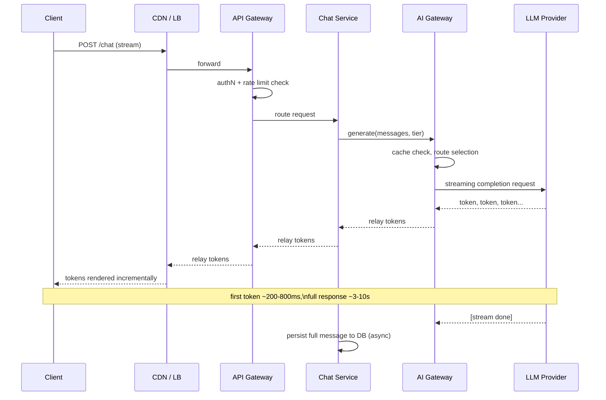

# Request Flow, End to End

## Why This Matters

Knowing what each component does, as covered in the [Complete Architecture Walkthrough](complete-architecture-walkthrough.md), is necessary but not sufficient. The question that actually gets asked in an incident channel or a system design interview is sharper: *for this one request, in this exact order, which components got touched, and how long did each one take?* Answering that requires tracing a real request — not a diagram — through the system. This chapter does that twice: once for an ordinary CRUD write, and once for an AI-backed request that streams a response back to the client. Together they cover the two fundamentally different request shapes a modern API platform has to support.

## Core Concept

Every request flowing through this architecture falls into one of two categories, and the category determines its whole shape:

- **Synchronous, bounded-latency requests** — a database read or write where the client waits for a definitive answer within milliseconds. `POST /orders` is the example here.
- **Long-running, streamed requests** — a request whose total latency is dominated by an external, slow, non-deterministic dependency (an LLM call), where the client experiences the response as it arrives rather than all at once. `POST /chat` is the example here.

Both requests pass through the same edge and gateway layers described in the walkthrough chapter. They diverge hard once they reach the application layer, and that divergence — a fast, bounded write path versus a long-lived, streamed AI path — is the most important structural distinction to internalize about production AI systems.

## Mental Model

Think of `POST /orders` as a **bank teller transaction**: you walk up, hand over a form, the teller processes it against the vault's ledger in a few seconds, stamps a receipt, and you leave with a definite answer. Think of `POST /chat` as **ordering a custom cake**: you place the order at the counter (fast), but the actual work happens in the back, takes minutes, and — if the bakery is any good — they let you watch progress through a window (streaming) rather than making you stand at the counter in silence until it's fully done. Both interactions start the same way (walk in, get authenticated as a customer, wait your turn) and diverge completely in how the "work" phase is experienced.

## How It Works

### Request A — `POST /orders` (synchronous CRUD write)

1. Client sends the request with a JSON body and an `Idempotency-Key` header (writes should be idempotent — see [Idempotency](../06-production-reliability/README.md)).
2. CDN passes it straight through (POST requests aren't cached) to the load balancer, which picks a healthy API Gateway instance.
3. The gateway validates the bearer token, checks the rate limit bucket for this user, generates a trace ID, and routes to an Order Service instance.
4. The Order Service validates the request body against a Pydantic model (Part 3 — [Building APIs](../03-building-apis/README.md)), opens a database transaction, inserts the order row, and commits.
5. Within the same handler, it publishes an `order.created` message onto the queue (see [Message Queues](../08-async-systems/message-queues.md)) for anything that doesn't need to block the response — sending a confirmation email, updating a recommendation model, notifying an internal analytics service.
6. It writes the newly created order into the cache (or just invalidates the relevant cache key, depending on the caching policy — see [Cache-Aside](../07-caching-performance/cache-aside.md)).
7. It returns `201 Created` with the order representation. Total elapsed time: typically 20–150ms, almost entirely database round-trip.
8. Independently and after the response has already gone back to the client, a worker picks the `order.created` message off the queue and does the slower follow-up work.

The client never waits on step 8. That's the entire point of separating the queue-driven side effects from the request path.

### Request B — `POST /chat` (AI-backed, streamed)

1. Client sends a chat message, typically opening a connection that will receive a stream of Server-Sent Events or chunked HTTP (see [Streaming LLM Responses](../14-ai-api-engineering/README.md) and [Streaming APIs](../09-realtime-and-webhooks/README.md)).
2. CDN and load balancer pass it through to the API Gateway, which authenticates and rate-limits exactly as in Request A — this part of the path is identical regardless of what the request will eventually do.
3. The gateway routes to a Chat Service instance. Unlike the Order Service, this handler does not expect to finish in milliseconds — it needs a connection that can stay open and stream partial output.
4. The Chat Service loads conversation context (recent messages, possibly retrieved via a cache or a vector store for RAG — see [Retrieval](../16-rag-apis/README.md) if applicable), then calls the **AI Gateway** rather than any LLM provider directly.
5. The AI Gateway checks a prompt or semantic cache for an equivalent recent request; on a miss, its router selects a provider and model based on policy and current health (see [Model Routing](../15-production-ai-systems/model-routing.md)), and opens a streaming connection to the chosen LLM provider.
6. As the provider streams tokens back, the AI Gateway relays them upstream to the Chat Service, which relays them to the client — the client starts seeing output within roughly 200–800ms (time to first token) even though the *full* response might take 3–10 seconds to complete.
7. If the first-choice provider errors out or times out mid-stream, the AI Gateway's fallback logic (see [Fallback Systems](../15-production-ai-systems/fallback-systems.md)) can retry against a secondary provider — ideally before any tokens have been sent to the client, since a stream can't cleanly restart mid-flight.
8. Once the stream completes, the Chat Service persists the full message to PostgreSQL and pushes usage/cost data into the observability and cost-tracking pipeline; any slower follow-up (e.g., generating a conversation title, updating long-term memory) is pushed onto the queue exactly as in Request A.

The two requests share an identical first half (client → CDN → gateway → auth/rate-limit) and a structurally similar tail (durable write + queue-based follow-up work), but their middle is completely different: one is a single fast database round trip, the other is a long-lived streamed call through a second gateway to a third-party system with an order of magnitude more latency variance.

## Architecture

```mermaid
sequenceDiagram
    participant C as Client
    participant CDN as CDN / LB
    participant GW as API Gateway
    participant SVC as Order Service
    participant DB as PostgreSQL
    participant CACHE as Redis
    participant Q as Queue

    C->>CDN: POST /orders
    CDN->>GW: forward
    GW->>GW: authN + rate limit check
    GW->>SVC: route request
    SVC->>DB: BEGIN; INSERT order; COMMIT
    DB-->>SVC: order row
    SVC->>CACHE: SET order:42 (or invalidate)
    SVC->>Q: publish order.created
    SVC-->>GW: 201 Created
    GW-->>CDN: 201 Created
    CDN-->>C: 201 Created (~20-150ms total)
    Note over Q: consumed later, off request path
```



## Request / Response Example

**Request A**, condensed:

```http
POST /orders HTTP/1.1
Authorization: Bearer eyJhbGciOi...
Idempotency-Key: 8f14e45f-...
Content-Type: application/json

{"items": [{"sku": "ABC-123", "qty": 2}]}
```

```http
HTTP/1.1 201 Created
Location: /orders/42
X-Request-Id: 6f1e2b3a-...

{"id": 42, "status": "pending", "total_cents": 4599}
```

**Request B**, condensed — the client receives a stream of Server-Sent Events rather than one JSON body:

```http
POST /chat HTTP/1.1
Authorization: Bearer eyJhbGciOi...
Accept: text/event-stream
Content-Type: application/json

{"conversation_id": "c_9d2f", "message": "Summarize this order for me."}
```

```
HTTP/1.1 200 OK
Content-Type: text/event-stream

data: {"delta": "Your"}
data: {"delta": " order"}
data: {"delta": " includes"}
...
data: {"event": "done", "usage": {"input_tokens": 210, "output_tokens": 48}}
```

## Code Example

A minimal FastAPI sketch showing the structural difference between the two handlers — one returns once, the other yields repeatedly from the AI Gateway's stream:

```python
from fastapi import APIRouter
from fastapi.responses import StreamingResponse
import httpx

router = APIRouter()


@router.post("/orders", status_code=201)
async def create_order(payload: OrderCreate, deps: ServiceDependencies):
    async with deps.db.begin() as tx:
        order = await insert_order(tx, payload)
    await deps.cache.delete(f"order:{order.id}")
    await deps.queue_publish("order.created", {"order_id": order.id})
    return order  # single response, request ends here


@router.post("/chat")
async def chat(payload: ChatRequest, deps: ServiceDependencies):
    async def event_stream():
        async with deps.ai_gateway.stream(
            "POST", "/v1/generate",
            json={"messages": payload.messages, "tier": "balanced"},
        ) as ai_response:
            async for chunk in ai_response.aiter_lines():
                yield f"data: {chunk}\n\n"
        # persistence happens after the stream closes, not before
        await deps.queue_publish("chat.completed", {"conversation_id": payload.conversation_id})

    return StreamingResponse(event_stream(), media_type="text/event-stream")
```

## Production Considerations

- **Time-to-first-byte matters more than total latency for streamed requests.** A user judges `POST /chat` as "fast" based on when tokens start appearing, not when the stream closes — this is why the AI Gateway's provider selection and cache check need to happen *before* opening the stream, not interleaved with it.
- **Idempotency matters most on the request that looks safest to retry.** A client that times out waiting for `POST /orders` and retries naively can create duplicate orders without an idempotency key; a client that retries `POST /chat` after a dropped stream just gets a second (possibly different) answer, which is a UX problem, not a data-integrity one.
- **Set different timeout budgets for the two paths.** `POST /orders` should have an aggressive end-to-end timeout (low seconds); `POST /chat` needs a much longer client-side timeout but should still bound how long the AI Gateway will wait for a first token before treating the provider as unhealthy (see [Timeouts](../06-production-reliability/README.md) and [Retries](../06-production-reliability/retries.md)).
- **Trace both flows with the same request ID scheme.** Propagate the trace ID from the API Gateway through the AI Gateway and into the LLM provider call's logged metadata — see [Distributed Tracing](../12-observability/distributed-tracing.md) — so a slow chat response can be broken down by hop (gateway overhead vs. provider latency vs. network).

## Common Mistakes

- **Buffering the entire LLM response before sending anything to the client**, effectively turning a streaming-capable request into a slow synchronous one. This throws away the biggest UX advantage of streaming for no benefit.
- **Doing the database write for `POST /orders` inside the same transaction as slow side effects** (like a synchronous call to a fraud-check service), which drags a 20ms operation out to seconds and holds a database transaction open the whole time.
- **Not distinguishing gateway-added latency from provider latency** in monitoring, which makes it impossible to tell whether a `POST /chat` slowdown is your own infrastructure or an upstream LLM provider having a bad day.
- **Retrying a partially-streamed AI response from the beginning** on a transient mid-stream error, without telling the user, resulting in duplicated or garbled output.

## Best Practices

- Keep the synchronous write path (`POST /orders`) as short as physically possible: one transaction, one cache update, one queue publish, return.
- Push everything without a hard latency requirement onto the queue, and be honest with yourself about what actually needs to block the response.
- For AI-backed endpoints, always route through the AI Gateway so caching, routing, and fallback are applied consistently — see [LLM Gateways](../15-production-ai-systems/llm-gateways.md).
- Log time-to-first-token and total-stream-duration as separate metrics for every AI-backed request; they answer different questions.
- Use the same trace ID and structured logging conventions (Part 12 — [Observability](../12-observability/README.md)) across both request types so on-call engineers don't need two different debugging mental models.

## AI Engineering Perspective

The clearest way to see how AI changes request-flow design is to compare the two sequence diagrams above: Request A has one external dependency with predictable, low latency (PostgreSQL); Request B has one external dependency with unpredictable, order-of-magnitude-higher latency (the LLM provider) sitting in the middle of an otherwise ordinary request. Everything about the AI-backed flow — streaming instead of buffering, a dedicated gateway with fallback, separate timeout budgets, first-token vs. total-duration metrics — exists specifically to keep that one slow, unpredictable dependency from degrading the experience of the entire request the way a slow database query would in a traditional CRUD flow.

## Exercises

**Beginner**
1. Trace a `GET /orders/42` request (a read, not a write) through the architecture and list which components it touches. How does its flow differ from the `POST /orders` flow in this chapter?

**Intermediate**
2. Add a step to the `POST /chat` flow where the AI Gateway must fall back to a second provider mid-request. Redraw the sequence diagram with that failure path included.

**Advanced**
3. Sketch what changes in the request flow for `POST /chat` if it becomes a RAG-backed endpoint that must first retrieve documents from a vector database before calling the LLM. Where does the retrieval step fit relative to the AI Gateway call, and what new latency and failure considerations does it introduce?

## Key Takeaways

- Every request in this architecture is either a bounded-latency synchronous operation or a long-running streamed one, and the two shapes diverge sharply after the shared edge/gateway path.
- `POST /orders` stays fast by doing the minimum necessary synchronously and pushing everything else onto the queue.
- `POST /chat` routes through a second, specialized gateway (the AI Gateway) because its critical dependency — the LLM provider — has fundamentally different latency and failure characteristics than a database.
- Time-to-first-token, not total duration, is the metric that determines whether a streamed AI response feels fast.
- The same trace ID should follow a request across both gateways and every service hop, which is what makes either flow debuggable in production.
