# Scaling Strategy

## Why This Matters

"Just scale it up" is not a strategy — it's a placeholder for one. Every layer in the [Complete Architecture Walkthrough](complete-architecture-walkthrough.md) scales differently, on a different signal, with a different ceiling. Scaling the wrong layer — adding application service instances when the database connection pool is the actual constraint, or throwing more workers at a queue when the real bottleneck is a rate-limited LLM provider — burns money and engineering time without moving the needle on the problem you actually have. This chapter goes layer by layer through how each part of the architecture scales, and closes with the single most important insight for any AI-backed system: the bottleneck usually isn't your infrastructure at all — it's the LLM provider's own capacity limits.

## Core Concept

Scaling strategy in this architecture rests on one organizing principle: **each layer scales independently, on its own signal, because each layer was deliberately built stateless or partitionable enough to allow it.** This isn't accidental — it's the payoff of the architectural choices made throughout this handbook (stateless services, cache-aside, queue-based async work, a dedicated AI gateway). The layers and their scaling signals:

| Layer | Scales by | Signal |
|---|---|---|
| CDN / Load Balancer | Provider-managed, effectively unbounded | Traffic volume |
| API Gateway | Horizontal (more instances) | CPU, request rate |
| Application Services | Horizontal (more instances) | CPU, request rate, latency |
| PostgreSQL | Vertical + read replicas + (eventually) sharding | Query latency, connection saturation, write throughput |
| Redis | Vertical + clustering/replicas | Memory usage, ops/sec, hit rate |
| Queue | Partition/shard the topic | Publish throughput |
| Workers | Horizontal, autoscaled | Queue depth / consumer lag |
| AI Gateway | Horizontal | Request rate, but bounded by... |
| LLM Providers | **Not yours to scale** | Provider-side rate limits and capacity |

That last row is the crux of the chapter: everything above it, you can scale by spending money on more infrastructure. The LLM provider layer, you generally cannot — which changes how you think about capacity planning for AI-backed features entirely.

## Mental Model

Think of this system as a **multi-lane highway feeding into a series of tollbooths, feeding into a border crossing.** You can add lanes to the highway (more app service instances) and add tollbooths (more workers, more gateway instances) fairly cheaply and quickly. The database is more like widening a bridge — possible, but each additional lane (read replica) helps less than the last, and past a certain point you need an entirely different bridge design (sharding). The border crossing (the LLM provider) is run by someone else, with their own capacity and their own rules — you can build sixteen lanes leading up to it, but if the border agency processes 500 cars an hour, that's still the throughput of the whole system, no matter how wide your highway is.

## How It Works

**CDN / Load Balancer.** This layer is typically managed by your cloud provider or CDN vendor and scales close to transparently — it exists specifically so you rarely have to think about scaling it yourself. The only thing you actively manage here is cache hit ratio (more caching at the edge means less load reaches everything downstream) and the load balancing algorithm's fit for your traffic pattern.

**API Gateway.** Stateless, so it scales the same way application services do: add instances behind the load balancer, keyed off CPU and request-rate metrics. Because every request passes through it, it needs to stay ahead of aggregate traffic growth, not just average load — a common cause of platform-wide outages is an under-provisioned gateway layer becoming the bottleneck for every downstream service at once (see [Common Mistakes](#common-mistakes)).

**Application Services.** The textbook case for horizontal scaling because they're stateless by design (see the [Complete Architecture Walkthrough](complete-architecture-walkthrough.md)). An autoscaler watching CPU utilization, request rate, or p95 latency adds or removes instances. Because any instance can serve any request, this scales close to linearly — doubling instances roughly doubles capacity, until some *other* layer (usually the database connection pool) becomes the limiting factor first.

**Database (PostgreSQL).** This is where scaling stops being "just add instances" and starts requiring actual design decisions, per Part 4 — [Databases & APIs](../04-databases-and-apis/README.md):
- **Vertical scaling** (a bigger primary instance) is the first lever and the simplest, but has a ceiling and doesn't help with availability.
- **Read replicas** offload read traffic from the primary — most systems are read-heavy, so this is usually the highest-leverage move after vertical scaling. Reads that can tolerate slight staleness (a product catalog, an order history list) go to replicas; writes and reads that need strict consistency stay on the primary.
- **Connection pooling** (PgBouncer or equivalent) matters as much as raw compute — a database can be under-loaded on CPU and still fall over because every application instance opened its own dozens of raw connections.
- **Sharding** — splitting data across multiple independent database instances by some key (tenant ID, user ID range) — is the last resort, reserved for when a single primary's write throughput is the actual ceiling, because it introduces real complexity (cross-shard queries, rebalancing) that you should not take on before you need it.

**Redis (cache).** Scales along two independent axes: memory capacity (how much can be cached, addressed with a bigger instance or Redis Cluster's sharding across nodes) and read throughput (addressed with read replicas). A well-tuned cache-aside layer (see [Redis](../07-caching-performance/redis.md) and [Cache-Aside](../07-caching-performance/cache-aside.md)) with a healthy hit rate is usually the single highest-leverage scaling investment in the whole data layer, because every cache hit is a database query that never needed to scale at all.

**Queue.** Modern message queues (Kafka, SQS, RabbitMQ — see [Message Queues](../08-async-systems/message-queues.md)) scale publish throughput by partitioning a topic across multiple brokers or shards, allowing many producers and consumers to operate in parallel. This is rarely the bottleneck on the publish side; it's almost always the consumer (worker) side that needs active scaling attention.

**Workers.** Scale horizontally, and unlike application services, the correct signal isn't CPU — it's **queue depth** (or consumer lag). A worker autoscaler that watches "how many messages are waiting" and adds workers accordingly keeps processing latency bounded regardless of traffic spikes, and scales back down during quiet periods to save cost.

**AI Gateway.** Scales horizontally like any other stateless service for its *own* CPU/request-handling load. But this is where the strategy fundamentally changes: the AI Gateway can have a hundred perfectly healthy instances and still be the slowest part of the system, because its own throughput is capped by...

**LLM Providers.** This is the layer this handbook keeps returning to, because it's genuinely different from everything above it: providers enforce their own rate limits (requests per minute, tokens per minute — see [AI Rate Limits](../15-production-ai-systems/ai-rate-limits.md) and [Token Rate Limits](../15-production-ai-systems/token-rate-limits.md)), and no amount of scaling your own infrastructure increases that ceiling. The AI Gateway's job under load isn't to scale the provider — it's to manage demand against a fixed supply: [model routing](../15-production-ai-systems/model-routing.md) across multiple providers to aggregate more total capacity than any one provider offers, queuing or shedding load gracefully when aggregate demand exceeds aggregate provider capacity, and prioritizing traffic (e.g., paying customers over free-tier) when capacity is genuinely scarce. This is the real capacity planning conversation for an AI product: less "how many servers do we need" and more "how much provider capacity have we contracted or can we route across."

## Architecture

```mermaid
flowchart TB
    subgraph EDGE["Scales ~transparently (provider-managed)"]
        CDN[CDN / Load Balancer]
    end

    subgraph HORIZ["Scales horizontally, stateless, near-linear"]
        GW[API Gateway instances]
        SVC[Application Service instances]
        AIGW[AI Gateway instances]
    end

    subgraph WORKQ["Scales on queue depth"]
        Q[[Queue - partitioned]]
        W[Worker pool - autoscaled]
    end

    subgraph DATA["Scales with real design tradeoffs"]
        DBP[(PostgreSQL Primary)]
        DBR1[(Read Replica)]
        DBR2[(Read Replica)]
        REDIS[(Redis Cluster)]
    end

    subgraph EXT["NOT yours to scale — fixed/contracted capacity"]
        LLM1[LLM Provider A - rate limited]
        LLM2[LLM Provider B - rate limited]
    end

    CDN --> GW --> SVC
    SVC --> REDIS
    SVC --> DBP
    SVC --> DBR1
    SVC --> DBR2
    SVC --> Q --> W --> DBP
    SVC --> AIGW
    W --> AIGW
    AIGW -->|routed across providers\nto aggregate capacity| LLM1
    AIGW --> LLM2

    style EDGE fill:#1e2f5a,stroke:#3b5bdb
    style HORIZ fill:#1e5a2e,stroke:#27ae60
    style WORKQ fill:#5a4a1e,stroke:#e0a020
    style DATA fill:#4a1e5a,stroke:#8e44ad
    style EXT fill:#5a1e1e,stroke:#c0392b
```



The color grouping is the point: green layers scale by writing a check and adding instances; purple layers require real design work as they grow; red layers don't scale on your terms at all, and the architecture's job is to manage demand against them, not increase their supply.

## Request / Response Example

A capacity-aware AI Gateway response when aggregate provider capacity is temporarily exhausted, prioritizing gracefully instead of failing every request identically:

```http
HTTP/1.1 429 Too Many Requests
Retry-After: 4
X-Capacity-Reason: provider_rate_limit_exhausted
X-Request-Priority: standard

{"error": "capacity_exceeded", "retry_after_seconds": 4}
```

Versus a higher-priority (e.g., paid tier) request routed through successfully during the same capacity crunch, because the gateway's routing policy reserved headroom for it:

```http
HTTP/1.1 200 OK
X-AI-Provider: provider-b
X-Request-Priority: premium

data: {"delta": "Sure, here's..."}
```

## Code Example

A simplified worker autoscaling decision function, keyed on queue depth rather than CPU — illustrating the different signal each layer scales on:

```python
from dataclasses import dataclass


@dataclass
class ScalingDecision:
    target_workers: int
    reason: str


def scale_workers(
    current_workers: int,
    queue_depth: int,
    avg_job_duration_seconds: float,
    target_drain_time_seconds: float = 30.0,
    min_workers: int = 2,
    max_workers: int = 50,
) -> ScalingDecision:
    """Scale worker count so the current backlog drains within target_drain_time.

    This is deliberately keyed on queue depth, not CPU — a worker fleet can be
    CPU-idle while waiting on slow external calls (e.g. an AI Gateway request)
    and still need more workers to keep up with arrival rate.
    """
    if queue_depth == 0:
        target = min_workers
    else:
        jobs_per_worker_per_window = target_drain_time_seconds / avg_job_duration_seconds
        target = max(min_workers, round(queue_depth / jobs_per_worker_per_window))

    target = min(target, max_workers)

    if target == current_workers:
        return ScalingDecision(current_workers, "stable")
    reason = "queue backlog growing" if target > current_workers else "queue draining"
    return ScalingDecision(target, reason)
```

This same "scale on the signal that actually reflects load" principle is why the AI Gateway should scale on request rate and provider capacity headroom, not on its own CPU — an AI Gateway instance spends most of its time waiting on a provider's response, not computing.

## Production Considerations

- **Identify the real bottleneck before scaling anything** — use the observability stack (Part 12) to find which layer's latency or saturation is actually driving user-facing slowness before spending money on the wrong one.
- **Database scaling decisions are the hardest to reverse** — adding a read replica is cheap and reversible; sharding is neither. Exhaust vertical scaling, caching, and read replicas before considering it.
- **Provider capacity should be part of capacity planning, not an afterthought** — talk to LLM providers about rate limit increases and enterprise agreements the same way you'd plan database capacity for an expected traffic increase.
- **Autoscaling needs headroom and cooldown tuning** — scaling too reactively causes thrashing (add instances, traffic drops, remove instances, traffic returns); scaling too conservatively means real users wait during the ramp-up.
- **Cost scales with capacity** — the [Cost Management](README.md) chapter (planned) covers this in depth, but scaling decisions in the AI layer especially have direct, per-request dollar implications that don't exist in the same way for CPU-bound infrastructure scaling.

## Common Mistakes

- **Scaling the database first** when the real problem is a low cache hit rate or an under-provisioned application layer — the database is usually innocent until proven guilty; check cache metrics and connection pool saturation first.
- **Treating the AI Gateway like a normal stateless service for capacity planning purposes** — adding AI Gateway instances does nothing if the constraint is the LLM provider's own rate limit; you're scaling the doorway to a room that's already full.
- **Scaling workers on CPU instead of queue depth**, which under-provisions worker capacity for I/O-bound jobs (like calling an LLM) that spend most of their time waiting, not computing.
- **Sharding the database preemptively** "for scale" long before write throughput is actually the bottleneck, taking on permanent cross-shard query complexity for a problem that hadn't arrived yet.
- **No plan for what happens when provider capacity is genuinely exhausted** — no priority tiers, no graceful shedding, so every user gets the same degraded experience instead of protecting the traffic that matters most.

## Best Practices

- Scale each layer on the signal that actually reflects its load: CPU/request-rate for stateless services, queue depth for workers, query latency and connection saturation for the database, cache hit rate for Redis.
- Push read traffic to cache and read replicas aggressively before considering any database sharding.
- Aggregate capacity across multiple LLM providers via the AI Gateway's routing policy rather than relying on a single provider's limits (see [Multi-Provider Architecture](../15-production-ai-systems/multi-provider-architecture.md)).
- Build load-shedding and priority tiers into the AI Gateway before you need them under real capacity pressure, not during an incident.
- Load-test each layer independently to find its actual ceiling, rather than assuming the architecture diagram's order of components predicts the order they'll become bottlenecks.

## AI Engineering Perspective

Every layer in a traditional backend architecture — even the database — can, in principle, be scaled by spending more money on more infrastructure that you control. The LLM provider layer breaks that assumption for the first time in this handbook: it is the one component in the entire system whose capacity ceiling is set by someone else's infrastructure, contract terms, and rate-limit policy, not your own budget or engineering effort. This is why AI-backed capacity planning looks less like "provision enough servers" and more like "secure enough contracted throughput across enough providers, and build routing and prioritization logic to make the most of it." It's also why the AI Gateway's fallback and routing capabilities (see [Fallback Systems](../15-production-ai-systems/fallback-systems.md)) do double duty — the same mechanism that contains a provider *outage* (failure scenarios chapter) is also what lets you aggregate more *total capacity* than any single provider offers, which is the actual scaling strategy for the AI layer.

## Exercises

**Beginner**
1. For each layer in the table in this chapter's Core Concept section, write down one metric you'd watch on a dashboard to know when it's time to scale that layer.

**Intermediate**
2. Your worker pool is maxed out at its configured `max_workers` and queue depth is still climbing. Walk through the decision process for what to do next — and identify at what point the actual bottleneck might not be the workers at all.

**Advanced**
3. Sketch what changes in this architecture if traffic grows 100x overnight, layer by layer, using the table and diagram in this chapter as a starting point. Which layers scale by simply adding more instances, which require a genuine design change (e.g., sharding), and which cannot scale at all no matter what you do to your own infrastructure — and what does the architecture do about that last category?

## Key Takeaways

- Every layer in this architecture scales on a different signal, and using the wrong signal (CPU for workers, request count for the database) leads to scaling the wrong thing.
- Stateless layers (API Gateway, Application Services, AI Gateway) scale horizontally and close to linearly; the database requires real design tradeoffs (replicas, eventually sharding) that get harder to reverse the further you go.
- Cache hit rate is one of the highest-leverage scaling levers in the entire system, because every cache hit is database load that never needed to scale.
- Workers should scale on queue depth, not CPU, because their bottleneck is usually waiting on slow external calls rather than computation.
- LLM providers are the one layer whose capacity you don't control — the real "scaling strategy" for AI features is aggregating capacity across providers and prioritizing demand, not adding infrastructure.
