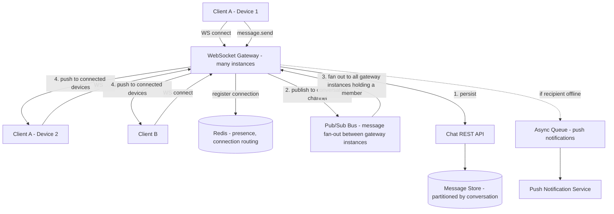

# Design a Chat API

## Problem Statement

Design the backend for a messaging product like a 1:1 and group chat feature: users need real-time message delivery when both parties are online, reliable delivery and message history when they're not, read receipts and presence (online/offline/typing), and delivery to multiple devices for the same user (phone + laptop + tablet, all logged in simultaneously). The service needs to behave correctly across the full matrix of "sender online/offline" × "recipient online/offline" × "recipient has 1-N devices."

The core tension in this design is that WebSockets give you real-time delivery but are inherently connection-based and stateful, while the durable source of truth for "what messages exist and in what order" needs to be a database that doesn't care whether anyone's currently connected. The design is really about how those two worlds — ephemeral live connections and durable message history — talk to each other correctly.

## Requirements

### Functional Requirements

- Send a message in a 1:1 or group conversation; deliver it in real time to online recipients.
- Persist full message history, paginated, so a user can scroll back through a conversation.
- Deliver missed messages when an offline user reconnects.
- Fan out a message to all of a recipient's active devices/sessions simultaneously.
- Track and broadcast presence (online/offline/last-seen) and typing indicators.
- Read receipts: mark messages as delivered/read, and notify the sender.

### Non-Functional Requirements

- Real-time delivery latency (online-to-online): p95 under 300ms.
- Message durability: a message accepted by the server is never lost, even if delivery to the recipient fails at that moment.
- Ordering: messages within a single conversation must be delivered/displayed in a consistent order to all participants.
- Horizontally scalable WebSocket connection layer — millions of concurrent open connections, no single point handling all of them.
- Multi-device consistency: a message read on one device shows as read on all of a user's other devices.

## Capacity Estimates

Assumptions, stated explicitly:

- 10 million daily active users, each sending ~40 messages/day on average (mix of light and heavy chatters).
- Each user maintains ~1.5 concurrent connected devices on average when active.

Message volume:
- 10M DAU × 40 messages/day = 400M messages/day ≈ 4,600 messages/s average.
- Peak at 5x (evening peak usage) ≈ 23,000 messages/s peak.

Fan-out (delivery events, not messages — a message to a group of 5 members fans out to 5× the recipients, each with ~1.5 devices):
- Assume average conversation size (including 1:1, which is "2") works out to ~2.3 recipients per message on average across the whole platform.
- 400M messages/day × 2.3 recipients × 1.5 devices/recipient ≈ 1.38B delivery events/day ≈ 16,000/s average, ~80,000/s peak.

Concurrent WebSocket connections:
- 10M DAU × 1.5 devices, assuming ~30% of DAU is concurrently online at any given moment during peak hours → 10M × 0.3 × 1.5 ≈ 4.5 million concurrent open WebSocket connections at peak.
- At roughly 10,000 sustainable connections per connection-server instance (a realistic figure for a tuned event-loop-based server), that's ~450 connection-server instances needed at peak — the number that matters for capacity planning this tier.

Storage:
- 400M messages/day × ~300 bytes (sender, conversation_id, content, timestamps) ≈ 120 GB/day → ~44 TB/year. Needs partitioning by conversation and time; old/cold conversations are natural candidates for tiered storage.

## API Design

Most of the real-time surface is over WebSocket, not REST; REST covers history, setup, and anything that doesn't need to be push-based.

```
WS     /v1/ws?token=<access_token>
  Client → Server messages:
    { "type": "message.send", "conversation_id": "conv_1", "client_msg_id": "uuid", "content": "hi" }
    { "type": "typing.start", "conversation_id": "conv_1" }
    { "type": "read.ack", "conversation_id": "conv_1", "up_to_message_id": "msg_500" }

  Server → Client messages:
    { "type": "message.new", "message": { "id": "msg_501", "conversation_id": "conv_1", "sender_id": "usr_1", "content": "hi", "sent_at": "..." } }
    { "type": "presence.update", "user_id": "usr_2", "status": "online" | "offline", "last_seen": "..." }
    { "type": "typing.update", "conversation_id": "conv_1", "user_id": "usr_2" }
    { "type": "read.receipt", "conversation_id": "conv_1", "user_id": "usr_2", "up_to_message_id": "msg_500" }

REST (history, setup, fallback):
POST   /v1/conversations
  Request:  { "member_ids": ["usr_1", "usr_2"] }
  Response: 201 { "conversation_id": "conv_1" }

GET    /v1/conversations/{id}/messages?before=msg_500&limit=50
  Response: 200 { "messages": [ ... ], "has_more": true }

POST   /v1/conversations/{id}/messages
  # REST fallback for sending when no WebSocket connection is available
  Request:  { "client_msg_id": "uuid", "content": "hi" }
  Response: 201 { "message_id": "msg_501", "status": "sent" }
```

`client_msg_id` is generated client-side and is the idempotency key for message sends — critical for a mobile client that might retry a send after a flaky connection without risking a duplicate message.

## Database Design

A combination of a relational/wide-column store for durable message history (needs strong ordering and reasonable query patterns) and an in-memory store for ephemeral real-time state (presence, connection routing) that doesn't need durability.

```
conversations
  id              UUID PK
  type            TEXT       -- 'direct' | 'group'
  created_at      TIMESTAMPTZ

conversation_members
  conversation_id UUID FK -> conversations.id
  user_id         UUID
  joined_at       TIMESTAMPTZ
  last_read_message_id  UUID  -- per-member read cursor
  PRIMARY KEY(conversation_id, user_id)

messages           -- partitioned by conversation_id (or time), append-only
  id              UUID PK           -- time-sortable (e.g., ULID) so ID order == send order
  conversation_id UUID NOT NULL
  sender_id       UUID NOT NULL
  client_msg_id   UUID NOT NULL     -- idempotency key
  content         TEXT
  sent_at         TIMESTAMPTZ
  UNIQUE(conversation_id, client_msg_id)
  INDEX(conversation_id, id DESC)   -- powers reverse-chronological pagination

message_receipts
  message_id      UUID
  user_id         UUID
  delivered_at    TIMESTAMPTZ NULL
  read_at         TIMESTAMPTZ NULL
  PRIMARY KEY(message_id, user_id)
```

Message IDs use a time-sortable format (ULID/Snowflake-style) rather than a random UUID specifically so that "order by id" is equivalent to "order by send time" without needing a separate sort key, which simplifies both storage indexing and pagination cursors.

Ephemeral state, kept in Redis, not the durable store:
- `presence:{user_id}` → status + last_seen, with a short TTL refreshed by heartbeats.
- `connections:{user_id}` → set of `{server_id, connection_id}` pairs, so the system knows which connection-server instance(s) hold this user's live WebSocket(s), for routing a new message to the right place.

## High-Level Architecture



## Data Flow

**Sending a message (recipient online):**
1. Client A sends `message.send` over its WebSocket connection, including a `client_msg_id`.
2. The gateway instance handling that connection forwards the message to the chat API/persistence layer, which first checks `(conversation_id, client_msg_id)` uniqueness (idempotency — if this exact client message was already persisted, e.g., due to a client retry, return the existing message rather than creating a duplicate).
3. On successful insert into the message store, the server has now durably committed the message — this happens *before* attempting real-time delivery, so a delivery failure can never mean a lost message, only a delayed one.
4. The message is published to a pub/sub channel keyed by `conversation_id` (or by each recipient's user ID). Every gateway instance subscribed to that channel — i.e., every instance currently holding a live connection for a member of this conversation — receives it.
5. Each relevant gateway instance looks up which of its local connections belong to conversation members (using the `connections:{user_id}` routing info) and pushes `message.new` down each matching WebSocket, including to Client A's *other* devices (Device 2), achieving multi-device fan-out.

**Sending a message (recipient offline):**
1. Steps 1-3 are identical — persistence always happens first, independent of anyone's online status.
2. The pub/sub publish finds no active gateway holding a connection for the offline recipient (their entry is absent from `connections:{user_id}`).
3. A background path enqueues a push notification job so the recipient's device gets an OS-level push alert.
4. When the recipient's client reconnects, it calls `GET /v1/conversations/{id}/messages` (or a dedicated "sync since last seen" endpoint) using its last-known message ID as a cursor, catching up on everything it missed — the WebSocket layer is for real-time delivery, not the durable record of what was sent, so reconnection-time catch-up always goes through the database, never relies on the pub/sub layer having buffered anything.

**Read receipts:**
1. Client sends `read.ack` with the highest message ID it has displayed/read.
2. Server updates `conversation_members.last_read_message_id` (or a per-message row in `message_receipts`) and publishes a `read.receipt` event to the conversation channel, so other members' clients update the "seen" indicator in real time if they're online.

## Scaling Strategy

At 10x scale (45M concurrent connections, 230,000 messages/s peak):

- **WebSocket connection layer** scales horizontally by adding gateway instances behind a connection-aware load balancer (sticky enough that a given client stays on one instance for the life of its connection, though reconnects can land anywhere). The actual constraint is memory/file-descriptors per instance, not CPU — well-tuned event-loop servers (not one-thread-per-connection) are the standard answer here.
- **Pub/sub fan-out** becomes the trickiest piece at scale: broadcasting every message to every gateway instance subscribed to a channel is fine for small groups, but a channel with hundreds of thousands of potential gateway subscribers (a very large or viral group conversation) needs smarter targeted routing — e.g., looking up exactly which gateway instances hold relevant connections and publishing only to those, rather than broadcasting to all instances and having each check relevance locally.
- **Message store partitioning** by `conversation_id` keeps hot conversations' writes isolated from each other, but a small number of extremely large group conversations (thousands of members, high message volume) can still create hot partitions — these may need dedicated sharding/capacity separate from the long tail of ordinary 1:1 conversations.
- **Presence updates** are extremely high-frequency (heartbeats from millions of connections) and don't need durability — keeping this exclusively in Redis (sharded) rather than ever touching the durable message store is what keeps it scalable; at 100x, presence itself may need its own dedicated, purpose-built pub/sub tier separate from message fan-out, since the two have very different volume and consistency requirements.

## Failure Handling

- **Gateway instance crashes:** all WebSocket connections on that instance drop. Clients reconnect (with backoff) to a different instance via the load balancer; on reconnect, the client's "sync since last message ID" call to the REST history endpoint recovers anything sent during the gap — no message loss, just a brief real-time delivery interruption for that connection.
- **Pub/sub bus is briefly unavailable:** real-time delivery for currently-connected users stalls, but persistence (step 3 in the data flow) is unaffected since it doesn't depend on pub/sub — messages are still safely stored, and clients will pick them up on their next reconnect/sync even if they never received the live push, degrading gracefully from "instant" to "eventually, on reconnect" rather than losing anything.
- **Message store partition/shard down:** conversations mapped to that shard are unavailable for send/history, but this is isolated to that shard's conversations, not global — a well-partitioned design turns a full outage into a partial, bounded one.
- **Push notification service down:** offline users simply don't get an OS-level alert promptly, but the message is safely persisted and will appear whenever they next open the app and sync — this is a degraded-UX failure, not a data-loss failure, and should be treated with lower urgency than persistence-layer failures for exactly that reason.

## Security

- **WebSocket authentication at connect time** (token passed during the handshake, validated before the connection is accepted into any conversation channel) — an unauthenticated socket should never be allowed to subscribe to any user's or conversation's events.
- **Per-conversation authorization on every send/history request:** the server must verify the requesting user is actually a member of `conversation_id` before persisting a message or returning history, since a client-supplied conversation ID is untrusted input.
- **Message content encryption in transit** (TLS on both the WebSocket and REST paths) as a baseline; for products with a stronger privacy bar, end-to-end encryption is a materially different design (the server can then only route ciphertext and can't itself read message content, which changes what server-side features like search or moderation can do) — worth stating as a scope decision explicitly rather than assuming.
- **Rate limiting on message sends per user** to prevent spam/abuse (a compromised or malicious client blasting messages into a conversation).
- **Read receipts and presence leak metadata** (who's online, who's read what) even without exposing message content — the design should let users control visibility of this metadata (e.g., "read receipts off"), since it's a real privacy surface, not just a UX nicety.

## Trade-offs

1. **WebSocket connections + pub/sub fan-out vs. pure client-side polling for new messages.** Chosen: WebSocket, because the p95 < 300ms real-time latency requirement is simply not achievable with polling without either polling so frequently it becomes its own scaling problem, or accepting multi-second delays. The cost is materially higher operational complexity — connection state management, sticky routing, and a pub/sub layer that polling would never need — justified specifically because "real time" is a stated hard requirement here.
2. **Persist-then-fan-out (write to durable storage before attempting real-time delivery) vs. fan-out-first with async persistence.** Chosen: persist-then-fan-out, because it makes durability unconditional — a message is never at risk of being delivered live but lost if the persistence write subsequently fails. Rejected: delivering live first for lower latency and persisting asynchronously after, which shaves a small amount of latency off the online-to-online path but introduces a real, if narrow, window where a message could be seen by the recipient yet never actually get saved — an unacceptable trade for a chat product where message history is a core expectation.
3. **Time-sortable message IDs (ULID/Snowflake) vs. random UUIDs with a separate timestamp column.** Chosen: time-sortable IDs, because they make "insert order == display order" free and let pagination cursors be simple ID comparisons rather than needing a compound sort on a separate timestamp column (which is more failure-prone under clock skew or same-millisecond collisions between messages from different senders). The cost is a small amount of additional care in ID generation (each generator needs to avoid backward time jumps), a solved problem with well-known algorithms.
4. **Separate ephemeral store (Redis) for presence/connection-routing vs. storing presence in the same durable database as messages.** Chosen: separate. Presence changes extremely frequently and doesn't need durability (a stale presence indicator after a crash self-heals via TTL expiry), so persisting every heartbeat to the same store carrying message history would add enormous, unnecessary write load to the system whose durability guarantees actually matter most.

## Related Handbook Chapters

- [Part 9 — WebSocket](../09-realtime-and-webhooks/websocket.md)
- [Part 9 — Server-Sent Events](../09-realtime-and-webhooks/server-sent-events.md)
- [Part 9 — Polling](../09-realtime-and-webhooks/polling.md)
- [Part 7 — Redis](../07-caching-performance/redis.md)
- [Part 8 — Message Queues](../08-async-systems/message-queues.md)
- [Part 2 — Pagination](../02-rest-api-design/pagination.md)

Back to [Part 19 — System Design Case Studies](README.md).
