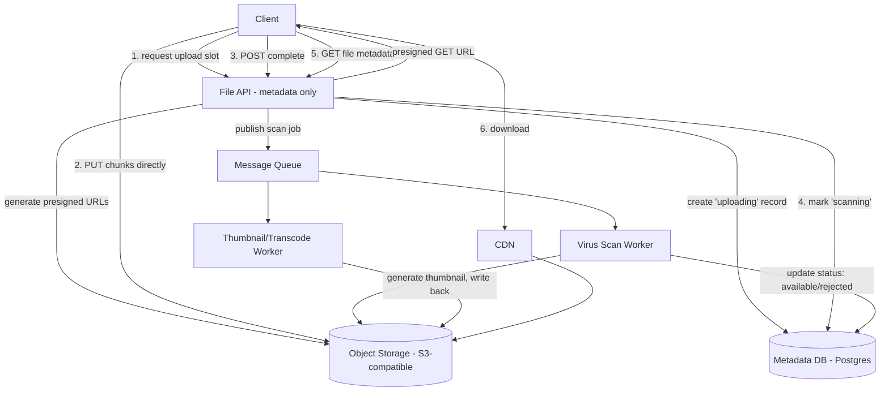

# Design a File Upload API

## Problem Statement

Design an API that lets users upload files — profile pictures up to a few MB, but also documents and videos up to several GB — reliably, without routing gigabytes of bytes through the application servers, and without a flaky connection forcing a user to restart a 2 GB upload from zero. The uploaded files need to be scanned for malware before they're considered "available," and the system needs a metadata layer (owner, filename, status, permissions) that's separate from the actual bytes.

The core insight interviewers are looking for here is that the application server should never be in the data path for the file bytes themselves — it should only ever hand out short-lived, scoped credentials (presigned URLs) that let the client talk directly to object storage. Everything else (chunking, virus scanning, metadata) is built around that constraint.

## Requirements

### Functional Requirements

- Request an upload slot for a file (returns credentials/URL for direct upload to storage).
- Upload large files in chunks, resumable if the connection drops mid-upload.
- Mark an upload as complete and trigger post-processing (virus scan, thumbnail generation for images).
- Download/view a file (with permission checks — files aren't all public).
- List a user's uploaded files with metadata (name, size, status, upload date).
- Delete a file.

### Non-Functional Requirements

- File bytes never pass through the application server's own compute — only through object storage directly.
- Support files from a few KB up to 5 GB.
- Resumable uploads: a dropped connection at 80% shouldn't require re-uploading the first 80%.
- A file is not marked "available for download" until it has passed a malware scan.
- Metadata queries (list, status) must be fast (p99 < 100ms) even though the underlying files can be huge.
- Storage durability: 99.999999999% (11 nines, matching object storage SLAs) — file loss is unacceptable.

## Capacity Estimates

Assumptions, stated explicitly:

- 3 million active users, each uploading on average 2 files/week.
- Average file size 15 MB (mix of small images and occasional large documents/videos skews the mean up from a "typical" photo).

Upload volume:
- 3M users × 2 files/week = 6M uploads/week ≈ 860,000 uploads/day ≈ 10 uploads/s average.
- Peak at 8x (business-hours concentration) ≈ 80 uploads/s peak.

Bandwidth:
- 860,000 uploads/day × 15 MB = ~12.9 TB/day of ingress. Because uploads go directly client → object storage, this bandwidth never touches the application servers — a crucial point to state explicitly, since it means the app tier's bandwidth needs are essentially just metadata-sized (JSON requests), not file-sized.
- At 10 uploads/s average × 15MB, and assuming an average upload takes ~20s to complete (chunked over a real connection), concurrent in-flight uploads ≈ 10 × 20 = 200 concurrent uploads at any moment, average; peak concurrent ≈ 1,600.

Storage:
- 6M uploads/week × 15 MB ≈ 90 TB/week ≈ 4.7 PB/year, before any deletion. Object storage is designed for this scale natively; the concern shifts to cost-tiering (move cold files to cheaper storage classes after N days of no access) rather than raw capacity.

Metadata database:
- ~450M file records/year × ~400 bytes/row ≈ 180 GB/year. This fits comfortably in a relational database with standard indexing, especially since it's metadata, not blobs.

## API Design

```
POST   /v1/files/uploads
  Request:  { "filename": "video.mp4", "content_type": "video/mp4", "size_bytes": 2147483648 }
  Response: 201 {
    "file_id": "file_123",
    "upload_id": "up_abc",              -- multipart upload session id
    "chunk_size_bytes": 8388608,        -- 8 MB chunks
    "chunk_upload_urls": [ "https://storage.../part1?sig=...", "..." ],
    "expires_at": "2026-08-19T15:00:00Z"
  }

PUT    <presigned chunk URL, direct to object storage>
  # client uploads each 8MB chunk directly; not routed through the app server at all

POST   /v1/files/uploads/{upload_id}/complete
  Request:  { "parts": [ { "part_number": 1, "etag": "..." }, ... ] }
  Response: 202 { "file_id": "file_123", "status": "scanning" }

GET    /v1/files/uploads/{upload_id}/status
  Response: 200 { "file_id": "file_123", "status": "scanning" | "available" | "rejected", "uploaded_bytes": 1073741824 }

GET    /v1/files/{file_id}
  Response: 200 { "file_id": "file_123", "filename": "video.mp4", "size_bytes": ..., "status": "available", "download_url": "https://storage.../...?sig=..." }
  # download_url is itself a short-lived presigned GET URL, not a proxy through the app server

GET    /v1/files?owner_id=usr_1&status=available
  Response: 200 { "files": [ ... ], "next_cursor": "..." }

DELETE /v1/files/{file_id}
  Response: 204
```

## Database Design

Two clearly separated stores: object storage (S3-compatible) for bytes, and a relational database for metadata — a NoSQL document store would also work for metadata, but relational is chosen here because file metadata has real relational structure (owners, permissions, scan results) and the query patterns (list by owner, filter by status) map cleanly onto indexed SQL.

```
files
  id                 UUID PK
  owner_id           UUID NOT NULL
  filename           TEXT NOT NULL
  content_type       TEXT
  size_bytes         BIGINT
  storage_key        TEXT NOT NULL      -- path/key in object storage
  status             TEXT NOT NULL      -- 'uploading' | 'scanning' | 'available' | 'rejected' | 'deleted'
  scan_result         TEXT              -- 'clean' | 'infected' | null
  created_at         TIMESTAMPTZ
  updated_at         TIMESTAMPTZ
  INDEX(owner_id, created_at), INDEX(status)

uploads               -- tracks in-progress multipart/resumable sessions
  id                 UUID PK
  file_id            UUID FK -> files.id
  storage_upload_id  TEXT NOT NULL       -- object storage's own multipart upload id
  total_parts        INT
  completed_parts    INT[]               -- or a separate parts table for very large files
  expires_at         TIMESTAMPTZ         -- abandoned uploads are garbage-collected
  INDEX(expires_at)

file_permissions
  file_id            UUID FK -> files.id
  grantee_id         UUID                -- user or group granted access
  permission         TEXT                -- 'read' | 'write'
  PRIMARY KEY(file_id, grantee_id)
```

`storage_key` decouples the public-facing `file_id` from the internal object storage path, which allows re-keying/migrating storage backends without changing the API-facing identifier.

## High-Level Architecture



## Data Flow

**Upload:**
1. Client calls `POST /v1/files/uploads` with the intended filename, content type, and size. The API validates the request (size limits, content-type allowlist), creates a `files` row in `uploading` status, initiates a multipart upload session with the object store, and returns a set of presigned URLs — one per chunk — each scoped (via signature) to only allow a PUT of that specific part, expiring in a short window (e.g., 1 hour).
2. The client uploads chunks (e.g., 8 MB each) directly to object storage in parallel or sequence, using the presigned URLs. If the connection drops, the client resumes by re-requesting only the chunks that didn't complete — it can query `GET /v1/files/uploads/{upload_id}/status` to see which parts already landed, avoiding a full restart.
3. Once all chunks are uploaded, the client calls `POST /v1/files/uploads/{upload_id}/complete` with the list of part ETags. The API calls the object store's "complete multipart upload" operation (which stitches the parts into one object server-side, still without the app server touching the bytes), sets `files.status = 'scanning'`, and publishes a scan job to the queue.
4. A malware-scan worker pulls the job, streams the object from storage, scans it, and updates `files.status` to `available` or `rejected` accordingly. Only at this point does the file become visible/downloadable to other users via the API.
5. In parallel, if the file is an image or video, a separate worker generates thumbnails/transcodes and writes derived assets back to storage, referenced from the metadata record.

**Download:**
1. Client requests `GET /v1/files/{file_id}`. The API checks `file_permissions` (or ownership) and, only if authorized and `status = 'available'`, returns a short-lived presigned GET URL.
2. Client fetches the file directly from the CDN (which itself pulls from object storage on a cache miss) — again, bytes never route through the application server.

## Scaling Strategy

At 10x scale (60 uploads/s average, ~800 concurrent uploads), the metadata API and database scale conventionally — stateless API instances behind a load balancer, read replicas for the `files` table under heavy `list`/`status` polling load. The genuine bottlenecks:

- **Virus scan throughput.** Scanning large files (GBs) is CPU/IO-heavy and the queue can back up during upload spikes. Scale scan workers horizontally and independently of the API tier; for very large files, scan in streaming fashion (chunk-by-chunk) rather than downloading the whole file into worker memory first, and prioritize the queue so small files (most of the volume) aren't stuck behind a few huge ones — a separate queue/priority lane by file size avoids head-of-line blocking.
- **Abandoned multipart uploads.** At scale, a non-trivial fraction of upload sessions never complete (browser closed, app killed). These leave orphaned parts in object storage costing money. A periodic job aborts multipart uploads past their `expires_at` and reclaims the storage.
- **Status polling.** If clients poll `GET /v1/files/uploads/{id}/status` aggressively, this becomes read-heavy on the metadata DB. Cache short-lived status in Redis, or push status via WebSocket/SSE for actively-watched uploads instead of polling.
- **Hot files (viral downloads).** A single very popular file can spike download traffic disproportionately. The CDN layer absorbs this by design — origin (object storage) load stays flat because cache hit ratio approaches 100% for popular, immutable objects.

## Failure Handling

- **Client disconnects mid-upload:** because uploads are chunked, only the in-flight chunk is lost, not the whole file. The client resumes from the last confirmed part, discovered via the status endpoint.
- **App server crashes between chunk upload and "complete" call:** the multipart upload session in object storage is unaffected (state lives in the storage service, not the app server) — the client can retry the complete call against a different app instance and it will succeed once all parts are actually present, since app servers are stateless with respect to upload sessions.
- **Virus scan worker crashes mid-scan:** the job is redelivered by the queue (at-least-once delivery) to another worker; scanning is idempotent (re-scanning the same immutable object produces the same result), so redelivery is safe.
- **Object storage briefly unavailable:** upload slot creation fails fast with a retryable error; in-progress presigned uploads simply retry against storage directly (the app server isn't in that path to begin with, so an app-server blip doesn't affect uploads already in flight).
- **A file is later found to be malicious after being marked available (scanner false negative discovered later):** the design should support a manual/automated "quarantine" transition back to `rejected` at any time, immediately revoking any outstanding presigned download URLs is not possible retroactively, so this also argues for short URL expiries and, for sensitive content, CDN cache purge on quarantine.

## Security

- **Presigned URLs are scoped and short-lived** — an upload URL can only PUT to one specific part of one specific upload session, and expires quickly, limiting the blast radius if a URL leaks (e.g., via logs or browser history).
- **Content-type and size validation happens server-side** before issuing upload credentials — the client-declared `content_type`/`size_bytes` is advisory for the URL request, but the object store also enforces max object size, and the scan/processing pipeline validates actual file signatures rather than trusting the declared MIME type (a common bypass: renaming a `.exe` to `.jpg`).
- **Mandatory malware scanning before availability** is the core defense against the platform being used to distribute malicious files — no file is servable until it clears this gate.
- **Permission checks on every download**, not just at upload time — file sharing/permission changes must take effect immediately for new download URL requests, even though already-issued presigned URLs remain valid until they expire (another reason to keep expiries short, e.g., minutes not days).
- **Storage buckets are private by default**; presigned URLs are the only sanctioned path to an object, not public bucket ACLs, which prevents accidental exposure via storage misconfiguration.

## Trade-offs

1. **Direct client-to-storage upload via presigned URLs vs. proxying uploads through the application server.** Chosen: direct/presigned. Rejected: proxying, which is simpler to reason about (the app server can validate content mid-stream) but means every byte of every upload consumes app-server compute and bandwidth — at the estimated 12.9 TB/day of ingress, that would require the app tier to be sized for storage-gateway-level throughput instead of ordinary API traffic. The cost of the chosen approach is that content validation (e.g., true virus scanning) has to happen asynchronously, after the bytes already land in storage, rather than inline.
2. **Chunked/resumable multipart upload vs. single-shot upload.** Chosen: chunked, because at file sizes up to 5 GB, a single dropped connection at 95% would otherwise force a full restart, which is both a poor user experience and wasteful of bandwidth. The cost is meaningfully more complexity — tracking part state, stitching parts, garbage-collecting abandoned sessions — that wouldn't be justified for a system that only ever handles small files.
3. **Async malware scanning (file goes through a 'scanning' status) vs. synchronous scan-before-upload-completes.** Chosen: async. Rejected: scanning inline before acknowledging the upload as complete, which would be simpler state-wise but adds significant latency to every upload (scanning a multi-GB file can take tens of seconds) and doesn't fit an architecture where the app server never sees the bytes anyway — a synchronous scan would require the app server to fetch and stream the whole file itself, contradicting the core design constraint.
4. **Serving downloads via presigned URL + CDN vs. proxying downloads through the app server for fine-grained access logging.** Chosen: presigned + CDN, for the same bandwidth-isolation reason as uploads. This trades away the ability to log every byte range served at the app layer (harder to get fine-grained download analytics) in exchange for not making the app tier a bandwidth bottleneck; access is still recorded at the point the presigned URL is issued, which is normally sufficient for audit purposes.

## Related Handbook Chapters

- [Part 16 — File Upload Architecture](../16-rag-apis/file-upload-architecture.md)
- [Part 16 — Async Document Processing](../16-rag-apis/async-document-processing.md)
- [Part 8 — Background Tasks](../08-async-systems/background-tasks.md)
- [Part 8 — Message Queues](../08-async-systems/message-queues.md)
- [Part 7 — Redis](../07-caching-performance/redis.md)
- [Part 6 — Retries](../06-production-reliability/retries.md)

Back to [Part 19 — System Design Case Studies](README.md).
