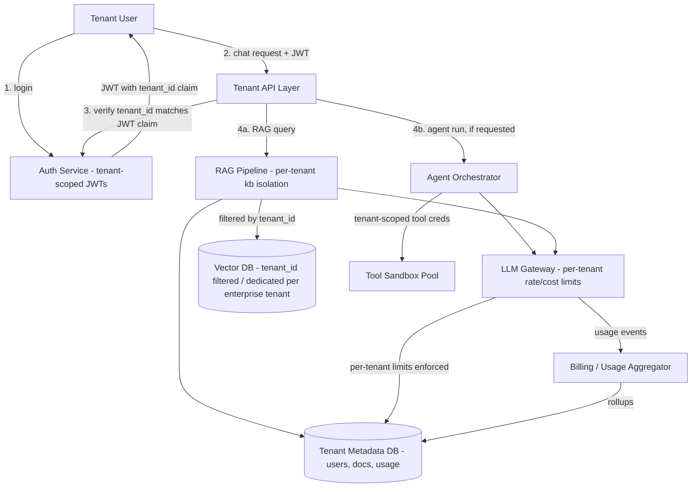

# Design a Multi-Tenant AI SaaS

## Problem Statement

Design the overall backend architecture for a B2B SaaS product where each customer (tenant) gets their own AI-powered assistant that can answer questions grounded in their own documents (RAG), take autonomous action via an agent when asked, and is billed based on usage. This is the synthesis case study of the handbook: it doesn't introduce fundamentally new mechanisms so much as it forces a decision about how authentication, RAG, agents, and an LLM gateway — each already designed in isolation in earlier case studies — compose into one coherent system, with tenant isolation as the thread running through every layer rather than a feature bolted on afterward.

The question an interviewer is really asking here is: "can you keep straight what has to be strictly isolated per tenant (data, cost, rate limits) versus what can be safely shared infrastructure (the LLM gateway, the vector database engine, the agent orchestrator)?" Getting that boundary wrong in either direction is either a security incident or an unnecessarily expensive, unscalable architecture.

## Requirements

### Functional Requirements

- Each tenant (a company) has its own workspace: users, documents (RAG knowledge base), and agent configurations, fully isolated from other tenants.
- Tenant admins manage users and permissions within their workspace (RBAC scoped per tenant).
- End users chat with an AI assistant that retrieves from their tenant's documents and can invoke agent tools scoped to that tenant's integrations (e.g., their own CRM, not another tenant's).
- Usage (tokens, API calls, storage) is metered per tenant for billing.
- Tenant admins can set their own usage limits/budgets and see cost/usage dashboards.
- Support both a shared multi-tenant infrastructure tier and a dedicated/isolated tier for enterprise customers with stricter data-isolation requirements.

### Non-Functional Requirements

- Strict data isolation: one tenant's documents, embeddings, and conversation history must never be retrievable by another tenant, under any query path — this is the single hardest requirement in the whole system.
- Per-tenant rate and cost limits, independent of other tenants' usage — a heavy tenant must not degrade another tenant's latency or eat into their budget.
- New tenant onboarding (workspace + initial document ingestion) completes within minutes, not hours.
- Multi-tenant shared infrastructure must scale to thousands of tenants of wildly varying size (from a 5-person startup to a 5,000-person enterprise) without per-tenant operational overhead.
- Auditability: every AI-driven action taken on a tenant's behalf (a chat answer, an agent tool call) is attributable and reviewable by that tenant's admins.

## Capacity Estimates

Assumptions, stated explicitly:

- 3,000 tenant companies, average 25 active users/tenant → 75,000 total active users.
- Each active user sends ~15 chat messages/day (a mix of simple RAG queries and occasional agent invocations).

Query volume:
- 75,000 users × 15 messages/day = 1.125M chat messages/day ≈ 13 messages/s average, ~65/s peak (5x business-hours concentration).
- Of these, assume 10% trigger an agent run (multi-step, tool-using) rather than a single RAG-grounded answer → ~112,500 agent runs/day, and 90% (≈1M/day) are single-turn RAG queries.

Tenant size distribution (this matters more here than raw averages): assume a power-law — the top 5% of tenants (150 companies) account for 50% of total usage, while the bottom 50% of tenants (1,500 companies) account for under 10% of usage combined. This shapes the isolation design directly: a purely per-tenant-fixed-capacity model would be enormously wasteful for the long tail of small tenants, while a purely shared-pool model risks the largest tenants starving everyone else — the architecture needs both a shared pool and per-tenant caps, not one or the other.

Storage:
- Documents/RAG: assume average tenant has 500 documents. 3,000 tenants × 500 docs × 9 chunks/doc (per the RAG case study's chunking assumption) ≈ 13.5M chunks total — two orders of magnitude smaller than the standalone RAG case study's estimate, appropriately, since this is one product's tenant base rather than a RAG platform serving many external customers.
- Conversation history: 1.125M messages/day × 300 bytes ≈ 340 MB/day → ~124 GB/year, partitioned per tenant for both performance and isolation.

Cost:
- 1.125M RAG queries/day × ~$0.01 average LLM cost + 112,500 agent runs/day × ~$0.15 average (multi-step, higher token volume) ≈ $11,250 + $16,875 ≈ $28,000/day in underlying LLM spend — the number that makes per-tenant cost tracking and budget enforcement a first-class product feature, not an afterthought, since it directly determines the platform's own gross margin per tenant.

## API Design

```
POST   /v1/tenants
  # platform-admin only: provision a new tenant workspace
  Request:  { "company_name": "Acme Inc", "tier": "shared" | "dedicated" }
  Response: 201 { "tenant_id": "tnt_1" }

POST   /v1/tenants/{tenant_id}/users
  Request:  { "email": "user@acme.com", "role": "admin" | "member" }
  Response: 201 { "user_id": "usr_1" }

POST   /v1/tenants/{tenant_id}/documents
  # scoped identically to the RAG case study's ingestion, but every call is tenant-scoped by path + token
  Request:  multipart upload
  Response: 202 { "document_id": "doc_1", "status": "processing" }

POST   /v1/tenants/{tenant_id}/chat
  Request:  { "conversation_id": "conv_1", "message": "What's our Q3 refund policy?", "allow_agent": true }
  Response: 200 (SSE stream)
    event: chunk
    data: { "text": "..." }
    event: citations
    data: { "sources": [ ... ] }
    event: done
    data: { "usage": { "tokens": 1820, "cost_usd": 0.012 } }

GET    /v1/tenants/{tenant_id}/usage?period=2026-08
  Response: 200 { "total_cost_usd": 940.15, "budget_usd": 2000.00, "by_user": [ ... ], "by_day": [ ... ] }

PATCH  /v1/tenants/{tenant_id}/limits
  # tenant-admin: set their own budget/rate ceilings, within platform-wide bounds
  Request:  { "monthly_budget_usd": 2000, "requests_per_min": 300 }
```

Every path is prefixed with `/tenants/{tenant_id}`, and the authenticated caller's token is checked against that exact `tenant_id` on every single request — not just at login — since this is the enforcement point for the entire isolation guarantee.

## Database Design

The architecture composes the schemas from the earlier case studies (auth, RAG, agents, LLM gateway usage tracking) under one unifying principle: every tenant-scoped table carries `tenant_id` as part of its key or as a mandatory, indexed, always-filtered column.

```
tenants
  id                UUID PK
  name              TEXT
  tier              TEXT     -- 'shared' | 'dedicated'
  monthly_budget_usd  NUMERIC
  created_at        TIMESTAMPTZ

users               -- from the Authentication API case study, extended with tenant scoping
  id                UUID PK
  tenant_id         UUID FK -> tenants.id NOT NULL
  email             TEXT
  role              TEXT     -- 'admin' | 'member', scoped within the tenant
  UNIQUE(tenant_id, email)   -- same email can exist under different tenants
  INDEX(tenant_id)

documents / chunks / vector_index      -- from the RAG API case study
  -- identical shape, but kb_id is effectively tenant_id here: every vector search
  -- and every chunk fetch is filtered by tenant_id, with zero exceptions

agent_runs / agent_steps / tool_executions   -- from the AI Agent API case study
  -- identical shape, with tenant_id added and enforced the same way;
  -- agent tool configurations (e.g., which CRM integration credentials to use)
  -- are themselves tenant-scoped rows, never shared or defaulted across tenants

usage_records        -- from the LLM Gateway case study, keyed by tenant_id instead of team_id
  id                UUID PK
  tenant_id         UUID FK -> tenants.id
  user_id           UUID
  feature           TEXT     -- 'rag_query' | 'agent_run'
  input_tokens      INT
  output_tokens     INT
  cost_usd          NUMERIC
  created_at        TIMESTAMPTZ
  INDEX(tenant_id, created_at)
```

For the `dedicated` tier, the same schema applies but is deployed into fully separate database instances/vector indexes per tenant, rather than sharing the multi-tenant pool at all — the schema design doesn't change, only the deployment topology does, which keeps the application code identical across tiers.

## High-Level Architecture



## Data Flow

**A chat message end to end:**
1. The user authenticates (Authentication API case study's flow) and receives a JWT whose claims include their `user_id` and, critically, their `tenant_id` — every subsequent request's tenant scope is derived from this signed claim, never from a client-supplied parameter alone, since a client-supplied `tenant_id` in the URL is not itself trustworthy.
2. The user sends a chat message to `/v1/tenants/{tenant_id}/chat`. The API layer's very first check, before any business logic, is that the JWT's `tenant_id` claim matches the `{tenant_id}` in the path — a mismatch is an immediate 403, not a routing decision.
3. The message is routed to the RAG pipeline (Design a RAG API case study), which embeds the query and performs a vector search filtered by `tenant_id` — this filter is applied at the vector-database query level, not as a post-filter on results, so a bug elsewhere in the stack can't accidentally leak a result set across tenants before filtering happens.
4. If the message pattern (or an explicit `allow_agent: true` flag) indicates an agentic task rather than a simple grounded question, the request is instead routed to the agent orchestrator (Design an AI Agent API case study), which loads that tenant's specific tool configurations (e.g., their own CRM API credentials, stored per-tenant and never shared or defaulted) before starting the loop.
5. Both paths ultimately call the LLM gateway (Design an LLM Gateway case study) for generation, with the gateway enforcing this specific tenant's rate limit and remaining budget before dispatching to a provider — a tenant that has exhausted their monthly budget gets a clear, immediate error at this layer, not a surprise on their next invoice.
6. The response streams back to the user, and a `usage_records` row is written asynchronously, feeding both the tenant's real-time usage dashboard and the platform's own billing aggregation.

**New tenant onboarding:**
1. A platform admin (or a self-serve signup flow) creates a `tenants` row and the first admin `users` row.
2. The tenant admin uploads initial documents, which flow through the same ingestion pipeline as the RAG case study, scoped from the first byte by `tenant_id` — there is no "shared staging area" at any point in ingestion where documents briefly exist without a tenant scope.
3. Default rate/budget limits are applied from the tenant's `tier`, immediately enforceable, so a newly onboarded tenant can't accidentally (or maliciously) generate unbounded cost before an admin has configured anything.

## Scaling Strategy

At 10x scale (30,000 tenants, ~650 messages/s peak):

- **The "long tail of small tenants, few large ones" distribution is the central scaling design problem**, not raw throughput. A shared connection/resource pool (vector DB, LLM gateway capacity) serves the long tail efficiently, while the largest tenants need per-tenant capacity guarantees (dedicated rate-limit budgets, and at the extreme, dedicated infrastructure via the `dedicated` tier) so their load doesn't starve smaller tenants sharing the same pool — this is the multi-tenant analogue of the webhook system's per-endpoint queue isolation and the LLM gateway's per-team rate limits, applied one layer up.
- **Vector index growth per tenant is uneven** — a handful of enterprise tenants with huge document sets shouldn't force every tenant's index onto the same sharding scheme. Route large tenants to their own dedicated shard/index (transparent to the application layer, which always queries "this tenant's index" without needing to know if it's a shared or dedicated one) while small tenants share pooled shards.
- **The LLM gateway's per-tenant token-rate-limiting** (from that case study) is the direct mechanism preventing one large or runaway tenant from consuming a disproportionate share of the company's provider-side rate limits — at 10x tenant count, this control matters more, not less, since the odds of at least one tenant having a usage spike at any given moment rise with tenant count.
- **Onboarding pipeline throughput** (bulk document ingestion for new enterprise tenants signing up with thousands of existing documents) needs isolation from the steady-state query path exactly as in the RAG case study — a large customer's onboarding bulk-import shouldn't degrade query latency for every other tenant.

## Failure Handling

- **Vector DB shard for one tenant goes down:** with per-tenant/pooled shard routing, this is scoped to the tenants on that shard, not global — a well-isolated design turns what could be a platform-wide RAG outage into a bounded incident affecting a known, bounded set of tenants, who can be notified specifically.
- **LLM gateway degrades:** every tenant is affected simultaneously since it's genuinely shared infrastructure at this layer (per the LLM Gateway case study's own failure handling — multi-provider fallback is the mitigation), which is precisely why that component's own availability target is held to a higher bar than any individual tenant-facing service.
- **A single tenant's agent runs consume excessive sandbox capacity:** per-tenant concurrency caps on agent runs (in addition to cost caps) prevent one tenant's heavy agentic usage from starving sandbox availability for other tenants' runs — this needs the same isolation thinking as the AI Agent API case study's cost caps, just applied at the tenant level rather than the individual run level.
- **Tenant metadata DB (auth, users, usage) down:** this is a genuinely platform-wide dependency (every request needs to verify the tenant/user), so it warrants the highest availability investment in the whole stack (replication, failover) — unlike the vector DB, there's no natural per-tenant isolation boundary that limits its blast radius.

## Security

- **`tenant_id` isolation enforced at every single layer independently** — JWT claim, API path check, database query filter, vector search filter, agent tool credential scoping — rather than relying on any one layer to be the sole source of truth. This defense-in-depth approach exists because this is the one requirement where a single missed filter anywhere in the stack is a genuine cross-tenant data breach, not a degraded-UX bug.
- **Tenant-scoped credentials for agent tool integrations** (a tenant's own CRM API key, for example) are stored and retrieved strictly per-tenant, with the same isolation rigor as the vector search filtering — an agent run for Tenant A must never be able to load Tenant B's integration credentials, even accidentally, which argues for these being fetched by a code path that takes `tenant_id` as a mandatory, non-optional parameter with no "default" fallback.
- **RBAC within a tenant** (admin vs. member) governs what a user can do inside their own workspace (manage documents, configure agent tools, view billing) but is entirely separate from, and doesn't affect, cross-tenant isolation — these are two different authorization dimensions that shouldn't be conflated in the permission model.
- **Audit logging per tenant, visible to that tenant's admins**, gives customers visibility into what their own AI assistant did on their behalf (which chats happened, which agent actions were taken) — both a trust feature and, in regulated industries, often a contractual requirement.
- **The `dedicated` tier exists specifically because pooled multi-tenant isolation, however rigorously enforced in software, is a harder sell for the most security-sensitive enterprise customers than physically separate infrastructure** — a real, common negotiation in enterprise AI SaaS sales, and worth naming as a deliberate two-tier security posture rather than treating "everyone shares the same pool" as the only option.

## Trade-offs

1. **Row-level `tenant_id` filtering on shared infrastructure vs. fully separate database/vector-index instances per tenant, for every tenant.** Chosen: shared infrastructure with mandatory filtering for the default tier, dedicated instances only for enterprise customers who need or pay for it. Fully separate infrastructure per tenant is the safest possible isolation but is operationally and financially untenable at 3,000+ tenants (thousands of database instances to patch, monitor, and scale individually) — the shared-with-strict-filtering model is what makes the shared/dedicated tiering possible at all, at the cost of isolation now depending on software correctness rather than physical separation for most tenants.
2. **Per-tenant rate/cost limits enforced at the LLM gateway layer vs. enforced only at the top-level tenant API.** Chosen: enforced at the gateway, closest to the actual expensive resource (provider calls), not just at the outer API. Enforcing only at the outer layer is simpler but would allow, for instance, an agent run's many internal LLM calls to bypass the check that only ran once at the top of the request — pushing enforcement down to where the cost is actually incurred closes that gap, at the cost of the gateway needing tenant-awareness that a generic gateway (as in the standalone LLM Gateway case study) wouldn't otherwise need.
3. **Composing existing subsystems (RAG, agents, gateway) as largely unmodified building blocks vs. designing one unified, purpose-built pipeline from scratch for the multi-tenant product.** Chosen: composition, adding `tenant_id` as a cross-cutting concern layered onto each existing subsystem's schema and query paths, rather than rebuilding RAG/agent/gateway logic bespoke for this product. This keeps each subsystem's design reusable and independently testable (and matches how real engineering organizations actually build these products — as platform capabilities composed together), at the cost of `tenant_id` propagation discipline being required consistently across every one of those subsystems, which is exactly the kind of cross-cutting requirement that's easy to get right in the design and easy to get wrong in the implementation if it isn't enforced structurally (e.g., via a shared query-building layer that makes omitting the filter difficult rather than merely a convention).
4. **Uniform default limits with tenant-admin-adjustable budgets vs. a single platform-wide fixed limit for everyone.** Chosen: per-tenant adjustable limits (within platform-wide bounds), because tenant size varies by two-plus orders of magnitude (a 5-person startup vs. a 5,000-person enterprise) — a single fixed limit would either be far too restrictive for large tenants or far too permissive (an open cost/abuse risk) for small ones. The cost is added product surface area (a limits/budget configuration UI and API) and the operational need to define sane platform-wide bounds so a tenant admin can't misconfigure their own limits into an unbounded liability for the platform.

## Related Handbook Chapters

- [Part 5 — Authentication and Authorization](../05-authentication-authorization/authentication-vs-authorization.md)
- [Part 5 — RBAC](../05-authentication-authorization/rbac.md)
- [Part 5 — JWT Deeply Explained](../05-authentication-authorization/jwt-deeply-explained.md)
- [Part 16 — RAG APIs Overview](../16-rag-apis/README.md)
- [Part 17 — AI Agents & MCP Overview](../17-ai-agents-and-mcp/README.md)
- [Part 15 — LLM Gateways](../15-production-ai-systems/llm-gateways.md)
- [Part 15 — Token Rate Limits](../15-production-ai-systems/token-rate-limits.md)
- [Part 15 — Cost Tracking](../15-production-ai-systems/cost-tracking.md)
- [Part 18 — Production Architecture Overview](../18-production-architecture/README.md)
- Related case studies: [Design a RAG API](design-a-rag-api.md), [Design an AI Agent API](design-an-ai-agent-api.md), [Design an LLM Gateway](design-an-llm-gateway.md), [Design an Authentication API](design-an-authentication-api.md)

Back to [Part 19 — System Design Case Studies](README.md).
