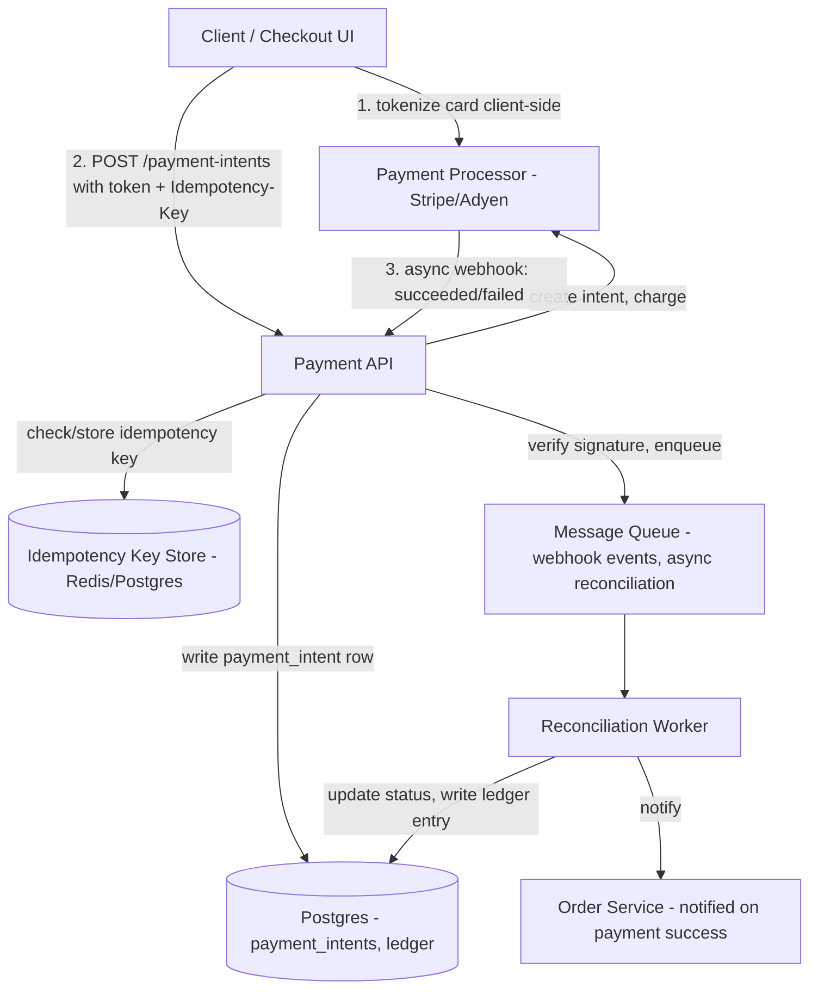

# Design a Payment API

## Problem Statement

Design an API that lets an e-commerce platform charge customers, using a third-party payment processor (Stripe-like) to actually move money. The API must never double-charge a customer even under network failures and client retries, must reconcile asynchronously with the processor's own eventually-consistent view of a payment's state, and must minimize the scope of sensitive card data the company itself has to handle.

This is the case study where "the network is unreliable" stops being an abstraction and becomes the entire design problem. A client that times out waiting for a response has no way to know if the charge succeeded — and if it naively retries, the design must guarantee that retry doesn't create a second charge. Everything else in this design (idempotency keys, a ledger, a state machine, webhooks) exists to make that one guarantee hold.

## Requirements

### Functional Requirements

- Create a payment intent for an order (amount, currency, customer).
- Confirm/capture a payment using a client-provided payment method (tokenized card, wallet).
- Handle asynchronous confirmation from the payment processor via webhook (many payment methods, e.g. bank transfers, 3D Secure, are not synchronous).
- Refund a payment (full or partial).
- Query the current status of a payment.
- Guarantee exactly-once charging semantics even when clients retry due to timeouts.

### Non-Functional Requirements

- Never double-charge a customer, under any failure mode — this is the hard invariant of the entire system.
- The company's servers never see or store raw card numbers (PCI-DSS scope minimization) — card data flows directly from the client to the processor via tokenization.
- Payment state must be auditable: every transition needs a durable, append-only trail for financial reconciliation and disputes.
- Availability: payment creation should degrade gracefully under processor slowness rather than hang indefinitely (timeouts + async confirmation).
- Idempotent by design: identical retried requests return the identical result, not a new side effect.

## Capacity Estimates

Assumptions, stated explicitly:

- 2 million orders/day on the platform.
- Each order triggers 1 payment intent, plus on average 1.3 processor round trips (some fail 3D Secure the first time and retry, some use multi-step wallets) → 2.6M processor-facing calls/day.
- Refund rate: 3% of orders → 60,000 refunds/day.
- Webhook events from the processor: ~2 events per payment on average (e.g., `payment_intent.created`, `payment_intent.succeeded`) → 4M inbound webhook deliveries/day.

QPS:
- 2M payments/day ÷ 86,400s ≈ 23 req/s average. Retail traffic is extremely bursty around sales events — assume 15x peak multiplier → ~350 req/s peak on payment creation.
- Webhook ingestion: 4M/day ≈ 46 events/s average, similarly bursty, ~700 events/s peak (processors often burst-deliver after their own recovery from an incident).

Storage:
- Payments table: 2M rows/day × 300 bytes ≈ 600 MB/day → ~220 GB/year. Retained indefinitely for financial/legal reasons; partition by month.
- Ledger (double-entry) table: ~2.5 entries per payment (charge, fee, occasional refund) × 2M/day × 150 bytes ≈ 750 MB/day → ~275 GB/year.
- Idempotency key store: one row per unique client request, TTL'd after 24-48 hours (once the client's retry window has certainly closed) — bounded at roughly 2 days × peak volume, a few GB, kept in a fast key-value store rather than the primary ledger tables.

## API Design

```
POST   /v1/payment-intents
  Headers:  Idempotency-Key: <client-generated UUID>
  Request:  { "order_id": "ord_1", "amount": 4999, "currency": "usd", "payment_method_token": "pm_tok_abc" }
  Response: 201 {
    "payment_intent_id": "pi_123",
    "status": "requires_confirmation" | "processing" | "succeeded",
    "client_secret": "pi_123_secret_xyz"   -- used by client SDK for 3DS challenge if needed
  }

POST   /v1/payment-intents/{id}/confirm
  Headers:  Idempotency-Key: <client-generated UUID>
  Response: 200 { "payment_intent_id": "pi_123", "status": "processing" | "succeeded" | "failed" }

GET    /v1/payment-intents/{id}
  Response: 200 { "payment_intent_id": "pi_123", "status": "succeeded", "amount": 4999, "currency": "usd" }

POST   /v1/payment-intents/{id}/refunds
  Headers:  Idempotency-Key: <client-generated UUID>
  Request:  { "amount": 4999 }   -- omit for full refund
  Response: 201 { "refund_id": "re_1", "status": "pending" }

POST   /internal/webhooks/processor
  # Inbound from the payment processor, not client-facing.
  # Verifies processor signature, updates payment_intents + ledger, is itself idempotent on event_id.
```

Every mutating endpoint requires an `Idempotency-Key` header. The server treats a repeated key with the same request body as a no-op that returns the original result, and a repeated key with a *different* body as a client error (409) — this is the mechanism that makes retries safe.

## Database Design

Relational database (PostgreSQL), chosen deliberately: payments need multi-row ACID transactions (updating a payment's status and inserting a ledger entry must be atomic), strong consistency (financial data is the last place to accept eventual consistency), and the data volume here is nowhere near the scale that would force a NoSQL trade-off — correctness dominates.

```
payment_intents
  id                  TEXT PK          -- 'pi_...'
  order_id            TEXT NOT NULL
  customer_id         TEXT NOT NULL
  amount              BIGINT NOT NULL  -- minor units (cents), never float
  currency            CHAR(3) NOT NULL
  status              TEXT NOT NULL    -- state machine, see below
  processor           TEXT NOT NULL    -- 'stripe', etc.
  processor_ref       TEXT             -- id on the processor's side
  created_at          TIMESTAMPTZ
  updated_at          TIMESTAMPTZ
  INDEX(order_id), INDEX(customer_id, created_at)

idempotency_keys
  key                 TEXT PK          -- client-supplied Idempotency-Key
  request_hash        TEXT NOT NULL    -- hash of the request body, to detect key reuse with different payload
  response_body        JSONB
  response_status      INT
  created_at          TIMESTAMPTZ
  expires_at          TIMESTAMPTZ      -- TTL cleanup, e.g. 48h

ledger_entries        -- append-only, double-entry style
  id                  BIGSERIAL PK
  payment_intent_id   TEXT FK -> payment_intents.id
  entry_type          TEXT     -- 'charge', 'fee', 'refund', 'chargeback'
  amount              BIGINT   -- signed
  currency            CHAR(3)
  created_at          TIMESTAMPTZ
  INDEX(payment_intent_id)

webhook_events        -- inbound processor events, for idempotent processing + audit
  event_id            TEXT PK   -- processor's event id, dedupe key
  payment_intent_id   TEXT
  event_type          TEXT
  payload             JSONB
  received_at         TIMESTAMPTZ
  processed_at        TIMESTAMPTZ NULL
```

Notably absent: any table with a card number or CVV column. The company's database only ever stores a `payment_method_token` issued by the processor's client-side SDK — this is what keeps the company's PCI-DSS scope to SAQ-A (minimal), instead of the much heavier scope required to touch raw card data.

## High-Level Architecture



## Data Flow

**Happy-path charge:**
1. Client tokenizes the card directly with the processor's SDK (card data never touches the company's servers) and receives a `payment_method_token`.
2. Client calls `POST /v1/payment-intents` with that token and a client-generated `Idempotency-Key`.
3. API checks the idempotency store: if this key was seen before with the same request hash, return the stored response immediately without re-charging. If seen with a different body, reject with 409.
4. If new, API creates a `payment_intents` row in `pending` status, calls the processor to create/confirm the charge, and stores the idempotency record and response together with the payment write, in one transaction, so a crash between "charged" and "recorded" is impossible to leave in an ambiguous state on the API's own side.
5. If the processor responds synchronously (many card charges do), the API updates status to `succeeded` and returns immediately.
6. If the processor requires an async step (3D Secure challenge, bank transfer), the API returns `processing`, and the client polls or waits for the eventual webhook-driven update.

**Async confirmation via webhook:**
1. Processor sends a signed webhook event to `/internal/webhooks/processor` once the charge finally settles.
2. API verifies the HMAC signature against the processor's shared secret, checks `webhook_events.event_id` for a duplicate (processors deliver at-least-once, so duplicates are expected and normal), and if new, enqueues it for processing rather than mutating state inline in the HTTP handler — keeping the webhook endpoint fast so it always returns 200 quickly and the processor doesn't back off or mark the endpoint unhealthy.
3. A worker consumes the queue, and in a single DB transaction: transitions `payment_intents.status` to `succeeded`/`failed`, appends a `ledger_entries` row, and marks the event `processed_at`.
4. The worker then notifies the order service so the order can move to "paid" and fulfillment can begin.

**Retry safety:** if the client's original `POST /v1/payment-intents` call times out on the network but actually succeeded server-side, the client's automatic retry carries the same `Idempotency-Key`. The API recognizes the key, returns the already-computed result, and no second charge is created — this is the whole point of the design, and it's the first thing to say out loud in an interview when asked "what if the client retries?"

## Scaling Strategy

At 10x scale (20M orders/day, ~230 req/s average, ~3,500 req/s peak):

- **Processor API rate limits become the bottleneck**, not the company's own infrastructure — most processors cap requests per second per account. Mitigate with request queuing/backpressure on the API side, and by negotiating higher limits or sharding across multiple processor accounts/regions.
- **The webhook endpoint** must scale independently of payment creation, since processors can burst-replay a backlog after their own incident. Decoupling ingestion (verify + enqueue) from processing (the worker) means the queue absorbs the burst instead of the database.
- **Idempotency key store** is a high-write, short-TTL workload — move it out of the primary Postgres instance into Redis once write volume competes with the ledger writes for I/O, keeping the two workloads isolated.
- **Ledger table growth** is append-only and time-ordered — partition by month from day one so old partitions can be moved to cheaper storage/read replicas for reporting without touching the hot write path.

At 100x scale, the ledger and reporting workload (finance running aggregate queries across years of data) should be split onto a read replica or a dedicated analytical store (columnar warehouse) so ad hoc reporting queries never contend with the transactional write path that's protecting the double-charge guarantee.

## Failure Handling

- **API crashes after charging the processor but before writing the DB row:** this is the classic dangerous window. Mitigation: create the `payment_intents` row in `pending` status *before* calling the processor (not after), so on restart/retry the API can query the processor for the actual status of that specific idempotency key/intent rather than blindly re-charging.
- **Processor times out (no response at all):** the API must not assume failure — an unknown outcome is not a failure. It records `processing`/`unknown` and relies on the async webhook (or an explicit reconciliation poll job that queries the processor's API for any `payment_intents` stuck in `pending` past a threshold) to resolve the true state, rather than retrying the charge blindly.
- **Webhook delivery fails or is delayed:** the reconciliation worker (a periodic job polling the processor for the status of any intent that's been `processing` for more than N minutes) is the backstop — the system doesn't depend solely on webhooks arriving.
- **Duplicate webhook delivery:** handled by the `event_id` uniqueness check; processing is naturally idempotent.
- **Database unavailable during checkout:** payment creation should fail fast (fast-failing 503) rather than hang — a hung checkout is worse for the business than a visibly failed one, and a fast failure lets the client show "please try again" rather than a spinner that eventually times out anyway.

## Security

- **PCI-DSS scope minimization** is the headline concern: raw card numbers never transit or persist on company servers — the client SDK tokenizes directly with the processor, and the company only ever handles opaque tokens. This is why the API design has no "raw card number" field anywhere.
- **Webhook signature verification** (HMAC, using the processor's signing secret) on every inbound webhook — without it, an attacker who discovers the webhook URL could forge `payment_intent.succeeded` events and get free orders marked as paid.
- **Idempotency keys are scoped per customer/API key**, not globally — one customer can't guess another's idempotency key to read their payment result.
- **Amounts are validated server-side** against the order total from the company's own order service, never trusted purely from client input, preventing a manipulated client from requesting a lower charge than the actual order total.
- **All financial mutations are logged to the append-only ledger** — even in the case of an application bug, the ledger provides a forensic trail for reconciliation and dispute resolution.

## Trade-offs

1. **Client-supplied idempotency keys vs. server-generated deduplication (e.g., dedupe on order_id + amount).** Chosen: client-supplied keys, the industry-standard approach (Stripe, etc.), because it correctly handles the case of a legitimate second charge for the same order (e.g., a retried failed payment with a new card) while still protecting against network-retry duplicates — a scheme keyed purely on `order_id` can't distinguish those two cases. The cost is that it depends on client SDKs correctly generating and reusing keys during retries, which is an integration-correctness burden on every client.
2. **Synchronous charge attempt + async webhook confirmation, vs. purely synchronous confirm-then-respond.** Chosen: hybrid, because payment methods like bank transfers and 3D Secure fundamentally cannot resolve synchronously — the money isn't guaranteed to move within an HTTP request/response cycle. A purely synchronous design would need to hold connections open indefinitely or poll internally, which doesn't scale and doesn't work at all for genuinely async payment rails.
3. **Storing an internal ledger vs. treating the processor as the sole source of truth.** Chosen: an internal, append-only ledger, because the company needs to reconcile against the processor's records (processor outages, billing disputes, chargebacks, and regulatory/audit requirements all need the company's own durable record), and depending solely on the processor's API for historical queries introduces both a hard external dependency for reporting and a data-loss risk if the processor's older records become inaccessible. The cost is the operational burden of keeping the two in sync via reconciliation jobs.
4. **PostgreSQL vs. a NoSQL store for payment data.** Chosen: PostgreSQL, because the workload is fundamentally transactional (atomic status + ledger writes) and the volume (a few hundred GB/year) never approaches the scale where NoSQL's horizontal write scaling becomes necessary — correctness and ACID guarantees dominate the decision at this scale.

## Related Handbook Chapters

- [Part 2 — Idempotency](../02-rest-api-design/idempotency.md)
- [Part 6 — Retries](../06-production-reliability/retries.md)
- [Part 6 — Exponential Backoff](../06-production-reliability/exponential-backoff.md)
- [Part 6 — Circuit Breakers](../06-production-reliability/circuit-breakers.md)
- [Part 8 — Message Queues](../08-async-systems/message-queues.md)
- [Part 9 — Webhooks](../09-realtime-and-webhooks/webhooks.md)
- [Part 9 — Webhook Signature Verification](../09-realtime-and-webhooks/webhook-signature-verification.md)

Back to [Part 19 — System Design Case Studies](README.md).
