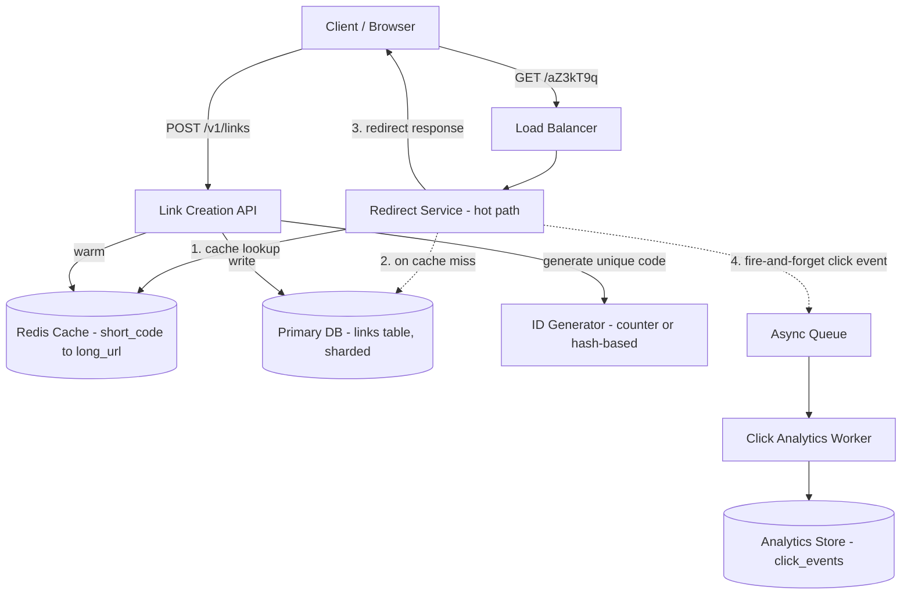

# Design a URL Shortener API

## Problem Statement

Design a service like bit.ly: users submit a long URL and get back a short code; anyone who visits the short URL is redirected to the original. The interesting engineering is almost entirely on the read side — redirects vastly outnumber creations, and every redirect adds latency to someone's click, so this is fundamentally a read-heavy, latency-sensitive caching problem wearing a simple CRUD API as a costume. The two design questions that actually matter are how to generate short codes without collisions at scale, and how to make redirects fast enough that the shortener is never the reason a link feels slow.

## Requirements

### Functional Requirements

- Create a short URL from a long URL, optionally with a custom alias.
- Redirect: visiting the short URL sends an HTTP redirect to the original long URL.
- Support link expiration (optional TTL on a short link).
- Track click analytics (count, timestamp, rough geography/referrer) without slowing down the redirect itself.
- Let a user view their created links and basic analytics.

### Non-Functional Requirements

- Redirect latency: p99 under 50ms — this is the number one UX metric; nobody should notice the shortener exists.
- Read:write ratio is heavily skewed toward reads (redirects dominate creations by orders of magnitude).
- Short codes must be effectively unique with no collisions, generated fast enough to never bottleneck link creation.
- High availability for redirects specifically — a shortener that's down means every link created with it appears broken, which is a much worse failure mode than the creation API being briefly unavailable.
- Click tracking must not add latency to the redirect's critical path.

## Capacity Estimates

Assumptions, stated explicitly:

- 100 million new short URLs created per month.
- Read:write ratio of 100:1 (a typical, even conservative, ratio for link shorteners — popular links get clicked far more than that, but 100:1 is a reasonable blended average across all links, most of which get only a handful of clicks).

Write (creation) traffic:
- 100M/month ÷ (30 × 86,400s) ≈ 100,000,000 / 2,592,000 ≈ 39 creations/s average. Peak at 5x ≈ 195/s.

Read (redirect) traffic:
- 100:1 ratio → 3.9 billion redirects/month ≈ 1,500 redirects/s average.
- Peak (viral link driving a spike) at 10x average ≈ 15,000 redirects/s peak — and a single very popular link can locally spike far higher than that, which is why per-link caching matters, not just aggregate throughput.

Storage:
- Assume links accumulate for 5 years before any expiration cleanup: 100M/month × 60 months = 6 billion links.
- Each record: short_code (7 bytes), long_url (avg 100 bytes), owner_id, created_at, expires_at ≈ 200 bytes/row → 6B × 200 bytes ≈ 1.2 TB. Large but very manageable for a modern key-value or relational store, especially since it's simple flat data with no complex joins on the hot path.

Short code space:
- Using base62 encoding (`[a-zA-Z0-9]`), a 7-character code gives 62^7 ≈ 3.5 trillion possible codes — vastly more than the 6 billion needed over 5 years, leaving huge headroom and making collisions a non-issue with the right generation strategy (see below).

Cache sizing:
- Cache the hottest ~20% of links (by access frequency, which follows a steep power-law distribution typical of link click-through) to absorb the vast majority of redirect traffic. 20% of a rolling window of, say, 500M "actively clicked in the last 90 days" links × 200 bytes ≈ 20 GB — comfortably fits in a Redis cluster's memory.

## API Design

```
POST   /v1/links
  Request:  { "long_url": "https://example.com/very/long/path?x=1", "custom_alias": "my-link" (optional), "expires_at": "..." (optional) }
  Response: 201 { "short_code": "aZ3kT9q", "short_url": "https://sho.rt/aZ3kT9q", "long_url": "..." }

GET    /{short_code}
  Response: 301/302 redirect to long_url
  # this is the hot path — no auth, no JSON, just a redirect

GET    /v1/links/{short_code}
  Response: 200 { "short_code": "aZ3kT9q", "long_url": "...", "created_at": "...", "click_count": 1042 }

GET    /v1/links?owner_id=usr_1
  Response: 200 { "links": [ ... ], "next_cursor": "..." }

DELETE /v1/links/{short_code}
  Response: 204

GET    /v1/links/{short_code}/analytics
  Response: 200 { "total_clicks": 1042, "clicks_by_day": [ ... ], "top_referrers": [ ... ] }
```

Note the deliberate asymmetry: `GET /{short_code}` is unauthenticated, minimal, and optimized purely for redirect speed, while the management endpoints under `/v1/links` are a normal authenticated CRUD API. Keeping the redirect path free of unnecessary work (auth checks, full JSON serialization) is itself a latency decision.

## Database Design

A key-value access pattern dominates (`short_code → long_url` lookup), which argues for a simple, horizontally-shardable store. A relational database (Postgres) works fine at this scale for the primary store given the low row size and simple access pattern, sharded by `short_code` hash once volume demands it; a NoSQL key-value store (DynamoDB/Cassandra) is an equally valid choice and arguably a more natural fit long-term, since there's essentially no need for joins or multi-row transactions here.

```
links
  short_code      VARCHAR(10) PK
  long_url        TEXT NOT NULL
  owner_id        UUID NULL           -- null for anonymous links
  created_at      TIMESTAMPTZ
  expires_at      TIMESTAMPTZ NULL
  is_custom_alias BOOLEAN DEFAULT FALSE
  INDEX(owner_id, created_at)

click_events        -- append-only, written async, not on the redirect's synchronous path
  id              BIGSERIAL PK
  short_code      VARCHAR(10)
  clicked_at      TIMESTAMPTZ
  referrer        TEXT
  country         CHAR(2)
  user_agent_hash TEXT
  INDEX(short_code, clicked_at)

id_generator_ranges   -- only needed if using the counter-based ID strategy (see below)
  range_start     BIGINT
  range_end       BIGINT
  assigned_to     TEXT     -- which app instance/worker claimed this range
```

`click_events` is intentionally a separate, append-only table (or even a separate analytics-oriented store like a time-series DB or a data warehouse at larger scale) so that heavy analytics writes and queries never contend with the `links` table that the redirect path depends on.

## High-Level Architecture



## Data Flow

**Create a short link:**
1. Client POSTs the long URL (and optionally a custom alias). The API validates the URL (well-formed, not pointing at the platform's own domain to prevent redirect loops, not on an abuse blocklist).
2. If a custom alias was requested, check availability directly against the primary store (a uniqueness constraint on `short_code` enforces this atomically even under a race).
3. If no custom alias, generate a code (see ID generation trade-off below) and insert the row.
4. Optionally pre-warm the cache with the new mapping, since a freshly-created link (e.g., shared on social media) can see an immediate traffic spike well before it would naturally become "hot" through repeated cache misses.
5. Return the short URL to the client.

**Redirect (the hot path):**
1. Client's browser requests `GET /{short_code}`.
2. Redirect service checks Redis first. Cache hit (expected ~80%+ of traffic given the power-law click distribution) returns the long URL in well under a millisecond.
3. On a cache miss, fall through to the primary database, fetch the row, populate the cache with a TTL, and proceed.
4. Respond with an HTTP redirect (302 for links that might change or expire, 301 only if the platform guarantees permanence — 302 is the safer default since it keeps the platform in control of future changes and doesn't get aggressively cached by browsers themselves).
5. The click is recorded by publishing a lightweight event to a queue asynchronously — the HTTP response to the client is not held up waiting for this write, since analytics durability is not on the critical path of "does the redirect work."
6. A separate worker consumes the queue and writes to the analytics store, which can batch/aggregate writes rather than doing one row-insert per click synchronously.

## Scaling Strategy

At 10x scale (15,000 redirects/s average, spikes into six figures for viral links):

- **Cache is the whole game.** With a well-tuned cache hit ratio (>95% achievable given the access pattern), the database mostly sees creation traffic and cold-link lookups, not the bulk of redirect volume. Scale Redis horizontally via a cluster with consistent hashing on `short_code`, and consider a local (in-process, e.g., an LRU of the top few thousand links per instance) L1 cache in front of Redis for the very hottest links, cutting network hops entirely for the most-requested handful of URLs.
- **A single viral link** can dominate traffic to one shard/key. This is a hot-key problem, not solved by horizontal sharding alone — mitigate with client-side/CDN caching of the redirect response itself (a short Cache-Control TTL lets browsers and edge CDNs absorb repeat requests for the same viral link without hitting the origin at all) and, if using a sharded cache, replicate especially hot keys across multiple cache nodes rather than pinning them to one.
- **Database writes for link creation** scale linearly and are the smaller of the two workloads by two orders of magnitude — sharding the primary store by a hash of `short_code` handles this comfortably, since there's no cross-shard query need (lookups are always by exact `short_code`).
- **Click analytics volume** grows with redirect volume, not creation volume, so it needs independent scaling — a queue-backed, batched-write pipeline into a purpose-built analytics/time-series store (rather than the same relational database backing the hot-path lookup) keeps this from ever becoming a redirect-latency risk, no matter how large analytics volume gets.

## Failure Handling

- **Cache cluster down:** redirects fall back to the primary database directly. Latency degrades (still needs to stay well under a user-noticeable threshold) but redirects keep working — the system should never treat "cache unavailable" as "service unavailable," since availability of the redirect path is the top priority.
- **Primary database down:** this is the actual worst case, since a cache miss now has nowhere to fall back to. Mitigate with read replicas serving the redirect lookup path specifically (redirect reads don't need the strictest consistency — a link becoming available for redirect a few hundred milliseconds after creation is an acceptable trade), so a primary outage that only affects writes (new link creation) doesn't take down existing redirects.
- **Click event queue backs up or is briefly unavailable:** redirects are unaffected since click tracking is fire-and-forget and off the critical path; some click events may be lost in a sufficiently bad outage, which is an acceptable trade for analytics data (approximate) versus the redirect itself (must be exact and always available).
- **ID generator unavailable (if using a counter-based service):** link creation degrades, but existing redirects are entirely unaffected, since redirect only depends on the cache/database lookup, never on the ID generator.

## Security

- **Open redirect / phishing abuse:** the single biggest risk for a URL shortener is being used to mask malicious destination URLs behind a trusted-looking short domain. Mitigate with URL validation against known-malicious-domain blocklists (checked async/periodically, not necessarily blocking creation, since blocklists update faster than any one submission), and support for retroactively disabling a link if it's later found to point somewhere malicious.
- **Enumeration/scraping of short codes:** codes should not be sequential/predictable if long URLs might contain sensitive information (e.g., a password-reset link someone shortened) — favor randomly-distributed codes (or a hash-based scheme) over a raw incrementing counter exposed directly as the code, or at minimum don't assume short codes are a security boundary at all and document that links should be treated as effectively public if guessable.
- **Rate limiting on link creation** to prevent the service being used as free infrastructure for spam/phishing campaigns at scale (mass-generating throwaway short links).
- **Redirect loops** (a short link pointing at another short link on the same platform, potentially circularly) should be detected and rejected at creation time.
- **No sensitive data in `long_url` display anywhere public** — the creation API should not echo back other users' long URLs from analytics or public endpoints, since a long URL can itself contain sensitive query parameters.

## Trade-offs

1. **Base62 counter-based ID generation vs. hash-based (e.g., MD5/SHA of the long URL, truncated).** Chosen: counter-based (e.g., a distributed range-allocator, like the `id_generator_ranges` table above, where each app instance claims a block of sequential IDs to encode without needing a coordinated lock on every single creation). Rejected: hashing the long URL, which seems simpler but has two real problems — the same long URL submitted twice either collides (bad if two users want independent, separately-trackable links to the same destination) or needs a disambiguation suffix anyway, and truncated hashes have a non-trivial collision probability at billions of entries that then needs its own detection-and-retry logic, which ends up about as complex as just doing counter-based generation properly.
2. **302 (temporary) redirect vs. 301 (permanent) redirect for the hot path.** Chosen: 302. Rejected: 301, which browsers and some ISP-level caches memorize aggressively and stop re-requesting from the origin at all — great for the shortener's own load, terrible for the platform's ability to update/expire/redirect the link differently later (e.g., disabling a link found to be malicious after the fact wouldn't reach users whose browsers cached a 301). Availability of control was judged more valuable than the marginal server-load savings.
3. **Asynchronous, fire-and-forget click tracking vs. synchronous write on the redirect path.** Chosen: async. A synchronous write would directly couple redirect latency (the top-priority metric) to analytics-database write latency and availability, which is an unacceptable coupling — a spike in analytics DB load should never be able to slow down or fail a redirect. The cost is that a small fraction of clicks can be lost during a queue outage, an accepted trade given analytics is inherently approximate for this kind of system.
4. **Relational primary store (sharded) vs. purpose-built NoSQL key-value store from day one.** Chosen: relational initially, since the team likely already operates Postgres elsewhere and the access pattern, while key-value-shaped, doesn't strictly require giving up SQL's operational familiarity at this scale (1.2 TB, simple sharding). Rejected: committing to a NoSQL store immediately, which isn't wrong, but is presented here as a "you could reasonably go either way" call rather than a clear necessity — worth stating explicitly in an interview rather than picking one dogmatically.

## Related Handbook Chapters

- [Part 7 — Why Caching Matters](../07-caching-performance/why-caching-matters.md)
- [Part 7 — Cache-Aside](../07-caching-performance/cache-aside.md)
- [Part 7 — Redis](../07-caching-performance/redis.md)
- [Part 7 — Latency and Percentiles](../07-caching-performance/latency-and-percentiles.md)
- [Part 6 — Rate Limiting](../06-production-reliability/rate-limiting.md)
- [Part 8 — Message Queues](../08-async-systems/message-queues.md)

Back to [Part 19 — System Design Case Studies](README.md).
