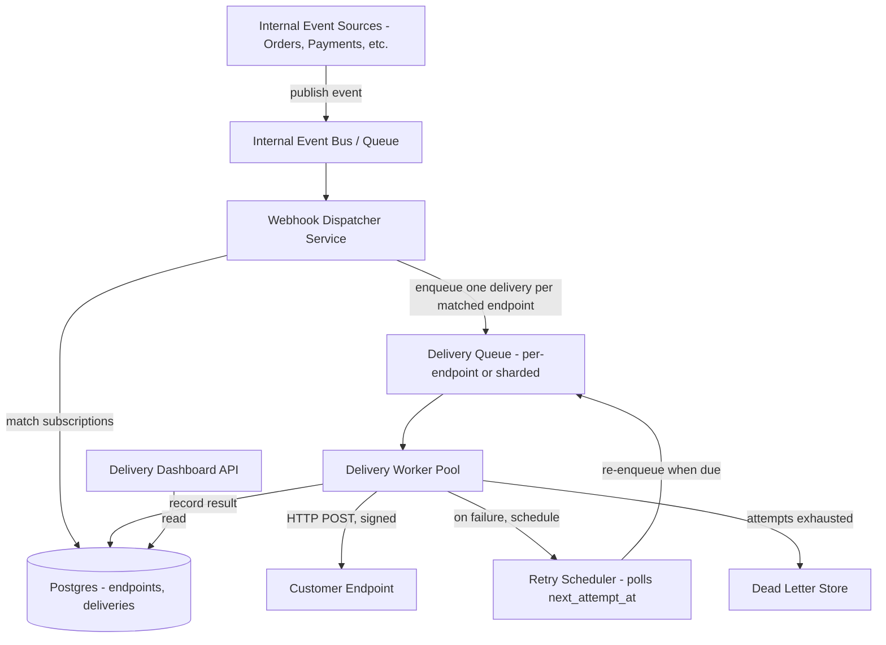

# Design a Webhook System

## Problem Statement

Design the webhook *provider* side of a platform — the system that reliably delivers event notifications (e.g., `order.created`, `payment.succeeded`) to customer-registered HTTP endpoints. Customer servers are unreliable by definition: they go down, they're slow, they return 500s during their own deploys. The platform must still guarantee at-least-once delivery, protect customers from receiving forged events, give them visibility into delivery health, and avoid one customer's broken endpoint degrading delivery to everyone else.

This is fundamentally a distributed retry-and-backoff problem dressed up as an integration feature. The interesting design decisions are almost all about what happens when the receiving end is slow, down, or actively hostile (an attacker pretending to be a legitimate subscriber to see what data leaks).

## Requirements

### Functional Requirements

- Customers register one or more webhook endpoint URLs, subscribed to specific event types.
- When an event occurs internally, deliver it as an HTTP POST to every matching, active subscription.
- Retry failed deliveries with exponential backoff up to a bounded number of attempts.
- Sign every payload (HMAC) so receivers can verify it genuinely came from the platform.
- Move deliveries that exhaust retries to a dead-letter state, visible to the customer.
- Provide a delivery-log dashboard/API so customers can see what was sent, when, and the response received.
- Allow customers to manually replay a failed delivery.

### Non-Functional Requirements

- At-least-once delivery guarantee — a delivery is never silently dropped without exhausting retries and being recorded as dead-lettered.
- One slow/down customer endpoint must not delay or block delivery to other customers (isolation).
- Delivery latency for a healthy endpoint: p95 under a few seconds from event occurrence.
- Retry schedule must not hammer a temporarily-down endpoint (exponential backoff + jitter) or the platform's own outbound infrastructure.
- Payload authenticity must be verifiable by the receiver without a callback to the platform.

## Capacity Estimates

Assumptions, stated explicitly:

- 50,000 customers with an active webhook subscription.
- Platform generates 100 million billable events/day (e.g., an e-commerce/SaaS platform's aggregate order, payment, and inventory events across all customers).
- Average fan-out: each event matches ~1.1 subscriptions on average (most events go to exactly one customer's endpoint, some internal events fan out to a couple of subscribed URLs on the same account for different services).

Delivery volume:
- 100M events/day × 1.1 ≈ 110M delivery attempts/day (first attempts only) ≈ 1,270 deliveries/s average.
- Assume 5% of first attempts fail and need at least one retry (customer endpoint blips are common at this scale) → +5.5M retry attempts/day, a modest addition on top.
- Peak traffic at 4x average (correlated with the underlying business events, e.g., a flash sale) ≈ 5,000 deliveries/s peak.

Latency budget:
- A healthy delivery (endpoint responds in under 1s) should complete within the p95 target of a few seconds end-to-end from the internal event being published.

Storage:
- Delivery log: 110M attempts/day × ~500 bytes (URL, status code, response snippet, timestamps) ≈ 55 GB/day → retained ~30 days for the dashboard ≈ 1.6 TB rolling window; older logs archived to cold storage or dropped.
- Dead-letter events: assume 0.1% of events exhaust all retries → 110,000/day, small enough to keep indefinitely for customer support/replay purposes.

## API Design

Customer-facing management API (not the outbound delivery itself, which is server-initiated):

```
POST   /v1/webhook-endpoints
  Request:  { "url": "https://customer.com/hooks", "event_types": ["order.created", "payment.succeeded"] }
  Response: 201 { "endpoint_id": "we_1", "secret": "whsec_...", "status": "active" }

GET    /v1/webhook-endpoints
  Response: 200 { "endpoints": [ { "endpoint_id": "we_1", "url": "...", "status": "active" }, ... ] }

PATCH  /v1/webhook-endpoints/{id}
  Request:  { "event_types": [...], "status": "paused" | "active" }
  Response: 200 { ... }

DELETE /v1/webhook-endpoints/{id}
  Response: 204

GET    /v1/webhook-endpoints/{id}/deliveries
  Response: 200 { "deliveries": [
    { "delivery_id": "del_1", "event_type": "order.created", "status": "delivered" | "retrying" | "dead_lettered",
      "attempts": 2, "last_attempt_at": "...", "response_status": 200 }
  ], "next_cursor": "..." }

POST   /v1/webhook-endpoints/{id}/deliveries/{delivery_id}/replay
  Response: 202 { "delivery_id": "del_1", "status": "queued" }
```

Outbound request the platform sends to the customer's URL:

```
POST https://customer.com/hooks
Headers:
  Content-Type: application/json
  X-Webhook-Signature: t=1755600000,v1=<hex hmac-sha256>
  X-Webhook-Delivery-Id: del_1
  X-Webhook-Event-Type: order.created
Body: { "event_type": "order.created", "data": { ... }, "created_at": "..." }
```

## Database Design

Relational database for subscriptions and delivery state (needs consistency for status tracking and customer-facing queries); the actual delivery queue is a separate message queue, not a database table, since it's a high-throughput transient workload.

```
webhook_endpoints
  id              UUID PK
  customer_id     UUID NOT NULL
  url             TEXT NOT NULL
  secret_hash     TEXT NOT NULL      -- HMAC signing secret, encrypted at rest
  event_types     TEXT[]             -- subscribed event types
  status          TEXT               -- 'active' | 'paused' | 'disabled_auto'  (auto-disabled after sustained failure)
  created_at      TIMESTAMPTZ
  INDEX(customer_id)

webhook_deliveries
  id              UUID PK
  endpoint_id     UUID FK -> webhook_endpoints.id
  event_id        UUID NOT NULL      -- source event, for idempotency/dedupe on producer side
  event_type      TEXT
  payload         JSONB
  status          TEXT               -- 'pending' | 'delivered' | 'retrying' | 'dead_lettered'
  attempt_count   INT DEFAULT 0
  next_attempt_at TIMESTAMPTZ
  last_response_status  INT
  last_response_body    TEXT         -- truncated snippet, not full body
  created_at      TIMESTAMPTZ
  INDEX(endpoint_id, created_at), INDEX(status, next_attempt_at)
```

`INDEX(status, next_attempt_at)` is the index the retry scheduler leans on: "give me all `retrying` rows whose `next_attempt_at` has passed." At the scale estimated above, this table is high-write and benefits from partitioning by time (e.g., daily partitions), with old `delivered` rows aged out to a cheaper archive after the 30-day dashboard window.

## High-Level Architecture



## Data Flow

**Event to delivery:**
1. An internal service (e.g., Orders) publishes `order.created` to the internal event bus once the order is committed.
2. The webhook dispatcher consumes the event, looks up all `webhook_endpoints` with `status = 'active'` and `event_types` containing `order.created` for the relevant customer, and creates one `webhook_deliveries` row per matched endpoint (fan-out happens here, at write time, not at delivery time — this makes each delivery independently retryable).
3. Each new delivery is pushed onto a delivery queue. The queue is partitioned/sharded by `endpoint_id` (or customer) so that one endpoint's backlog can't starve the workers assigned to other endpoints — this is the isolation requirement in practice, not just in principle.
4. A worker pulls a delivery, computes the HMAC signature over the payload using the endpoint's secret, and sends the HTTP POST with a short timeout (e.g., 5s) — a slow customer endpoint should not tie up a worker indefinitely.
5. On a 2xx response, the delivery is marked `delivered`. On any other response (or a timeout), `attempt_count` increments and `next_attempt_at` is set using exponential backoff with jitter (e.g., `base * 2^attempt + random_jitter`), and status is set to `retrying`.

**Retry loop:**
1. A retry scheduler continuously (or on a short poll interval) selects `retrying` rows where `next_attempt_at <= now()`, using the `(status, next_attempt_at)` index, and re-enqueues them onto the delivery queue.
2. This repeats up to a configured max attempt count (e.g., 8 attempts over ~24 hours). On exhausting retries, the delivery is marked `dead_lettered`, and the customer's dashboard reflects it as needing attention. If an endpoint accumulates enough consecutive dead-lettered deliveries, its `status` is auto-flipped to `disabled_auto` and the customer is notified — this protects the platform from spending resources indefinitely on an endpoint that's been abandoned.
3. The customer can call the replay endpoint at any time to force an immediate re-delivery attempt outside the normal backoff schedule.

## Scaling Strategy

At 10x scale (500M events/day, ~13,000 deliveries/s peak):

- **Fan-out at dispatch time** scales linearly with subscription count per event — for platforms with unusually high fan-out per event (e.g., a broadcast-style event that matches thousands of subscribers), batch the delivery-row inserts and queue publishes rather than doing them one at a time in a loop, and consider a separate high-fan-out path so it doesn't skew the latency profile of the common single-recipient case.
- **Per-endpoint queue isolation** is the mechanism that keeps this scalable in the specific way that matters here: without it, one customer running a slow endpoint during a traffic spike could occupy a disproportionate share of worker capacity. Sharding delivery queues by endpoint (or a bounded worker-pool-per-shard model with fair scheduling) keeps a single bad actor's blast radius to their own queue shard.
- **Delivery log storage** at 55 GB/day (100M events/day estimate) becomes several hundred GB/day at 10x — partition aggressively by day, and move anything past the dashboard's retention window (30 days) to cold storage or summarize/drop it, since the dashboard's actual query pattern is "recent deliveries for this endpoint," not full historical scans.
- **The retry scheduler poll** itself must scale — at high volume, a single poller scanning `(status, next_attempt_at)` becomes a bottleneck. Shard the scan by a hash of `endpoint_id` across multiple scheduler instances, each responsible for a slice of the keyspace.

## Failure Handling

- **Customer endpoint is down:** normal case, handled by the retry/backoff loop; no special handling needed beyond eventual dead-lettering if it stays down past the retry window.
- **Customer endpoint is slow but not down (e.g., 20s response times):** the worker's request timeout (5s) prevents this from tying up capacity — a slow 2xx is treated the same as a timeout and retried later, since the platform can't tell the difference between "about to respond" and "hung," and doesn't want to find out by blocking.
- **Delivery queue backs up during a large event burst:** workers are horizontally scaled and the queue absorbs the burst; because delivery is decoupled from event production (the dispatcher just enqueues), a backlog here doesn't propagate back and slow down the internal services generating the events.
- **Dispatcher crashes mid-fan-out:** because delivery rows are created before enqueueing, and the event bus redelivers unacknowledged messages (at-least-once), the dispatcher may reprocess an event — the fan-out step should be idempotent (e.g., upsert on `(endpoint_id, event_id)`) to avoid creating duplicate delivery rows for the same event on redelivery.
- **A customer's secret leaks:** they can rotate it via the management API; the design should support a brief dual-secret grace period (old and new both valid) so in-flight signed deliveries mid-rotation aren't rejected by the customer's own verification code.

## Security

- **HMAC signing** (`X-Webhook-Signature`, including a timestamp component `t=` to prevent replay of an old captured payload) lets receivers cryptographically verify a delivery genuinely came from the platform and wasn't forged or tampered with in transit — this is the single most important control in a webhook system, since the receiving endpoint is, by definition, a public-facing URL that anyone could otherwise POST fake events to.
- **Per-endpoint secrets**, not one shared platform-wide secret, so a leak on one customer's side doesn't compromise every other customer's ability to trust their deliveries.
- **SSRF protection on endpoint registration:** validate that registered URLs don't resolve to internal/private IP ranges (169.254.x.x, 10.x.x.x, etc.) at both registration time and delivery time (DNS can change between the two), since a webhook system that will happily POST to any URL a customer supplies is a textbook SSRF vector into the platform's own internal network if not restricted.
- **Response bodies from customer endpoints are stored truncated and treated as untrusted data** in the dashboard (never rendered unescaped), since a compromised or malicious customer endpoint could return content designed to exploit the dashboard's rendering.
- **Outbound requests use a dedicated, isolated network path/egress IP range** distinct from the platform's internal service-to-service traffic, so a customer can't use webhook registration as a lever to probe the platform's internal network topology.

## Trade-offs

1. **At-least-once delivery (with receiver-side dedupe expected) vs. exactly-once delivery.** Chosen: at-least-once, the only practical option — guaranteeing exactly-once across an unreliable network and an unreliable receiver is not achievable (the platform can't know if a "timeout" meant the receiver processed it and the ack was lost, or never received it at all). The design compensates by including a stable `X-Webhook-Delivery-Id` so receivers can dedupe on their end, pushing the final exactly-once-processing guarantee to the consumer, which is the standard, honest trade-off every major webhook provider makes.
2. **Per-endpoint queue sharding for isolation vs. a single global delivery queue.** Chosen: sharded. Rejected: one global FIFO-ish queue, which is simpler operationally but violates the isolation requirement directly — a burst of failures to one slow customer endpoint would consume a disproportionate share of worker retries and delay delivery to healthy endpoints queued behind it.
3. **Exponential backoff with a bounded max-attempts (then dead-letter) vs. retrying forever.** Chosen: bounded retries. Retrying forever seems more "reliable" on the surface but in practice just accumulates unbounded queue/storage growth for endpoints that are permanently abandoned (a customer who deleted their server months ago), and gives the customer no clear signal that something needs their attention — dead-lettering with dashboard visibility is more honest and operationally sustainable.
4. **Storing full delivery logs for a 30-day rolling window vs. logging only failures.** Chosen: log everything (success and failure), because customers need to debug "did you actually send this?" for successful-looking deliveries too (e.g., their own endpoint silently dropped a payload after returning 200), and audit/compliance needs often require a full record — at the cost of meaningfully higher storage volume than a failures-only log would need.

## Related Handbook Chapters

- [Part 9 — Webhooks](../09-realtime-and-webhooks/webhooks.md)
- [Part 9 — Webhook Signature Verification](../09-realtime-and-webhooks/webhook-signature-verification.md)
- [Part 6 — Retries](../06-production-reliability/retries.md)
- [Part 6 — Exponential Backoff](../06-production-reliability/exponential-backoff.md)
- [Part 8 — Message Queues](../08-async-systems/message-queues.md)
- [Part 2 — Idempotency](../02-rest-api-design/idempotency.md)

Back to [Part 19 — System Design Case Studies](README.md).
