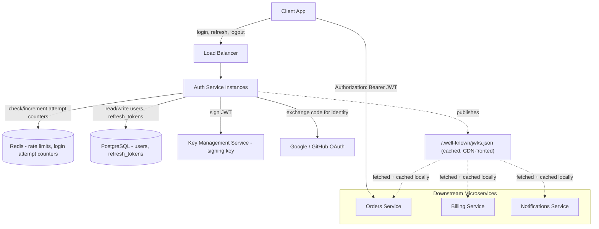

# Design an Authentication API

## Problem Statement

Design an authentication service that other services in a company's backend depend on. It needs to support username/password login, social login via OAuth (Google, GitHub), issue tokens that downstream APIs can verify cheaply without calling back to the auth service on every request, and survive credential-stuffing and brute-force attacks at internet scale. Assume this service backs a consumer product with millions of users, and that multiple internal microservices (not just one monolith) need to validate the identity of the caller on every request.

This is the case study most interviewers reach for first because it forces you to reason about a genuine tension: tokens need to be verifiable without a database round trip (for latency), but you also need the ability to revoke a session immediately (for security). Every real design here is a negotiated trade-off between those two forces.

## Requirements

### Functional Requirements

- Register a new account with email + password.
- Log in with email + password, receive an access token and a refresh token.
- Log in via OAuth 2.0 with Google and GitHub (social login).
- Refresh an expired access token using a refresh token.
- Log out (invalidate the current session/refresh token).
- Log out of all devices (invalidate all sessions for a user).
- Change password (invalidates all other sessions).
- Downstream services can verify a token's authenticity without calling the auth service synchronously on every request.

### Non-Functional Requirements

- Token verification latency: p99 < 5ms (it happens on the hot path of every API call in the company).
- Login endpoint availability: 99.95%.
- Passwords are never stored or logged in plaintext, anywhere, including error logs.
- Resistant to credential stuffing and brute-force attacks (rate limiting, lockouts).
- Horizontally scalable — no in-memory session state pinned to a single instance.
- Token revocation (logout) must take effect within a few seconds, not wait for token expiry.

## Capacity Estimates

Assumptions, stated explicitly:

- 20 million registered users, 5 million daily active users (DAU).
- Each DAU logs in fresh (new session) roughly 1.2 times/day (some already have a valid refresh token from yesterday), and makes ~40 authenticated API calls/day that require token verification.
- Access tokens are short-lived (15 minutes), so a DAU refreshes their token roughly 96 times/day if active across a full day — but in practice most users are active in bursts, so assume ~8 refreshes/day/DAU on average.

Login traffic:
- 5M DAU × 1.2 logins/day = 6M logins/day → 6,000,000 / 86,400s ≈ 70 req/s average.
- Peak (login is bursty — morning commute, evening) at 6x average ≈ 420 req/s peak.

Refresh traffic:
- 5M DAU × 8 refreshes/day = 40M refresh calls/day ≈ 460 req/s average, ~2,000 req/s peak.

Token verification traffic (distributed across every downstream service, not just this API):
- 5M DAU × 40 calls/day = 200M verifications/day ≈ 2,300 req/s average, ~10,000+ req/s peak across the fleet.
- This is the number that rules out "verify every token against a database." At 10,000 req/s, a synchronous DB hit per verification would need a database cluster sized for that alone. This is the central argument for JWTs.

Storage:
- User table: 20M rows × ~500 bytes/row (email, password hash, metadata) ≈ 10 GB. Trivial for a relational database.
- Refresh token / session table: assume each user keeps ~2 active sessions on average → 40M rows × ~200 bytes ≈ 8 GB, growing steadily; needs TTL-based cleanup.
- Login attempt / rate-limit counters: ephemeral, lives in Redis with short TTLs, not counted in durable storage.

## API Design

```
POST   /v1/auth/register
  Request:  { "email": "a@b.com", "password": "..." }
  Response: 201 { "user_id": "usr_123", "email": "a@b.com" }

POST   /v1/auth/login
  Request:  { "email": "a@b.com", "password": "..." }
  Response: 200 {
    "access_token": "<jwt>",
    "refresh_token": "<opaque>",
    "expires_in": 900
  }

POST   /v1/auth/oauth/{provider}/callback
  Request:  { "code": "<oauth_authorization_code>" }
  Response: 200 { "access_token": "<jwt>", "refresh_token": "<opaque>", "expires_in": 900 }

POST   /v1/auth/refresh
  Request:  { "refresh_token": "<opaque>" }
  Response: 200 { "access_token": "<jwt>", "refresh_token": "<opaque>", "expires_in": 900 }
  # refresh token rotation: old refresh token is invalidated, a new one is issued

POST   /v1/auth/logout
  Request:  { "refresh_token": "<opaque>" }
  Response: 204

POST   /v1/auth/logout-all
  Request:  (authenticated via access token)
  Response: 204   # invalidates every session for this user

POST   /v1/auth/change-password
  Request:  { "current_password": "...", "new_password": "..." }
  Response: 204   # invalidates all other sessions

GET    /v1/auth/.well-known/jwks.json
  Response: 200 { "keys": [ ... ] }   # public keys for downstream services to verify JWT signatures
```

Downstream services never call `/v1/auth/verify`. They fetch and cache the JWKS document and verify signatures locally — that endpoint's absence is the point of the design.

## Database Design

Relational database (PostgreSQL) — chosen because this data is strongly consistent, low-volume relative to the read-heavy token traffic, and benefits from foreign keys and transactional integrity (e.g., password change must atomically invalidate sessions).

```
users
  id              UUID PK
  email           TEXT UNIQUE NOT NULL
  password_hash   TEXT              -- argon2id hash, null for OAuth-only accounts
  email_verified  BOOLEAN DEFAULT FALSE
  created_at      TIMESTAMPTZ
  updated_at      TIMESTAMPTZ

oauth_identities
  id              UUID PK
  user_id         UUID FK -> users.id
  provider        TEXT     -- 'google', 'github'
  provider_uid    TEXT     -- subject id from the provider
  UNIQUE(provider, provider_uid)

refresh_tokens
  id              UUID PK
  user_id         UUID FK -> users.id
  token_hash      TEXT UNIQUE NOT NULL   -- SHA-256 of the opaque token, never store raw
  family_id       UUID     -- rotation family, for reuse-detection
  device_info     TEXT
  issued_at       TIMESTAMPTZ
  expires_at      TIMESTAMPTZ
  revoked_at      TIMESTAMPTZ NULL
  INDEX(user_id), INDEX(expires_at)

login_audit
  id              UUID PK
  user_id         UUID NULL
  email_attempted TEXT
  ip              INET
  success         BOOLEAN
  created_at      TIMESTAMPTZ
  INDEX(email_attempted, created_at), INDEX(ip, created_at)
```

Refresh tokens are stored as hashes (like passwords) so a database leak doesn't hand out valid session tokens directly. `family_id` supports refresh-token rotation with reuse detection: if a previously-rotated (and thus invalidated) refresh token is presented again, it signals token theft, and the entire family is revoked.

Rate-limit counters (failed login attempts per email, per IP) live in Redis, not Postgres — they're high-write, short-TTL, and don't need durability.

## High-Level Architecture



The critical architectural decision is the dotted line: downstream services verify JWT signatures locally against a cached public key set, never by calling the auth service synchronously per request.

## Data Flow

**Login (password-based):**
1. Client POSTs email + password to `/v1/auth/login`.
2. Auth service checks Redis for a lockout on this email/IP (too many recent failed attempts → 429 immediately, skip step 3 entirely to blunt brute force).
3. Auth service looks up the user by email in Postgres, verifies the password with argon2id.
4. On success: reset the failed-attempt counter, issue a short-lived JWT access token (signed with the service's private key, containing `sub`, `exp`, `iat`, and a few non-sensitive claims like role) and an opaque refresh token (random 256-bit value, stored hashed in `refresh_tokens` with a new `family_id`).
5. On failure: increment the Redis failed-attempt counter (both by email and by IP, since attackers rotate IPs but not target emails, and vice versa), write to `login_audit`, return 401 with a generic message ("invalid email or password" — never reveal which field was wrong).
6. Response returns both tokens to the client.

**Authenticated request to a downstream service:**
1. Client sends `Authorization: Bearer <access_token>` to, say, the Orders service.
2. Orders service has the auth service's public JWKS cached locally (refreshed every few minutes, or on `kid` cache-miss). It verifies the JWT signature and `exp` claim in-process — no network call.
3. If valid, the request proceeds with the identity extracted from the JWT claims. This step is sub-millisecond and adds no dependency on the auth service's uptime.

**Token refresh with rotation:**
1. Client POSTs its refresh token when the access token expires.
2. Auth service hashes the incoming token, looks it up in `refresh_tokens`. If not found or already revoked, and it belongs to a known `family_id`, this is a reuse signal — revoke the entire family (all tokens ever issued in that rotation chain) and force re-login, since it likely means the token was stolen and used by both the legitimate user and an attacker.
3. If valid, revoke the presented token, issue a new access token and a new refresh token in the same family, and store the new one.

## Scaling Strategy

At 10x traffic (50M DAU), the login/refresh path scales horizontally trivially — the auth service instances are stateless, so add more behind the load balancer. The actual bottlenecks:

- **Postgres write load on `refresh_tokens`.** Every refresh both revokes an old row and inserts a new one — that's 2x the refresh QPS in writes. At 10x scale this could be 4,000+ writes/sec sustained. Mitigation: partition the table by `user_id` hash, or move session state to a purpose-built low-latency store (DynamoDB, or Redis with AOF persistence) once relational write throughput becomes the ceiling. Read replicas don't help writes, so this needs either sharding or a different storage engine.
- **Redis rate-limit counters at 100x** become a single-node bottleneck. Move to a Redis Cluster with hashed key distribution across shards; each `email`/`IP` counter key is independent, so this shards cleanly with no cross-shard coordination needed.
- **JWKS distribution.** This scales *better* under load by design, since verification is local. The only risk is a slow key-rotation rollout — put JWKS behind a CDN with a short TTL (60s) so a compromised key can be rotated out fleet-wide within a minute, not just at whatever cadence individual services happen to poll.
- **OAuth provider dependency.** Google/GitHub outages shouldn't take down password login. Isolate the OAuth callback path so failures there don't share a connection pool or thread pool with the password path (bulkhead pattern).

## Failure Handling

- **Auth service instance crashes mid-request:** stateless design means the load balancer routes the retry to a healthy instance; no session affinity required.
- **Postgres primary down:** login/refresh/register fail (they need a write), but token *verification* by downstream services is unaffected since it doesn't touch the database at all. This is the payoff of the JWT design — the blast radius of an auth-service database outage is "can't log in," not "the entire company's APIs reject every request."
- **Redis (rate limiter) down:** fail open or fail closed is a real decision. Failing closed (block all logins) turns a cache outage into a full outage. Fail open with a tighter fallback (e.g., a much stricter fixed global rate limit enforced at the load balancer/API gateway layer) so brute-force risk is reduced but the service stays up.
- **JWKS endpoint unreachable during a key rotation:** downstream services should keep serving requests using their last-cached key set until a fetch succeeds, with alerting if the cache goes stale beyond a threshold — hard-failing every request the moment JWKS is unreachable turns a minor blip into a full outage.
- **Compromised refresh token:** reuse-detection (above) automatically revokes the family and forces re-authentication, limiting the blast radius of a leaked token to one detected reuse.

## Security

- Passwords hashed with argon2id (memory-hard, resistant to GPU cracking), never bcrypt-only in 2026-era designs given argon2's advantages; a unique salt per password is implicit in the hash.
- Failed-login lockouts scoped by both email and IP to blunt both password-spraying (many emails, few passwords, one IP) and credential-stuffing (one email, many passwords/IPs) attack shapes.
- Refresh tokens are opaque and stored hashed — a database dump doesn't yield usable sessions.
- Access tokens are short-lived (minutes) specifically so a leaked access token (e.g., via a logged request) has a small window of exploitability, while the longer-lived refresh token is never sent on ordinary API calls, only to the auth service itself, over TLS.
- Generic error messages on login failure prevent user enumeration.
- All auth traffic is TLS-only; JWTs are signed (not encrypted) with an asymmetric algorithm (RS256/ES256) so downstream services hold only the public key and can never mint tokens themselves — only the auth service holds the private signing key, ideally in a KMS/HSM rather than application memory.

## Trade-offs

1. **JWT (stateless) access tokens vs. opaque tokens verified against a database on every call.** Chosen: JWT. Rejected: DB-checked opaque tokens everywhere, which would trivially support instant revocation but cannot meet the p99 < 5ms verification requirement at 10,000+ req/s without an enormous, latency-critical shared database dependency for every service in the company. The cost is that a JWT can't be instantly revoked mid-lifetime — mitigated by keeping access tokens short-lived (15 min) so the exposure window is bounded, and by having refresh tokens (which *are* DB-checked) as the actual revocation control point.
2. **Refresh token rotation with reuse detection vs. long-lived static refresh tokens.** Chosen: rotation. Rejected: a single long-lived refresh token per session, which is simpler to implement but means a single leaked refresh token is valid for its entire lifetime with no way to detect the theft. Rotation adds a write on every refresh (cost, discussed in Scaling), but converts "leaked token" from a silent, unbounded risk into a detectable event.
3. **Fail-open vs. fail-closed on rate-limiter (Redis) outage.** Chosen: fail open with a coarser fallback limit. Rejected: fail closed, which is more secure in isolation but turns a Redis blip into a company-wide login outage — an availability/security trade made explicitly in favor of availability, backstopped by a cruder rate limit at the gateway so the system isn't defenseless during the outage.
4. **Storing sessions in Postgres vs. a purpose-built session store (Redis/DynamoDB) from day one.** Chosen: Postgres initially, for transactional consistency with the `users` table (e.g., atomic "change password + revoke all sessions"). Rejected: starting with a NoSQL session store, which would scale writes better but complicates the atomic multi-table operations needed for security-critical flows like password change. The design explicitly defers that migration to the 10x/100x scaling stage rather than over-engineering upfront.

## Related Handbook Chapters

- [Part 5 — JWT Deeply Explained](../05-authentication-authorization/jwt-deeply-explained.md)
- [Part 5 — Access vs Refresh Tokens](../05-authentication-authorization/access-vs-refresh-tokens.md)
- [Part 5 — OAuth 2.0](../05-authentication-authorization/oauth2.md)
- [Part 5 — Bearer Tokens](../05-authentication-authorization/bearer-tokens.md)
- [Part 5 — Sessions and Cookies](../05-authentication-authorization/sessions-and-cookies.md)
- [Part 6 — Rate Limiting](../06-production-reliability/rate-limiting.md)
- [Part 7 — Redis](../07-caching-performance/redis.md)

Back to [Part 19 — System Design Case Studies](README.md).
