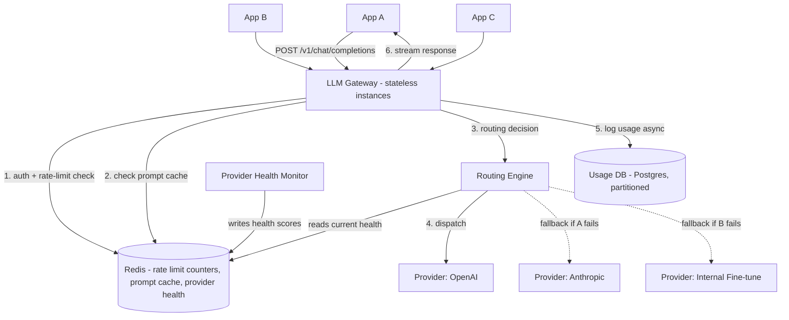

# Design an LLM Gateway

## Problem Statement

Design an internal gateway service that sits between every application in a company and the various LLM providers (OpenAI, Anthropic, an in-house fine-tuned model) they use. Instead of every application team integrating directly with each provider's SDK, they all call one internal API. The gateway is responsible for routing requests to the right model/provider, falling back to an alternative when a provider is degraded, enforcing per-team rate and cost limits, tracking spend, and caching responses/prompts where possible — all while adding minimal latency to what is already a slow operation (LLM generation).

The core design tension: the gateway sits directly in the hot path of every LLM call in the company, so it must add negligible overhead itself, while still doing real work (auth, rate limiting, routing decisions, cost accounting) on every single request. This is a proxy-design problem wearing AI-specific clothing — the specifics that make it distinct from a generic API gateway are token-based rate limiting (not just request-count limiting), provider-specific failure modes, and cost tracking denominated in tokens, not just requests.

## Requirements

### Functional Requirements

- Provide a single, provider-agnostic API for chat completions, used by every internal application.
- Route requests to a specific provider/model based on request parameters, policy, or load.
- Automatically fall back to an alternative provider/model when the primary is down, rate-limited, or erroring.
- Enforce per-team/per-application rate limits, denominated in both requests/minute and tokens/minute.
- Track cost per team/application/model for chargeback and budgeting.
- Support prompt caching to avoid re-sending (and re-billing for) identical repeated prefixes.
- Support streaming responses transparently, regardless of which underlying provider is handling the request.

### Non-Functional Requirements

- Gateway-added latency overhead: under 50ms p99 on top of the provider's own latency — the gateway must not become a meaningful fraction of a call that already takes seconds.
- Availability higher than any single underlying provider's — this is close to the entire value proposition of the gateway, so its own infrastructure must not introduce a new single point of failure worse than what it's protecting against.
- Cost tracking must be accurate to the token, since it's used for real billing/chargeback between internal teams.
- Rate limit enforcement must be consistent across a horizontally scaled gateway fleet — a limit of "1,000 requests/minute" must hold even when requests land on 50 different gateway instances.

## Capacity Estimates

Assumptions, stated explicitly:

- 150 internal applications/teams using the gateway, generating a combined 80 million LLM calls/day.
- Average request: 1,500 input tokens, 400 output tokens (mix of short chat turns and longer RAG/agent-style calls).

Request throughput:
- 80M/day ÷ 86,400s ≈ 925 req/s average. Peak at 4x (business hours, batch jobs kicking off) ≈ 3,700 req/s peak.

Token throughput:
- 80M requests × 1,900 total tokens ≈ 152 billion tokens/day processed through the gateway (input + output combined) — this is the number that drives cost-tracking volume and rate-limiter update frequency, since token counts (not just request counts) are what's being metered.
- At average, that's ≈152B / 86,400s ≈ 1.76M tokens/s flowing through — though the gateway itself doesn't process token content, it needs to record token counts per call at this rate.

Gateway compute:
- At 3,700 req/s peak, with each request needing auth lookup, rate-limit check, routing decision, and cost-log write, assume each gateway instance sustainably handles ~500 req/s → 8 gateway instances needed at peak, a modest, easily horizontally-scaled fleet — the point being that the gateway's own compute footprint is small relative to the LLM provider calls it's brokering.

Cost tracking storage:
- 80M requests/day × ~200 bytes (team_id, model, tokens in/out, cost, timestamp) ≈ 16 GB/day → ~5.8 TB/year at full granularity; realistic designs aggregate into rollups (hourly/daily per team/model) for dashboards and archive/drop raw per-request logs after a shorter retention window (e.g., 90 days) to control this.

## API Design

```
POST   /v1/chat/completions
  Headers:  Authorization: Bearer <internal service token>
  Request:  {
    "model": "gateway-default" | "gpt-4.1" | "claude-sonnet" | "internal-finetune-v3",
    "messages": [ { "role": "user", "content": "..." } ],
    "stream": true,
    "routing_policy": "cost_optimized" | "latency_optimized" | "pinned"  (optional)
  }
  Response: 200 (SSE if stream=true, else single JSON)
    { "id": "chatcmpl_1", "model_used": "claude-sonnet-...", "provider_used": "anthropic",
      "choices": [ ... ], "usage": { "input_tokens": 1500, "output_tokens": 400, "cost_usd": 0.014 } }

GET    /v1/usage?team_id=team_platform&period=2026-08
  Response: 200 { "team_id": "team_platform", "total_cost_usd": 4210.55, "by_model": [ ... ], "by_day": [ ... ] }

GET    /v1/rate-limits/team_platform
  Response: 200 { "requests_per_min_limit": 2000, "requests_per_min_used": 340,
                  "tokens_per_min_limit": 500000, "tokens_per_min_used": 88000 }

POST   /v1/admin/routing-policies
  # admin-only: configure model routing rules, fallback chains, per-team overrides
  Request:  { "primary": "gpt-4.1", "fallback_chain": ["claude-sonnet", "internal-finetune-v3"] }
```

Applications never talk to OpenAI's or Anthropic's SDKs directly — every call goes through this one endpoint, with `model` acting as a logical alias the gateway resolves according to routing policy, not necessarily a literal pass-through to a specific provider's model name.

## Database Design

A mix of a fast key-value store for rate-limit counters (needs atomic increments at high frequency, doesn't need long-term durability) and a relational/analytical store for usage and cost records (needs durability and supports aggregation queries for billing dashboards).

```
teams
  id                UUID PK
  name              TEXT
  default_routing_policy  TEXT
  requests_per_min_limit  INT
  tokens_per_min_limit    INT

usage_records          -- one row per completed request, feeds cost tracking
  id                UUID PK
  team_id           UUID FK -> teams.id
  model_requested   TEXT
  model_used        TEXT     -- the actual model/provider the router chose, may differ from requested
  provider          TEXT
  input_tokens      INT
  output_tokens     INT
  cost_usd          NUMERIC
  latency_ms        INT
  fallback_used     BOOLEAN
  created_at        TIMESTAMPTZ
  INDEX(team_id, created_at), INDEX(created_at)   -- partitioned by day

usage_rollups           -- pre-aggregated, what the dashboard actually queries
  team_id           UUID
  model             TEXT
  period            DATE      -- daily granularity
  total_requests    BIGINT
  total_input_tokens BIGINT
  total_output_tokens BIGINT
  total_cost_usd    NUMERIC
  PRIMARY KEY(team_id, model, period)

provider_health          -- current health status, used by the router
  provider          TEXT PK
  status            TEXT      -- 'healthy' | 'degraded' | 'down'
  error_rate_5m     FLOAT
  p99_latency_ms_5m INT
  last_updated      TIMESTAMPTZ
```

Rate-limit counters themselves (`requests_per_min_used`, `tokens_per_min_used`) live in Redis using a sliding-window or token-bucket scheme, not in the relational store — they need sub-millisecond atomic increments at the request rate estimated above, which a relational table isn't built for.

## High-Level Architecture



## Data Flow

**A routed request with fallback:**
1. An internal application sends a chat completion request to the gateway, authenticated with an internal service token identifying its `team_id`.
2. The gateway checks the team's rate limit (both request-count and token-count budgets) against Redis counters using an atomic increment — if either limit is exceeded, return 429 immediately, before ever making an expensive outbound call to a provider.
3. If a prompt cache is configured and the request's prompt prefix matches a cached entry (common in RAG/agent workloads with repeated system prompts or shared context), the gateway can short-circuit — either by using the provider's own prompt-caching feature (passed through transparently) or, for exact-match cases, serving a cached response directly, skipping the provider call entirely.
4. The routing engine decides the actual provider/model to use, based on the requested `model` alias, the team's routing policy (cost-optimized, latency-optimized, or pinned to a specific provider), and current provider health scores (maintained by a background health monitor that continuously samples error rates and latency per provider).
5. The gateway dispatches the request to the chosen provider. If that call fails (error, timeout, or the provider signals it's rate-limiting the gateway itself), the gateway immediately retries against the next provider in the configured fallback chain, rather than surfacing the failure to the calling application — from the application's point of view, the request either succeeds or exhausts the entire fallback chain, it never sees an individual provider's failure directly.
6. The response (streamed or not) is relayed back to the calling application, tagged with which model/provider was actually used (important for callers that care, and essential for debugging).
7. Asynchronously (off the response's critical path), the gateway logs a `usage_records` row with token counts and computed cost, and increments the team's Redis usage counters for the rate-limit window.

## Scaling Strategy

At 10x scale (9,250 req/s average, ~37,000 req/s peak):

- **Gateway instances scale horizontally trivially** since they're stateless — the harder question is whether the shared Redis layer keeping rate-limit state consistent across instances becomes the bottleneck. At this volume, shard Redis by `team_id` hash, since rate limits are inherently per-team and never need cross-team coordination, making this an easy, clean shard boundary.
- **Provider-side rate limits become the real ceiling**, not the gateway's own infrastructure — a single provider account has its own hard rate/quota limits regardless of how well the gateway scales. This is precisely the argument for multi-provider routing and load-spreading across multiple accounts/regions per provider as a deliberate scaling strategy, not just a failover mechanism.
- **Usage logging at 9,250 writes/s** needs to be fully decoupled from the response path (already async in the base design) and batched — write to a queue and have a separate consumer batch-insert into `usage_records`, rather than one synchronous insert per request, which would otherwise make the database the throughput ceiling for the entire gateway.
- **Prompt cache hit rate matters enormously at scale** — for workloads with large shared prefixes (e.g., a RAG system's system prompt, repeated across thousands of queries), effective caching can cut real provider-side cost and load by a large margin, meaning cache infrastructure (sizing, eviction policy) has a direct, multiplicative effect on how far the underlying provider capacity actually stretches.

## Failure Handling

- **A provider goes down entirely:** the health monitor detects elevated error rates within its sampling window and marks the provider `degraded`/`down` in the shared health store; the router stops sending new traffic to it and routes to the fallback chain instead — critically, this detection needs to happen fast enough (seconds, not minutes) that the fallback kicks in before a large fraction of requests have already failed against the dead provider.
- **All providers in a fallback chain fail:** the gateway must fail the request clearly and quickly rather than retrying indefinitely — a bounded number of total attempts across the whole fallback chain, with the final failure clearly indicating "all providers exhausted," not a generic timeout that leaves the calling application unsure what happened.
- **Redis (rate limiter/cache) unavailable:** similar to the auth-service case study, fail open on rate limiting (allow requests through, rather than blocking all LLM traffic company-wide) but log the degraded state loudly, since silently disabling rate limiting company-wide for an extended period risks a runaway cost spike from any single team.
- **Usage logging pipeline backs up:** must never block the response path — if the async usage-logging queue is backed up, responses keep flowing to applications and usage records catch up once the queue drains; a delay in cost visibility is acceptable, a delay in LLM responses is not.
- **A specific model/provider starts silently degrading in quality (not erroring, just worse outputs):** harder to detect automatically than outright errors; this argues for exposing `model_used`/`fallback_used` in every response so downstream teams can build their own quality monitoring, and for the gateway to support quick policy overrides (pin away from a specific model) without a deploy.

## Security

- **Every calling application authenticates with its own scoped service token**, mapped to exactly one `team_id` — this is what makes per-team rate limiting and cost attribution possible and prevents one team's token from being used to rack up spend attributed to (or worse, billed against) another team.
- **Provider API keys are held only by the gateway**, never distributed to individual application teams — this is a real security win beyond convenience: a leaked application-level credential exposes at most that team's gateway access (revocable, scoped, rate-limited), never a raw, unlimited-blast-radius provider API key.
- **Prompt/response content should not be logged in full by default** in the usage records used for cost tracking — only token counts and metadata; full-content logging (if needed at all, e.g., for debugging or compliance) should be a separate, more tightly access-controlled and consent-gated path, since prompts and completions routinely contain sensitive business or user data.
- **Routing policy changes are admin-only and audited** — the ability to redirect a team's traffic to a different (possibly cheaper, possibly worse-performing) model is a meaningful operational lever that shouldn't be self-service or unaudited.
- **Rate limits also function as a cost/abuse control**, not just a load-shedding one — a single misbehaving internal application (e.g., a bug causing a retry storm) is exactly the kind of incident the token-based rate limit is designed to contain before it becomes an unbounded bill.

## Trade-offs

1. **Centralized gateway for all LLM traffic vs. each team integrating directly with providers.** Chosen: centralized gateway. Rejected: direct integration, which avoids adding a hop of latency and a new dependency in the middle of every call, but leaves every team independently solving rate limiting, fallback, and cost tracking — and, worse, means a provider API key sprawl across dozens of codebases with no unified visibility into total spend or a single place to implement a fallback when a provider degrades. The gateway trades a small latency/complexity cost for centralized control that's hard to retrofit later.
2. **Automatic cross-provider fallback vs. surfacing provider failures directly to calling applications.** Chosen: automatic fallback, transparent to the caller, because most applications don't want to (and often can't, without significant duplicated effort) implement their own multi-provider retry logic — centralizing it in the gateway means every team benefits without each reimplementing it. The cost is that a fallback to a different, possibly lower-quality or differently-behaved model happens without the calling application necessarily realizing it in real time (mitigated by always reporting `model_used`/`fallback_used` in the response, so it's visible after the fact even though it wasn't a decision the caller made).
3. **Token-based rate limiting in addition to request-count limiting vs. request-count limiting alone.** Chosen: both. Request-count-only limiting is simpler but nearly meaningless for LLM cost control, since a single request can range from a few hundred to hundreds of thousands of tokens — two teams making "the same number of requests" can have wildly different actual cost/load impact. Token-based limiting is a more accurate proxy for real cost and provider-side load, at the cost of needing token-count estimation (or exact counts, post-hoc) built into the rate-limiting logic rather than a simple counter increment.
4. **Fail-open on rate limiter outage vs. fail-closed.** Chosen: fail open, for availability reasons consistent with the authentication API case study — the gateway is meant to be more available than any underlying provider, and a self-inflicted company-wide LLM outage caused by the gateway's own rate-limit-tracking Redis blipping would defeat that purpose. The trade accepts a temporary loss of cost-control precision during a rare outage window in exchange for the gateway never being a lower-availability link than what it's protecting against.

## Related Handbook Chapters

- [Part 15 — Production AI Systems Overview](../15-production-ai-systems/README.md)
- [Part 15 — LLM Gateways](../15-production-ai-systems/llm-gateways.md)
- [Part 15 — Multi-Provider Architecture](../15-production-ai-systems/multi-provider-architecture.md)
- [Part 15 — Model Routing](../15-production-ai-systems/model-routing.md)
- [Part 15 — Fallback Systems](../15-production-ai-systems/fallback-systems.md)
- [Part 15 — Token Rate Limits](../15-production-ai-systems/token-rate-limits.md)
- [Part 15 — Cost Tracking](../15-production-ai-systems/cost-tracking.md)
- [Part 15 — Prompt Caching](../15-production-ai-systems/prompt-caching.md)
- [Part 6 — Circuit Breakers](../06-production-reliability/circuit-breakers.md)
- [Part 6 — Rate Limiting](../06-production-reliability/rate-limiting.md)

Back to [Part 19 — System Design Case Studies](README.md).
