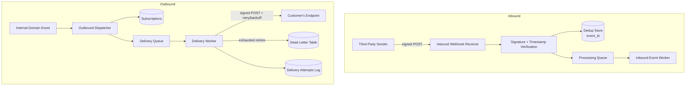

# Project 4 — Webhook Processing System

## Goal

Build a system that plays both sides of the webhook relationship: it **receives** webhooks from a third party (verifying signatures, deduplicating, processing asynchronously) and it **sends** webhooks to your own customers as a provider (with signing, retries, exponential backoff, and a dead-letter queue). Most tutorials only show the "receive" half. Building the "send" half is what teaches you why providers design webhooks the way they do — delivery isn't guaranteed on the first try, consumers can be down, and you need a durable retry story instead of a synchronous fire-and-forget HTTP call.

## Builds On

- [Part 9 — Real-Time APIs](../../docs/09-realtime-and-webhooks/README.md)
- Specifically: [webhooks](../../docs/09-realtime-and-webhooks/webhooks.md), [webhook signature verification](../../docs/09-realtime-and-webhooks/webhook-signature-verification.md)
- Also draws on: [retries](../../docs/06-production-reliability/retries.md), [exponential backoff](../../docs/06-production-reliability/exponential-backoff.md), [idempotency](../../docs/02-rest-api-design/idempotency.md)

## Requirements

- **Inbound side**: an endpoint that receives webhooks from a simulated third-party (e.g. a "payment provider" or "GitHub"-style sender), verifies an HMAC signature header, rejects unsigned/invalid/replayed payloads, and stores each event exactly once even if delivered multiple times.
- **Outbound side**: customers can register a webhook subscription (URL + list of event types + a generated signing secret). When a subscribed event occurs in your system, you deliver it to their URL.
- Outbound delivery signs the payload (HMAC-SHA256 over the raw body) so customers can verify it came from you, mirroring what you require on the inbound side.
- Failed outbound deliveries (non-2xx response, timeout, connection error) are retried with exponential backoff and jitter, up to a max attempt count.
- Deliveries that exhaust all retries land in a dead-letter queue/table, visible to the customer via an API, with a manual "redeliver" action.
- Full delivery history per subscription (status, attempt count, last response code, last attempt time) is queryable.
- Customers can rotate their signing secret without downtime (support two active secrets during a grace period).

## Architecture



## API Endpoints

| Method | Path | Description |
|---|---|---|
| POST | `/webhooks/inbound/{source}` | Receive a webhook from a third party; verifies signature, dedupes by `event_id`, enqueues for processing. |
| GET | `/webhooks/inbound/events` | List received inbound events with processing status (debug/admin view). |
| POST | `/subscriptions` | Register a new outbound webhook subscription (`target_url`, `event_types[]`). Returns a generated signing secret (shown once). |
| GET | `/subscriptions` | List the authenticated customer's subscriptions. |
| PATCH | `/subscriptions/{id}` | Update target URL, event types, or pause/resume the subscription. |
| DELETE | `/subscriptions/{id}` | Delete a subscription. |
| POST | `/subscriptions/{id}/rotate-secret` | Generate a new signing secret; old one stays valid for a grace period. |
| GET | `/subscriptions/{id}/deliveries` | List delivery attempts for a subscription, paginated, filterable by status. |
| GET | `/deliveries/{delivery_id}` | Get full detail of one delivery attempt including response body/headers received. |
| POST | `/deliveries/{delivery_id}/redeliver` | Manually re-trigger a failed/dead-lettered delivery. |
| GET | `/dead-letters` | List dead-lettered deliveries needing manual attention. |

## Database Schema

```sql
CREATE TABLE inbound_events (
    id             UUID PRIMARY KEY DEFAULT gen_random_uuid(),
    source         TEXT NOT NULL,
    provider_event_id TEXT NOT NULL,
    payload        JSONB NOT NULL,
    signature_valid BOOLEAN NOT NULL,
    processed_at   TIMESTAMPTZ,
    received_at    TIMESTAMPTZ NOT NULL DEFAULT now(),
    UNIQUE (source, provider_event_id)
);

CREATE TABLE subscriptions (
    id             UUID PRIMARY KEY DEFAULT gen_random_uuid(),
    customer_id    UUID NOT NULL,
    target_url     TEXT NOT NULL,
    event_types    TEXT[] NOT NULL,
    signing_secret TEXT NOT NULL,
    previous_secret TEXT,                    -- valid during rotation grace period
    secret_rotated_at TIMESTAMPTZ,
    status         TEXT NOT NULL DEFAULT 'active' CHECK (status IN ('active','paused')),
    created_at     TIMESTAMPTZ NOT NULL DEFAULT now()
);

CREATE TABLE outbound_events (
    id             UUID PRIMARY KEY DEFAULT gen_random_uuid(),
    event_type     TEXT NOT NULL,
    payload        JSONB NOT NULL,
    created_at     TIMESTAMPTZ NOT NULL DEFAULT now()
);

CREATE TABLE deliveries (
    id             UUID PRIMARY KEY DEFAULT gen_random_uuid(),
    subscription_id UUID NOT NULL REFERENCES subscriptions(id) ON DELETE CASCADE,
    event_id       UUID NOT NULL REFERENCES outbound_events(id),
    status         TEXT NOT NULL DEFAULT 'pending'
                   CHECK (status IN ('pending','delivered','retrying','failed','dead_letter')),
    attempt_count  INTEGER NOT NULL DEFAULT 0,
    max_attempts   INTEGER NOT NULL DEFAULT 8,
    next_attempt_at TIMESTAMPTZ,
    last_status_code INTEGER,
    last_error     TEXT,
    created_at     TIMESTAMPTZ NOT NULL DEFAULT now(),
    updated_at     TIMESTAMPTZ NOT NULL DEFAULT now()
);

CREATE TABLE delivery_attempts (
    id             UUID PRIMARY KEY DEFAULT gen_random_uuid(),
    delivery_id    UUID NOT NULL REFERENCES deliveries(id) ON DELETE CASCADE,
    attempt_number INTEGER NOT NULL,
    status_code    INTEGER,
    response_snippet TEXT,
    error          TEXT,
    attempted_at   TIMESTAMPTZ NOT NULL DEFAULT now()
);
```

## Suggested Folder Structure

```
04-webhook-system/
├── app/
│   ├── main.py
│   ├── api/routes/
│   │   ├── inbound.py
│   │   ├── subscriptions.py
│   │   └── deliveries.py
│   ├── schemas/
│   │   ├── subscription.py
│   │   └── delivery.py
│   ├── services/
│   │   ├── inbound_service.py
│   │   ├── dispatcher.py           # fan-out event -> deliveries
│   │   └── signing.py              # shared HMAC sign/verify logic
│   ├── workers/
│   │   ├── inbound_worker.py
│   │   └── delivery_worker.py      # retry/backoff loop
│   ├── models/
│   │   ├── subscription.py
│   │   ├── delivery.py
│   │   └── inbound_event.py
│   ├── db/session.py
│   └── core/config.py
├── tests/
│   ├── test_inbound_signature.py
│   ├── test_inbound_dedup.py
│   ├── test_outbound_signing.py
│   ├── test_retry_backoff.py
│   └── test_dead_letter.py
├── requirements.txt
└── README.md
```

## Step-by-Step Implementation Plan

1. Scaffold the project and stand up Postgres + a background worker process (simple polling loop or a lightweight queue like Redis/RQ).
2. Implement the shared `signing.py` module: `sign(payload_bytes, secret) -> signature` and `verify(payload_bytes, signature, secret, timestamp)`, reused by both inbound and outbound sides.
3. Build the inbound receiver: accept `POST /webhooks/inbound/{source}`, verify signature and timestamp freshness (reject if older than ~5 minutes to block replay), per [webhook signature verification](../../docs/09-realtime-and-webhooks/webhook-signature-verification.md).
4. Add inbound deduplication via the `(source, provider_event_id)` unique constraint — a duplicate delivery should return 200 immediately without reprocessing.
5. Build subscription management endpoints (`POST/GET/PATCH/DELETE /subscriptions`), generating a cryptographically random signing secret shown only once at creation.
6. Build the outbound dispatcher: given an internal domain event, find all active subscriptions matching its `event_type` and create one `deliveries` row per subscription.
7. Build the delivery worker: pop pending/due deliveries, sign the payload with the subscription's current secret, POST with a short timeout, record the attempt in `delivery_attempts`.
8. Implement retry logic with exponential backoff and jitter on failure (non-2xx, timeout, connection error), computing `next_attempt_at`, per [exponential backoff](../../docs/06-production-reliability/exponential-backoff.md) and [retries](../../docs/06-production-reliability/retries.md).
9. After `max_attempts` is exhausted, transition the delivery to `dead_letter` and stop retrying automatically.
10. Implement `POST /deliveries/{id}/redeliver` to manually reset a dead-lettered delivery back to `pending` with a fresh attempt budget.
11. Implement secret rotation: `POST /subscriptions/{id}/rotate-secret` generates a new secret, keeps the old one valid for signing verification (customer-side) during a grace window, then expires it.
12. Write tests simulating a flaky receiving endpoint (fails N times then succeeds) to verify the retry count, backoff timing, and eventual success or dead-lettering.

## Advanced Improvements

- Add per-subscription rate limiting so one slow customer endpoint can't starve delivery workers for everyone.
- Add a "test delivery" button/endpoint that sends a synthetic event to help customers debug their receiver.
- Add webhook event filtering by payload content, not just event type (e.g. `order.amount > 1000`).
- Add delivery batching (send N events in one payload) as an opt-in for high-volume subscribers.
- Add a real message queue (RabbitMQ/Kafka per [Part 8](../../docs/08-async-systems/README.md)) instead of DB-polling for the delivery queue.
- Build a small dashboard showing delivery success rate per subscription over time.

## Production Checklist

- [ ] Inbound signature verification is constant-time and rejects stale timestamps (replay protection).
- [ ] Inbound events are deduplicated before any side effect runs, since providers guarantee at-least-once delivery.
- [ ] Outbound payloads are signed with HMAC and include a timestamp header, documented clearly for customers to implement verification.
- [ ] Delivery worker enforces a strict timeout per attempt so one slow customer endpoint doesn't block the whole queue.
- [ ] Exponential backoff with jitter between retries; capped max attempts before dead-lettering.
- [ ] Dead-lettered deliveries are visible and actionable (redeliver) via API, not silently dropped.
- [ ] Secret rotation supported without downtime (dual-secret grace period).
- [ ] SSRF protection on customer-supplied `target_url` (block internal/private IP ranges).
- [ ] Delivery and inbound-processing metrics (success rate, latency, dead-letter count) exported for alerting.
- [ ] Idempotent inbound processing even under concurrent duplicate delivery (race-safe unique constraint, not just an app-level check).

## Related

- [Project index (Part 20)](../../docs/20-capstone-projects/README.md)
- [Handbook home](../../README.md)

## Reference Implementation

A working reference implementation lives in this directory under `app/` and `tests/` (FastAPI + Pydantic v2 + SQLAlchemy async + SQLite via `aiosqlite`, `httpx` for outbound delivery). It covers inbound signature verification with a replay-protection timestamp window, inbound deduplication on `(source, provider_event_id)` (race-safe via the DB unique constraint, with an `IntegrityError` fallback path for concurrent duplicates), subscription CRUD with a signing secret shown once and SSRF-blocking on `target_url`, secret rotation with a grace period, and a `delivery_worker.attempt_delivery()` function implementing HMAC-signed delivery, exponential backoff with jitter, and dead-lettering after `max_attempts`, plus `redeliver` and `dead-letters` endpoints. The delivery worker is exposed as a plain async function per delivery rather than a standing polling loop (see its module docstring) — wire it to a scheduler/cron/task queue for continuous operation. An additional `POST /events` endpoint (not in the original table) publishes an internal domain event so the outbound fan-out is reachable over HTTP.

To run it:

```bash
cd projects/04-webhook-system
python3 -m venv .venv && source .venv/bin/activate
pip install -r requirements.txt
cp .env.example .env
uvicorn app.main:app --reload
# in another shell:
pytest
```

**Verification status**: every file under `app/` and `tests/` was byte-compiled successfully with `python3 -m py_compile`. `pip install` and `pytest` could not actually be run in the sandbox this was built in (outbound access to PyPI was network-blocked), so the test suite has **not** been executed end-to-end — treat it as syntax-verified only until you run `pytest` yourself. The retry/dead-letter tests use `httpx.MockTransport` so they don't require real network access once dependencies are installed.
